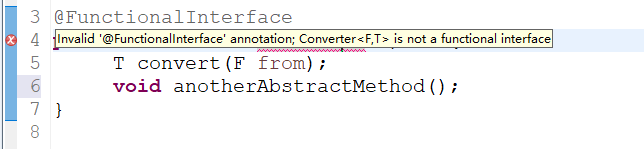

# 接口的默认方法

Java 8使我们能够通过使用 `default` 关键字向接口添加非抽象方法实现。 此功能也称为[虚拟扩展方法](http://stackoverflow.com/a/24102730)。

```java
interface Formula{

    double calculate(int a);

    default double sqrt(int a) {
        return Math.sqrt(a);
    }

}
```

Formula 接口中除了抽象方法计算接口公式还定义了默认方法 `sqrt`。 实现该接口的类只需要实现抽象方法 `calculate`。 默认方法`sqrt` 可以直接使用。当然你也可以直接通过接口创建对象，然后实现接口中的默认方法就可以了，我们通过代码演示一下这种方式。

```java
public class Main {

  public static void main(String[] args) {
    // 通过匿名内部类方式访问接口
    Formula formula = new Formula() {
        @Override
        public double calculate(int a) {
            return sqrt(a * 100);
        }
    };

    System.out.println(formula.calculate(100));     // 100.0
    System.out.println(formula.sqrt(16));           // 4.0

  }

}
```

formula 是作为匿名对象实现的。该代码非常容易理解，6行代码实现了计算 `sqrt(a * 100)`。在下一节中，我们将会看到在 Java 8 中实现单个方法对象有一种更好更方便的方法。

# lambda表达式（lambda experssions）

首先看看老版本的java中是如何排列字符串

```java
List<String> names = Arrays.asList("peter", "anna", "mike", "xenia");

Collections.sort(names, new Comparator<String>() {
    @Override
    public int compare(String a, String b) {
        return b.compareTo(a);
    }
});
```

只需要给静态方法`Collections.sort` 传入一个 List 对象以及一个比较器来按指定顺序排列。通常做法都是创建一个匿名的比较器对象然后将其传递给 `sort` 方法。

在Java 8 中你就没必要使用这种传统的匿名对象的方式了，Java 8提供了更简洁的语法，lambda表达式：

```java
Collections.sort(names, (String a, String b) -> {
    return b.compareTo(a);
});
```

可以看出，代码变得更段且更具有可读性，但是实际上还可以写得更短：

```java
Collections.sort(names, (String a, String b) -> b.compareTo(a));
```

可以看出，代码变得更段且更具有可读性，但是实际上还可以写得更短：

```java
Collections.sort(names, (String a, String b) -> b.compareTo(a));
```

对于函数体只有一行代码的，你可以去掉大括号{}以及return关键字，但是你还可以写得更短点：

```java
names.sort((a, b) -> b.compareTo(a));
```

List 类本身就有一个 `sort` 方法。并且Java编译器可以自动推导出参数类型，所以你可以不用再写一次类型。接下来我们看看lambda表达式还有什么其他用法。

# 函数接口（Functional interfaces）

**译者注：** 原文对这部分解释不太清楚，故做了修改！

Java 语言设计者们投入了大量精力来思考如何使现有的函数友好地支持Lambda。最终采取的方法是：增加函数式接口的概念。**“函数式接口”是指仅仅只包含一个抽象方法,但是可以有多个非抽象方法(也就是上面提到的默认方法)的接口。** 像这样的接口，可以被隐式转换为lambda表达式。`java.lang.Runnable` 与 `java.util.concurrent.Callable` 是函数式接口最典型的两个例子。Java 8增加了一种特殊的注解`@FunctionalInterface`,但是这个注解通常不是必须的(某些情况建议使用)，只要接口只包含一个抽象方法，虚拟机会自动判断该接口为函数式接口。一般建议在接口上使用`@FunctionalInterface` 注解进行声明，这样的话，编译器如果发现你标注了这个注解的接口有多于一个抽象方法的时候会报错的，如下图所示



```java
@FunctionalInterface
public interface Converter<F, T> {
  T convert(F from);
}
```

```java
    // TODO 将数字字符串转换为整数类型
    Converter<String, Integer> converter = (from) -> Integer.valueOf(from);
    Integer converted = converter.convert("123");
    System.out.println(converted.getClass()); //class java.lang.Integer
```

**译者注：** 大部分函数式接口都不用我们自己写，Java8都给我们实现好了，这些接口都在java.util.function包里。

# 方法和构造函数引用（Method and Constructor）

前一节的代码还可以通过静态方法引用来表示

```java
    Converter<String, Integer> converter = Integer::valueOf;
    Integer converted = converter.convert("123");
    System.out.println(converted.getClass());   //class java.lang.Integer
```

Java 8允许您通过`::`关键字传递方法或构造函数的引用。 上面的示例显示了如何引用静态方法。 但我们也可以引用对象方法：

```java
class Something {
    String startsWith(String s) {
        return String.valueOf(s.charAt(0));
    }
}
```

```java
Something something = new Something();
Converter<String, String> converter = something::startsWith;
String converted = converter.convert("Java");
System.out.println(converted);    // "J"
```

接下来看看构造函数是如何使用`::`关键字来引用的，首先我们定义一个包含多个构造函数的简单类：

```java
class Person {
    String firstName;
    String lastName;

    Person() {}

    Person(String firstName, String lastName) {
        this.firstName = firstName;
        this.lastName = lastName;
    }
}
```

接下来我们指定一个用来创建Person对象的对象工厂接口：

```java
interface PersonFactory<P extends Person> {
    P create(String firstName, String lastName);
}
```

这里我们使用构造函数引用来将他们关联起来，而不是手动实现一个完整的工厂：

```java
PersonFactory<Person> personFactory = Person::new;
Person person = personFactory.create("Peter", "Parker");
```

我们只需要使用 `Person::new` 来获取Person类构造函数的引用，Java编译器会自动根据`PersonFactory.create`方法的参数类型来选择合适的构造函数。

# Lamda表达作用域

## 访问局部变量

我们可以直接在 lambda 表达式中访问外部的局部变量：

```java
final int num = 1;
Converter<Integer, String> stringConverter =
        (from) -> String.valueOf(from + num);

stringConverter.convert(2);     // 3
```