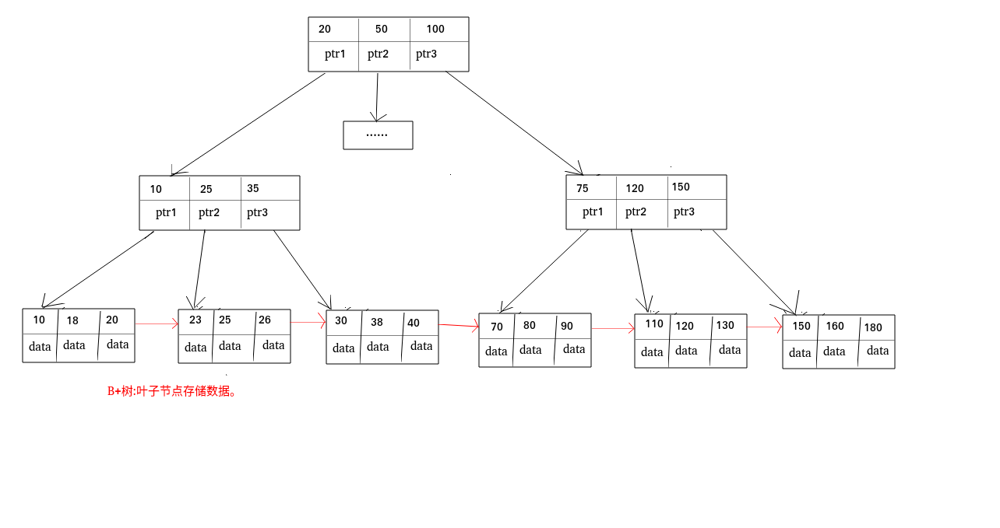
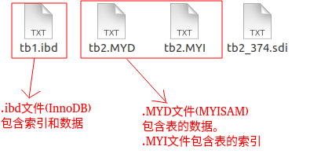

# 为什么要使用索引

1. 通过创建唯一索引，可以保证数据库表中每一行数据的唯一性
2. 可以大大加快数据的检索速度（大大减少的检索的数据量），这也是创建索引的最主要的原因。
3. 帮助服务器避免排序和临时表。
4. 将随机io变为顺序io。
5. 可以加速表和表之间的连接，特别是在实现数据的参考完整性特别有意义。

# 索引这么多优点，为什么不对表中每一个列创建一个索引

1. 当对表中的数据进行增加、删除和修改的时候，索引也要动态的维护，这样就降低了数据的维护速度
2. 索引需要占物理空间，除了数据表占数据空间之外，每一个索引还要占一定物理空间，如果建立聚族索引，那么需要的空间就会更大
3. 创建索引和维护索引要耗费时间，这样时间随着数据量的增加而增加

# 使用索引的注意事项

1. 在经常需要搜索的列上，可以加快搜索的速度；
2. 在经常使用where子句中列上面创建索引，加快条件的判断速度
3. 在经常需要排序的列上创建索引，因为索引已经排序，这样查询可以利用索引的排序，加快排序查询时间；
4. 对于中到大型表索引都是非常有效的，但是特大型表的话维护开销会很大，不适合建索引
5. 在经常用在连接的列上，这 些列主要是一些外键，可以加快连接的速度；
6. 避免 where 子句中对宇段施加函数，这会造成无法命中索引
7. 在使用InnoDB时使用与业务无关的自增主键作为主键，即使用逻辑主键，而不要使用业务主键
8. 将打算加索引的列设置为 NOT NULL ，否则将导致引擎放弃使用索引而进行全表扫描
9. 删除长期未使用的索引，不用的索引的存在会造成不必要的性能损耗 MySQL 5.7 可以通过查询 sys 库的 chema_unused_indexes 视图来查询哪些索引从未被使用
10. 在使用 limit offset 查询缓慢时，可以借助索引来提高性能

# mysql索引主要使用的两种数据结构

## 哈希索引

对于哈希索引来说，底层的数据结构就是哈希表，因此在绝大多数需求为单条记录查询的时候，可以选择哈希索引，查询性能最快；其余大部分场景，建议选择BTree索引。

## BTree索引

### myisam和innodb实现btree索引方式的区别

B+Tree叶节点的data域存放的是数据记录的地址。在索引检索的时候，首先按照B+Tree搜索算法搜索索引，如果指定的Key存在，则取出其 data 域的值，然后以 data 域的值为地址读取相应的数据记录。这被称为“非聚簇索引”

---

每个节点data的放点是地址，通过地址在取值


### innodb

聚族索引就是叶子节点才放着data

# 覆盖索引介绍

## 什么是覆盖索引

如果一个索引包含（或者说覆盖）所有需要查询的字段的值，我们就称之为“覆盖索引”。我们知道InnoDB存储引擎中，如果不是主键索引，叶子节点存储的是主键+列值。最终还是要“回表”，也就是要通过主键再查找一次。这样就会比较慢覆盖索引就是把要查询出的列和索引是对应的，不做回表操作！

## 覆盖索引使用实例

现在我创建了索引(username,age)，我们执行下面的 sql 语句

```sql
select username , age from user where username = 'Java' and age = 22
```

在查询数据的时候：要查询出的列在叶子节点都存在！所以，就不用回表

# 选择索引和编写利用这些索引的查询的3个原则

1. 单行访问是很慢的。特别是在机械硬盘存储中(SSD的随机I/O要快很多，不过这一点仍然成立）。如果服务器从存储中读取一个数据块只是为了获取其中一行，那么就浪费了很多工作。最好读取的块中能包含尽可能多所需要的行。使用索引可以创建位置引，用以提升效率。
2. 按顺序访问范围数据是很快的，这有两个原因。第一，顺序1/0不需要多次磁盘寻道，所以比随机I/O要快很多（特别是对机械硬盘）。第二，如果服务器能够按需要顺序读取数据，那么就不再需要额外的排序操作，并且GROUPBY查询也无须再做排序和将行按组进行聚合计算了。
3. 索引覆盖查询是很快的。如果一个索引包含了查询需要的所有列，那么存储引擎就 不需要再回表查找行。这避免了大量的单行访问，而上面的第1点已经写明单行访 问是很慢的。

# 为什么索引能提高查询速度

## 先从mysql的基本存储结构说起


- **各个数据页可以组成一个双向链表**
- **每个数据页中的记录又可以组成一个单向链表**
  - 每个数据页都会为存储在它里边儿的记录生成一个页目录，在通过主键查找某条记录的时候可以在页目录中使用二分法快速定位到对应的槽，然后再遍历该槽对应分组中的记录即可快速找到指定的记录
  - 以其他列(非主键)作为搜索条件：只能从最小记录开始依次遍历单链表中的每条记录。

所以说，如果我们写select * from user where indexname = 'xxx'这样没有进行任何优化的sql语句，默认会这样做：

1. **定位到记录所在的页：需要遍历双向链表，找到所在的页**
2. **从所在的页内中查找相应的记录：由于不是根据主键查询，只能遍历所在页的单链表了**

很明显，在数据量很大的情况下这样查找会很慢！这样的时间复杂度为O（n）。

## 使用索引后

索引做了些什么可以让我们查询加快速度呢？其实就是将无序的数据变成有序(相对)：


很明显的是：没有用索引我们是需要遍历双向链表来定位对应的页，现在通过 **“目录”** 就可以很快地定位到对应的页上了！（二分查找，时间复杂度近似为O(logn)）

其实底层结构就是B+树，B+树作为树的一种实现，能够让我们很快地查找出对应的记录。

# 关于索引其他重要的内容补充

## 最左前缀原则

MySQL中的索引可以以一定顺序引用多列，这种索引叫作联合索引。如User表的name和city加联合索引就是(name,city)，而最左前缀原则指的是，如果查询的时候查询条件精确匹配索引的左边连续一列或几列，则此列就可以被用到。如下：

```
select * from user where name=xx and city=xx ; ／／可以命中索引
select * from user where name=xx ; // 可以命中索引
select * from user where city=xx ; // 无法命中索引            
```

这里需要注意的是，查询的时候如果两个条件都用上了，但是顺序不同，如 `city= xx and name ＝xx`，那么现在的查询引擎会自动优化为匹配联合索引的顺序，这样是能够命中索引的。

由于最左前缀原则，在创建联合索引时，索引字段的顺序需要考虑字段值去重之后的个数，较多的放前面。ORDER BY子句也遵循此规则。

由于最左前缀原则，在创建联合索引时，索引字段的顺序需要考虑字段值去重之后的个数，较多的放前面。ORDER BY子句也遵循此规则

# 注意避免冗余索引

冗余索引指的是索引的功能相同，能够命中 就肯定能命中 ，那么 就是冗余索引如（name,city ）和（name ）这两个索引就是冗余索引，能够命中后者的查询肯定是能够命中前者的 在大多数情况下，都应该尽量扩展已有的索引而不是创建新索引。

MySQL 5.7 版本后，可以通过查询 sys 库的 `schema_redundant_indexes` 表来查看冗余索引

# mysql如何为表字段添加索引

添加promary key（主键索引）

```sql
ALTER TABLE `table_name` ADD PRIMARY KEY ( `column` ) 
```

添加unique（唯一索引）

```sql
ALTER TABLE `table_name` ADD UNIQUE ( `column` ) 
```

添加index（普通索引）

```sql
ALTER TABLE `table_name` ADD INDEX index_name ( `column` )
```

添加FULLTEXT(全文索引)

```sql
ALTER TABLE `table_name` ADD FULLTEXT ( `column`) 
```

添加多列索引

```sql
ALTER TABLE `table_name` ADD INDEX index_name ( `column1`, `column2`, `column3` )
```

# B树和B+树区别

- B树的所有节点既存放 键(key) 也存放 数据(data);而B+树只有叶子节点存放 key 和 data，其他内节点只存放key。
- B树的叶子节点都是独立的;B+树的叶子节点有一条引用链指向与它相邻的叶子节点。
- B树的检索的过程相当于对范围内的每个节点的关键字做二分查找，可能还没有到达叶子节点，检索就结束了。而B+树的检索效率就很稳定了，任何查找都是从根节点到叶子节点的过程，叶子节点的顺序检索很明显。



# 索引类型

## 主键索引

**数据表的主键列使用的就是主键索引。**

**一张数据表有只能有一个主键，并且主键不能为null，不能重复。**

**在mysql的InnoDB的表中，当没有显示的指定表的主键时，InnoDB会自动先检查表中是否有唯一索引的字段，如果有，则选择该字段为默认的主键，否则InnoDB将会自动创建一个6Byte的自增主键。**

## 二级索引

**二级索引又称为辅助索引，是因为二级索引的叶子节点存储的数据是主键。也就是说，通过二级索引，可以定位主键的位置。**

唯一索引，普通索引，前缀索引等索引属于二级索引。

**PS:不懂的同学可以暂存疑，慢慢往下看，后面会有答案的，也可以自行搜索。**

1. **唯一索引(Unique Key)** ：唯一索引也是一种约束。**唯一索引的属性列不能出现重复的数据，但是允许数据为NULL，一张表允许创建多个唯一索引。**建立唯一索引的目的大部分时候都是为了该属性列的数据的唯一性，而不是为了查询效率。
2. **普通索引(Index)** ：**普通索引的唯一作用就是为了快速查询数据，一张表允许创建多个普通索引，并允许数据重复和NULL。**
3. **前缀索引(Prefix)** ：前缀索引只适用于字符串类型的数据。前缀索引是对文本的前几个字符创建索引，相比普通索引建立的数据更小， 因为只取前几个字符。
4. **全文索引(Full Text)** ：全文索引主要是为了检索大文本数据中的关键字的信息，是目前搜索引擎数据库使用的一种技术。Mysql5.6之前只有MYISAM引擎支持全文索引，5.6之后InnoDB也支持了全文索引。

.png)

# 聚集索引

**聚集索引即索引结构和数据一起存放的索引。主键索引属于聚集索引。**

在 Mysql 中，InnoDB引擎的表的 `.ibd`文件就包含了该表的索引和数据，对于 InnoDB 引擎表来说，该表的索引(B+树)的每个非叶子节点存储索引，叶子节点存储索引和索引对应的数据。

#### [聚集索引的优点](https://snailclimb.gitee.io/javaguide/#/docs/database/数据库索引?id=聚集索引的优点)

聚集索引的查询速度非常的快，因为整个B+树本身就是一颗多叉平衡树，叶子节点也都是有序的，定位到索引的节点，就相当于定位到了数据。

#### [聚集索引的缺点](https://snailclimb.gitee.io/javaguide/#/docs/database/数据库索引?id=聚集索引的缺点)

1. **依赖于有序的数据** ：因为B+树是多路平衡树，如果索引的数据不是有序的，那么就需要在插入时排序，如果数据是整型还好，否则类似于字符串或UUID这种又长又难比较的数据，插入或查找的速度肯定比较慢。
2. **更新代价大** ： 如果对索引列的数据被修改时，那么对应的索引也将会被修改， 而且况聚集索引的叶子节点还存放着数据，修改代价肯定是较大的， 所以对于主键索引来说，主键一般都是不可被修改的。

# 非聚集索引

**非聚集索引即索引结构和数据分开存放的索引。**

**二级索引属于非聚集索引。**

> MYISAM引擎的表的.MYI文件包含了表的索引， 该表的索引(B+树)的每个叶子非叶子节点存储索引， 叶子节点存储索引和索引对应数据的指针，指向.MYD文件的数据。

**非聚集索引的叶子节点并不一定存放数据的指针， 因为二级索引的叶子节点就存放的是主键，根据主键再回表查数据。**

#### [非聚集索引的优点](https://snailclimb.gitee.io/javaguide/#/docs/database/数据库索引?id=非聚集索引的优点)

**更新代价比聚集索引要小** 。非聚集索引的更新代价就没有聚集索引那么大了，非聚集索引的叶子节点是不存放数据的

#### [非聚集索引的缺点](https://snailclimb.gitee.io/javaguide/#/docs/database/数据库索引?id=非聚集索引的缺点)

1. 跟聚集索引一样，非聚集索引也依赖于有序的数据
2. **可能会二次查询(回表)** :这应该是非聚集索引最大的缺点了。 当查到索引对应的指针或主键后，可能还需要根据指针或主键再到数据文件或表中查询。

这是Mysql的表的文件截图:



在 Mysql 中，InnoDB引擎的表的 `.ibd`文件就包含了该表的索引和数据，对于 InnoDB 引擎表来说，该表的索引(B+树)的每个非叶子节点存储索引，叶子节点存储索引和索引对应的数据。

聚集索引和非聚集索引:


### [非聚集索引一定回表查询吗(覆盖索引)?](https://snailclimb.gitee.io/javaguide/#/docs/database/数据库索引?id=非聚集索引一定回表查询吗覆盖索引)

**非聚集索引不一定回表查询。**

> 试想一种情况，用户准备使用SQL查询用户名，而用户名字段正好建立了索引。

```text
 SELECT name FROM table WHERE username='guang19';Copy to clipboardErrorCopied
```

> 那么这个索引的key本身就是name，查到对应的name直接返回就行了，无需回表查询。

**即使是MYISAM也是这样，虽然MYISAM的主键索引确实需要回表， 因为它的主键索引的叶子节点存放的是指针。但是如果SQL查的就是主键呢?**

```text
SELECT id FROM table WHERE id=1;Copy to clipboardErrorCopied
```

主键索引本身的key就是主键，查到返回就行了。这种情况就称之为覆盖索引了。

