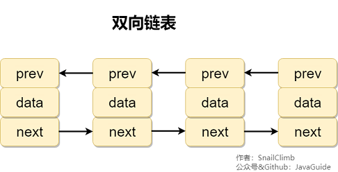

# List，set，Map三者的区别

- **List(对付顺序的好帮手)：** List接口存储一组不唯一（可以有多个元素引用相同的对象），有序的对象
- **Set(注重独一无二的性质):** 不允许重复的集合。不会有多个元素引用相同的对象。
- **Map(用Key来搜索的专家):** 使用键值对存储。Map会维护与Key有关联的值。两个Key可以引用相同的对象，但Key不能重复，典型的Key是String类型，但也可以是任何对象。

# ArrayList与LinkList的区别

- **1. 是否保证线程安全：** `ArrayList` 和 `LinkedList` 都是不同步的，也就是不保证线程安全；
- **2. 底层数据结构：** `Arraylist` 底层使用的是 **Object 数组**；`LinkedList`底层使用的是 **双向链表** 数据结构（JDK1.6之前为循环链表，JDK1.7取消了循环。注意双向链表和双向循环链表的区别，下面有介绍到！）
- **3. 插入和删除是否受元素位置的影响：** ① **ArrayList 采用数组存储，所以插入和删除元素的时间复杂度受元素位置的影响。** 比如：执行`add(E e)`方法的时候， `ArrayList` 会默认在将指定的元素追加到此列表的末尾，这种情况时间复杂度就是O(1)。但是如果要在指定位置 i 插入和删除元素的话（`add(int index, E element)`）时间复杂度就为 O(n-i)。因为在进行上述操作的时候集合中第 i 和第 i 个元素之后的(n-i)个元素都要执行向后位/向前移一位的操作。 ② **LinkedList 采用链表存储，所以对于add(E e)方法的插入，删除元素时间复杂度不受元素位置的影响，近似 O(1)，如果是要在指定位置i插入和删除元素的话（(add(int index, E element)） 时间复杂度近似为o(n))因为需要先移动到指定位置再插入。**
- **4. 是否支持快速随机访问：** `LinkedList` 不支持高效的随机元素访问，而 `ArrayList` 支持。快速随机访问就是通过元素的序号快速获取元素对象(对应于`get(int index)`方法)。
- **5. 内存空间占用：** ArrayList的空 间浪费主要体现在在list列表的结尾会预留一定的容量空间，而LinkedList的空间花费则体现在它的每一个元素都需要消耗比ArrayList更多的空间（因为要存放直接后继和直接前驱以及数据）。

# 补充内容：RandomAccess接口

```java
public interface RandomAccess {
}
```

该接口是可以随机访问的标志，ArrayList实现了RandomAccess接口，而LinkList没有实现，因为ArrayList底层是数组，而LinkList底层是链表。并不是ArrayList实现了RandomAccess接口才具有快速随机访问的功能

## list的遍历方式选择

1. 实现了RandomAccess接口list，优先选择普通for循环，其次foreach
2. 未实现RandomAccess接口的list，优先选择iterator遍历（foreach遍历底层也是通过iterator）大size的数据，千万不要使用普通for循环

# 补充内容：双向链表和双向循环链表




# ArrayList与Vetor的区别

vector类的所有方法都是同步的。可以由两个线程安全地访问一个Vector对象、但是一个线程访问vector的话代码在同步操作上面会耗费大量时间

# 说说ArrayList的扩容机制

详细看https://github.com/Snailclimb/JavaGuide/blob/master/docs/java/collection/ArrayList-Grow.md

总结：

1. 当用无参构造方法创建ArrayList时，会初始化为一个空数组。进行添加元素时才分配初始容量10在ensureCapacityInternal中
2. ensureExplicitCapacity()判断此时的的容量是否大于10，如果大于10就执行grow方法，就行扩容
3. 在grow方法中，int newCapacity=oldCapacity+(oldCapacity>>1)，所以ArrayList每次扩容为原来的1.5倍

# HashMap和Hashtable的qubie

1. 线程是否安全，HashMap是非线程安全的，HashTable是线程安全的HashTable内部的方法基本都经过synchronized修饰（如果要保证线程安全使用ConcurrentHashMap）
2. 效率：hashmap效率比较高
3. 对null key 和null value的支持：HashTable 中不能null，直接抛出NullpointerException
4. 初始容量大小和每次扩充容量大小的不同：HashTable默认初始大小为11，每次扩充，容量变为2n+1，HashMap默认初始化为16。之后每次变为2倍
5. 创建时如果给定了容量初始值，那么 Hashtable 会直接使用你给定的大小，而 HashMap 会将其扩充为2的幂次方大小，（HashMap 中的`tableSizeFor()`方法保证，下面给出了源代码）。也就是说 HashMap 总是使用2的幂作为哈希表的大小,后面会介绍到为什么是2的幂次方。
6. **底层数据结构：** JDK1.8 以后的 HashMap 在解决哈希冲突时有了较大的变化，当链表长度大于阈值（默认为8）（将链表转换成红黑树前会判断，如果当前数组的长度小于 64，那么会选择先进行数组扩容，而不是转换为红黑树）时，将链表转化为红黑树，以减少搜索时间。Hashtable 没有这样的机制。

**HashMap 中带有初始容量的构造函数：**

```java
    public HashMap(int initialCapacity, float loadFactor) {
        if (initialCapacity < 0)
            throw new IllegalArgumentException("Illegal initial capacity: " +
                                               initialCapacity);
        if (initialCapacity > MAXIMUM_CAPACITY)
            initialCapacity = MAXIMUM_CAPACITY;
        if (loadFactor <= 0 || Float.isNaN(loadFactor))
            throw new IllegalArgumentException("Illegal load factor: " +
                                               loadFactor);
        this.loadFactor = loadFactor;
        this.threshold = tableSizeFor(initialCapacity);
    }
     public HashMap(int initialCapacity) {
        this(initialCapacity, DEFAULT_LOAD_FACTOR);
    }
```

下面这个方法保证了 HashMap 总是使用2的幂作为哈希表的大小。

```java
    /**
     * Returns a power of two size for the given target capacity.
     */
    static final int tableSizeFor(int cap) {
        int n = cap - 1;
        n |= n >>> 1;
        n |= n >>> 2;
        n |= n >>> 4;
        n |= n >>> 8;
        n |= n >>> 16;
        return (n < 0) ? 1 : (n >= MAXIMUM_CAPACITY) ? MAXIMUM_CAPACITY : n + 1;
    }
```

# HashMap和HashSet区别

如果你看过 `HashSet` 源码的话就应该知道：HashSet 底层就是基于 HashMap 实现的。（HashSet 的源码非常非常少，因为除了 `clone()`、`writeObject()`、`readObject()`是 HashSet 自己不得不实现之外，其他方法都是直接调用 HashMap 中的方法。

| HashMap                          | HashSet                                                      |
| -------------------------------- | ------------------------------------------------------------ |
| 实现了Map接口                    | 实现Set接口                                                  |
| 存储键值对                       | 仅存储对象                                                   |
| 调用 `put()`向map中添加元素      | 调用 `add()`方法向Set中添加元素                              |
| HashMap使用键（Key）计算Hashcode | HashSet使用成员对象来计算hashcode值，对于两个对象来说hashcode可能相同，所以equals()方法用来判断对象的相等性， |

# HashSet如何检查重复

hashset加入对象时，会先计算对象的hashcode来判读对象加入的位置，如果有hashcode相同会调用equals方法进行比较值是否相同，如果不相同就插入，否则不能插入

# HashMap底层实现

## jdk1.8之前

jdk1.8 之前的HashMap底层是数组和链表结合在一起使用也就时链表散列。hashmap通过key的hashcode经过扰动函数处理过后得到hash值，然后通过（n-1）&hash判断当前存放的位置（这里n指的是数组的长度），如果当前位置存在元素的话，就判断该元素与要存入的元素hash值以及key是否相同，如果相同的话，直接覆盖，不相同就通过拉链法解决冲突

**所谓扰动函数指的就是 HashMap 的 hash 方法。使用 hash 方法也就是扰动函数是为了防止一些实现比较差的 hashCode() 方法 换句话说使用扰动函数之后可以减少碰撞。**

## jdk1.8HashMap的hash方法源码

jdk1.8的hash方法相当于jdk1.7hash方法更加简化，但是原理不变

```java
    static final int hash(Object key) {
      int h;
      // key.hashCode()：返回散列值也就是hashcode
      // ^ ：按位异或
      // >>>:无符号右移，忽略符号位，空位都以0补齐
      return (key == null) ? 0 : (h = key.hashCode()) ^ (h >>> 16);
  }
```

对比一下jdk1.7的hashmap的hash方法源码

```java
static int hash(int h) {
    // This function ensures that hashCodes that differ only by
    // constant multiples at each bit position have a bounded
    // number of collisions (approximately 8 at default load factor).

    h ^= (h >>> 20) ^ (h >>> 12);
    return h ^ (h >>> 7) ^ (h >>> 4);
}
```

相比于jdk1.8的hash方法，jdk1.7的hash方法性能会稍差一点点，因为毕竟扰动了4次

所谓拉链法就是：将链表和数组相结合。也就是说创建一个链表数组，数组中每一格就是一个链表。如果遇到哈希冲突，则将冲突的值加到链表中即可


## jdk1.8之后

相比较于之前的版本，jdk1.8之后在解决哈希冲突有了较大的变化，当链表长度大于阈值（默认为8）（将链表转换成红黑树前会判断，如果当前数组的长度小于64，那么会选择先进行数组扩容，而不是转换为红黑树）时，将链表转化为红黑树，以减少搜索时间。


TreeMap、TreeSet以及JDK1.8之后的HashMap底层都用到了红黑树。红黑树就是为了解决二叉查找树的缺陷，因为二叉查找树在某些情况下会退化成一个线性结构。

# HashMap的长度为什么是2的幂次方

hash值的范围值-2147483648到2147483647，前后加起来大概40亿的映射空间，然后计算坐标（n-1）&hash（n代表数组长度）。这也就解释了HashMap的长度为什么是2的幂次方

## 这个算法应该如何设计

我们首先想到%取余的操作来实现。但是，重点来了：“取余%操作中如果除数是2的幂次则等价于与其除数减一的与&操作（也就是说hash%length==hash&（length-1））的前提是2的n次方”，相对于%能够提高运算效率，这就解释了HashMap的长度为什么是2的幂次方

# HashMap多线程操作导致死循环问题

主要原因在并发下的rehash会造成元素之间会形成一个循环链表。不过，jdk1.8后会解决了这个问题，但是还是不建议在多线程使用HashMap，因为多线程下使用HashMap还是会存在其他问题比如数据丢失。并发环境推荐使用ConcurrenthashMap

多个线程在table【】重新迁移时会发生错误

# ConcurrentHashMap和Hashtable的qubie

- **底层数据结构：** JDK1.7的 ConcurrentHashMap 底层采用 **分段的数组+链表** 实现，JDK1.8 采用的数据结构跟HashMap1.8的结构一样，数组+链表/红黑二叉树。Hashtable 和 JDK1.8 之前的 HashMap 的底层数据结构类似都是采用 **数组+链表** 的形式，数组是 HashMap 的主体，链表则是主要为了解决哈希冲突而存在的；
- **实现线程安全的方式（重要）：** ① **在JDK1.7的时候，ConcurrentHashMap（分段锁）** 对整个桶数组进行了分割分段(Segment)，每一把锁只锁容器其中一部分数据，多线程访问容器里不同数据段的数据，就不会存在锁竞争，提高并发访问率。 **到了 JDK1.8 的时候已经摒弃了Segment的概念，而是直接用 Node 数组+链表+红黑树的数据结构来实现，并发控制使用 synchronized 和 CAS 来操作。（JDK1.6以后 对 synchronized锁做了很多优化）** 整个看起来就像是优化过且线程安全的 HashMap，虽然在JDK1.8中还能看到 Segment 的数据结构，但是已经简化了属性，只是为了兼容旧版本；② **Hashtable(同一把锁)** :使用 synchronized 来保证线程安全，效率非常低下。当一个线程访问同步方法时，其他线程也访问同步方法，可能会进入阻塞或轮询状态，如使用 put 添加元素，另一个线程不能使用 put 添加元素，也不能使用 get，竞争会越来越激烈效率越低。

**HashTable:**


jdk1.7的ConcurrentHashMap：


**DK1.8的ConcurrentHashMap（TreeBin: 红黑二叉树节点 Node: 链表节点）：**


# ConcurrentHashMap线程安全的具体实现方式、底层具体实现

### [JDK1.7（上面有示意图）](https://snailclimb.gitee.io/javaguide/#/docs/java/collection/Java集合框架常见面试题?id=jdk17（上面有示意图）)

首先将数据分为一段一段的存储，然后给每一段数据配一把锁，当一个线程占用锁访问其中一个段数据时，其他段的数据也能被其他线程访问。

**ConcurrentHashMap 是由 Segment 数组结构和 HashEntry 数组结构组成**。

Segment 实现了 ReentrantLock,所以 Segment 是一种可重入锁，扮演锁的角色。HashEntry 用于存储键值对数据。

```java
static class Segment<K,V> extends ReentrantLock implements Serializable {
}Copy to clipboardErrorCopied
```

一个 ConcurrentHashMap 里包含一个 Segment 数组。Segment 的结构和HashMap类似，是一种数组和链表结构，一个 Segment 包含一个 HashEntry 数组，每个 HashEntry 是一个链表结构的元素，每个 Segment 守护着一个HashEntry数组里的元素，当对 HashEntry 数组的数据进行修改时，必须首先获得对应的 Segment的锁。

### [JDK1.8 （上面有示意图）](https://snailclimb.gitee.io/javaguide/#/docs/java/collection/Java集合框架常见面试题?id=jdk18-（上面有示意图）)

ConcurrentHashMap取消了Segment分段锁，采用CAS和synchronized来保证并发安全。数据结构跟HashMap1.8的结构类似，数组+链表/红黑二叉树。Java 8在链表长度超过一定阈值（8）时将链表（寻址时间复杂度为O(N)）转换为红黑树（寻址时间复杂度为O(log(N))）

synchronized只锁定当前链表或红黑二叉树的首节点，这样只要hash不冲突，就不会产生并发，效率又提升N倍。

# comparable和comparator的区别

- comparable接口实际上是出自java.lang包 它有一个 `compareTo(Object obj)`方法用来排序
- comparator接口实际上是出自 java.util 包它有一个`compare(Object obj1, Object obj2)`方法用来排序

一般我们需要对一个集合使用自定义排序时，我们就要重写`compareTo()`方法或`compare()`方法，当我们需要对某一个集合实现两种排序方式，比如一个song对象中的歌名和歌手名分别采用一种排序方法的话，我们可以重写`compareTo()`方法和使用自制的Comparator方法或者以两个Comparator来实现歌名排序和歌星名排序，第二种代表我们只能使用两个参数版的 `Collections.sort()`.