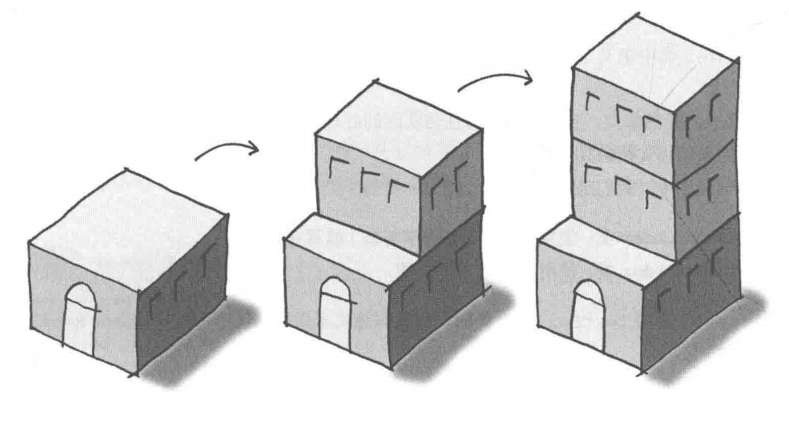
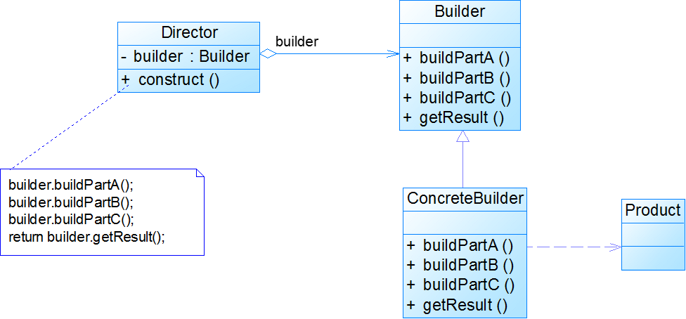
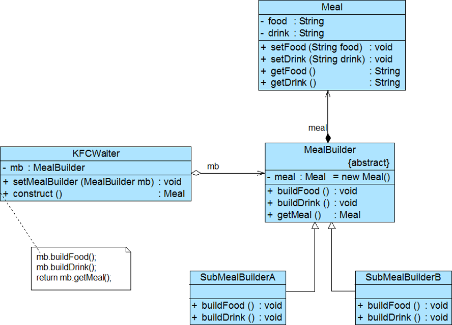
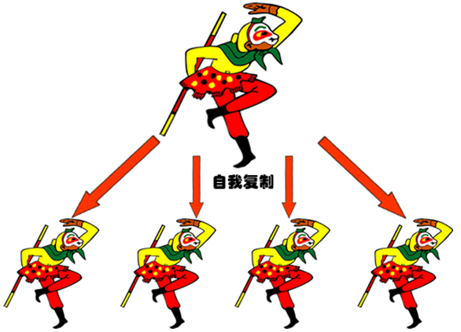
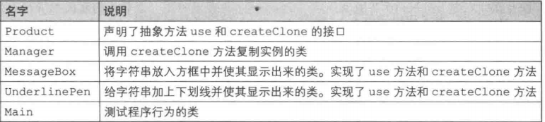
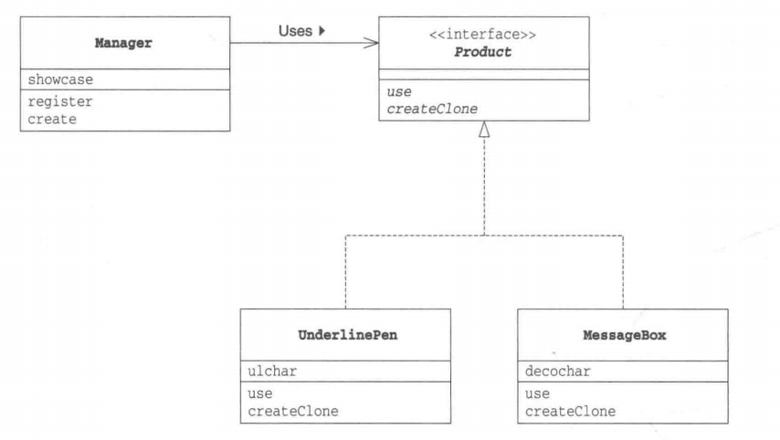

# java设计模式

## 创建型模式

- 创建型模式（Creational pattern）对类的实例化过程进行了抽象，能够将软件模块中对象的创建和对象的使用分离。为了使软件的结构更加清晰，外界对于这些对象只需要知道他们共同的接口，而不清楚具体的实现细节，使整个系统的设计更加符合单一职责原则
- 创建型模式在创建什么(What)，由谁创建(Who)，何时创建(When)等方面都为软件设计者提供了尽可能大的灵活性。创建型模式隐藏了类的实例的创建细节，通过隐藏对象如何被创建和组合在一起达到使整个系统独立的目的。

# 常见创建型模式详解

## 定义

保证一个类仅有一个实例，并提供一个访问他的全局访问点

## 为什么要用单例模式呢？

在我们的系统中，有一些对象其实我们只需要一个，比如说：线程池、缓存、对话框、注册表、日志对象、充当打印机、显卡等设备驱动程序对象，

**简单来说使用单例模式可以带来下面几个好处:**

- **对于频繁使用的对象，可以省略创建对象所花费的时间，这对于那些重量级对象而言，是非常可观的一笔系统开销**
- **由于ne我操作的次数减少，因而对系统内存的使用频率降低，这将减轻GC压力**

## 为什么不使用全局变量确保一个类只有一个实例呢

全局变量分为静态变量和实例变量，静态变量也可以保证该类的实例只存在一个。只要程序加载了类的字节码，不用创建任何实例对象，静态变量就会被分配空间，静态变量可以被使用

但是，如果说这个对象非常消耗资源，而且程序某次的执行中一直没用，这样就造成了资源的浪费。**利用单例模式的话，我们就可以实现在需要使用时才创建对象，这样就避免了不必要的资源浪费**不仅仅是因为这个原因，在程序中我们要尽量避免全局变量的使用，大量使用全局变量给程序的调试、维护等带来困难。

# 单例模式的实现

**通常单例模式在java中，有两种关键方式**

- 饿汉方式：指全局的单例在类装载时构建
- 懒汉方式：指全局单例实例在第一次被使用时构建

**不管哪种哪种创建方式，他们通常都存在下面几点相似处**

* 单例类必须要有一个private访问级别的构造函数，只有这样，才能确保单例不会在系统中被其他代码内被实例化
* instance 成员变量和 uniqueInstance 方法必须是 static 的。

# 饿汉方式（线程安全）

```java
public class Singleton{
    //在静态初始化区创建单例实例，这段代码保证了线程安全
    private static Singleton uniqueInstance=new Singleton();
    //Singleton类只有一个构造方法并且是被private修饰的，所以用户无法通过new方式创建g唉对象实例
    private Singleton(){}
    public static Singleton getInstance()}{
    return uniqueInstance;
}
}
```

所谓“饿汉式”就是说jvm在加载这个类时就马上创建此唯一单例实例，不管你用不用，先创建了再说，如果一直没有被使用，便浪费了空间，典型的空间换时间，每次调用的时候，就不需要在判断，节省了运行时间

## 懒汉式（非线程安全和synchronized关键字线程安全版本）

```java
public class Singleton{
    private static Singleton uniqueInstance;
    private Singleton(){}
    public static Singleton getInstance(){
        if(uniqueInstacne==null){
            uniqueInstance=new Singleton();
        }
        return uniqueInstance;
    }
}
```

所谓 **“ 懒汉式”** 就是说单例实例在第一次被使用时构建，而不是在JVM在加载这个类时就马上创建此唯一的单例实例。

但是上面这种方式很明显是线程不安全的，如果多个线程同时访问getInstance()方法时就会出现问题。如果想要保证线程安全，一种比较常见的方式就是在getInstance() 方法前加上synchronized关键字，如下：

```java
public static synchronized Singleton getInstance() {  
	      if (instance == null) {  
	          uniqueInstance = new Singleton();  
	      }  
	      return uniqueInstance;  
      }  
```

我们知道synchronized关键字偏重量级锁。虽然在JavaSE1.6之后synchronized关键字进行了主要包括：为了减少获得锁和释放锁带来的性能消耗而引入的偏向锁和轻量级锁以及其它各种优化之后执行效率有了显著提升。

但是在程序中每次使用getInstance() 都要经过synchronized加锁这一层，这难免会增加getInstance()的方法的时间消费，而且还可能会发生阻塞。我们下面介绍到的 **双重检查加锁版本** 就是为了解决这个问题而存在的。

## 懒汉式（双重检查加锁版本）

**利用双重检查加锁（double- checked locking）首先检查是否实例已经创建，如果尚未创建，“才”进行同步。这样以来，只有一次同步，这正是我们想要的效果****

```java
public class Singleton{
    private volatile static Singleton uniqueInstance;
    private Singleton(){}
    public static Singleton getInstance(){
        //检查实例，如果不存子啊，就进入同步代码块
        synchronized(Singleton.class){
            //进入同步代码块，在检查一次，如果是null，才能创建实例
            if(uniqueInstance==null){
                uniqueInstance=new Singleton();
            }
        }
    }
}
```

很明显，这种方式相比于使用synchronized关键字的方法，可以大大减少getInstance() 的时间消费。

我们上面使用到了volatile关键字来保证数据的可见性，关于volatile关键字的内容可以看我的这篇文章：

# 懒汉式（登记式/静态内部类）

**静态内部实现的单例是懒加载的且线程安全**

只有通过显式调用getInstance方式时，才会显式装载 SingletonHolder 类，从而实例化 instance（只有第一次使用这个单例的实例的时候才加载，同时不会有线程安全问题）。

```java
public class Singleton{
    private static class SingletonHolder{
        private static final Singleton INSTANCE=new Singleton();
    }
    private Singleton(){}
    public static final Singleton getInstance(){
        return SingletonHolder.INSTSNCE;
    }
}
```

# 饿汉式（枚举式）

这种实现方式还没有被广泛采用，但这是实现单例模式的最佳方法。 **它更简洁，自动支持序列化机制，绝对防止多次实例化** （如果单例类实现了Serializable接口，默认情况下每次反序列化总会创建一个新的实例对象，关于单例与序列化的问题可以查看这一篇文章[《单例与序列化的那些事儿》](http://www.hollischuang.com/archives/1144)），同时这种方式也是《Effective Java 》以及《Java与模式》的作者推荐的方式。

```java
public enum Singleton{
    INSTANCE;
    public void doSomeThing(){
        Sysmtem.out.println("枚举方式实现单例");
    }
}
```

## 使用方法

```java
public class ESTest{
    public static void main (String[] args){
        Singleton singleton=Singleton.INSTANCR;
        singleton.doSomeThing();
    }
}
```

# 工厂模式

**工厂模式的定义**

Define an interface for creating an object, but let subclasses decide which class to instantiate. Factory Method lets a class defer instantiation to subclasses.”(在基类中定义创建对象的一个接口，让子类决定实例化哪个类。工厂方法让一个类的实例化延迟到子类中进行。)

“Define an interface for creating an object, but let subclasses decide which class to instantiate. Factory Method lets a class defer instantiation to subclasses.”(在基类中定义创建对象的一个接口，让子类决定实例化哪个类。工厂方法让一个类的实例化延迟到子类中进行。)

## 工厂模式的分类

1. 简单工厂模式，又称静态工厂模式
2. 工厂方法模式，又称多态性工厂模式或虚拟构造子模式
3. 抽象工厂模式，又称工具箱模式

# 在开源框架中的使用

**举两个比较常见的例子**

1. spring中通过getBean（“xxx”）获取Bean
2. java消息服务jms中（下面以消息队列ActiveMQ为例子）

```java

        // 1、创建一个连接工厂对象，需要指定服务的ip及端口。
        ConnectionFactory connectionFactory = new ActiveMQConnectionFactory("tcp://192.168.25.155:61616");
        // 2、使用工厂对象创建一个Connection对象。

```


# 为什么要用工厂模式

1. 解耦：把对象的创建和使用的过程分开
2. 降低代码重复：如果创建某个对象的过程很复杂，
3. 降低维护成本

# 简单工厂实例

创建一个可以绘制不同形状的绘图工具，可以绘制圆形，正方形，三角形，每个图形都会有一个draw()方法用于绘图.

1. 创建Shape接口

```java

public interface Shape {
    void draw();
}
```

2. 创建实现该接口的具体图形类

```java

public class Circle implements Shape {
    public Circle() {
        System.out.println("Circle");
    }
    @Override
    public void draw() {
        System.out.println("Draw Circle");
    }
}
```

长方形

```java

public class Rectangle implements Shape {
    public Rectangle() {
        System.out.println("Rectangle");
    }
    @Override
    public void draw() {
        System.out.println("Draw Rectangle");
    }
}

```

正方形

```java

public class Square implements Shape {
    public Square() {
        System.out.println("Square");
    }

    @Override
    public void draw() {
        System.out.println("Draw Square");
    }
}
```

创建工厂类

```java

public class ShapeFactory {

    // 使用 getShape 方法获取形状类型的对象
    public static Shape getShape(String shapeType) {
        if (shapeType == null) {
            return null;
        }
        if (shapeType.equalsIgnoreCase("CIRCLE")) {
            return new Circle();
        } else if (shapeType.equalsIgnoreCase("RECTANGLE")) {
            return new Rectangle();
        } else if (shapeType.equalsIgnoreCase("SQUARE")) {
            return new Square();
        }
        return null;
    }
}
```

测试方法

```java
public class Test {

    public static void main(String[] args) {

        // 获取 Circle 的对象，并调用它的 draw 方法
        Shape circle = ShapeFactory.getShape("CIRCLE");
        circle.draw();

        // 获取 Rectangle 的对象，并调用它的 draw 方法
        Shape rectangle = ShapeFactory.getShape("RECTANGLE");
        rectangle.draw();

        // 获取 Square 的对象，并调用它的 draw 方法
        Shape square = ShapeFactory.getShape("SQUARE");
        square.draw();
    }
}

```

输出结果

```java
Circle
Draw Circle
Rectangle
Draw Rectangle
Square
Draw Square

```


这样的实现有个问题，如果我们新增产品类的话，就需要修改工厂类getShap()方法，这很明显不符合**开放-封闭**

**将工厂类改为下面的形式**

```java
package factory_pattern;

/**
 * 利用反射解决简单工厂每次增加新了产品类都要修改产品工厂的弊端
 * 
 * @author Administrator
 *
 */
public class ShapeFactory2 {
    public static Object getClass(Class<? extends Shape> clazz) {
        Object obj = null;

        try {
            obj = Class.forName(clazz.getName()).newInstance();
        } catch (ClassNotFoundException e) {
            e.printStackTrace();
        } catch (InstantiationException e) {
            e.printStackTrace();
        } catch (IllegalAccessException e) {
            e.printStackTrace();
        }

        return obj;
    }
}

```

测试方法

```java
package factory_pattern;
public class Test2{
	public static void main(String[] args){
        Circle circle = (Circle) ShapeFactory2.getClass(factory_pattern.Circle.class);
        circle.draw();

        Rectangle rectangle = (Rectangle) 			ShapeFactory2.getClass(factory_pattern.Rectangle.class);
        rectangle.draw();

        Square square = (Square) ShapeFactory2.getClass(factory_pattern.Square.class);
        square.draw();
    }
}
```

# 工厂方法模式

## 介绍

工厂方法模式应该是在工厂模式家族中是用的最多模式，一般项目中存在最多的就是这个模式。

工厂方法模式是简单工厂的仅一步深化， 在工厂方法模式中，我们不再提供一个统一的工厂类来创建所有的对象，而是针对不同的对象提供不同的工厂。也就是说 **每个对象都有一个与之对应的工厂** 。

## 使用场景

1. 一个类不知道它所需要的对象的类：在工厂方法模式中，客户端不需要知道具体产品类的类名，只需要知道所对应的工厂即可，具体的产品对象由具体工厂类创建；客户端需要知道创建具体产品的工厂类。
2. 一个类通过其子类来指定创建哪个对象：在工厂方法模式中，对于抽象工厂类只需要提供一个创建产品的接口，而由其子类来确定具体要创建的对象，利用面向对象的多态性和里氏
   将创建对象的任务委托给多个工厂子类中的某一个，客户端在使用时可以无需关心是哪一个工厂子类创建产品子类，需要时再动态指定，可将具体工厂类的类名存储在配置文件或数据库中


# 工厂方法模式角色分配

1. 抽象工厂(Abstract Factory)角色：是工厂方法模式的核心，与应用程序无关。任何在模式中创建的对象的工厂类必须实现这个接口。
2. 具体工厂(Concrete Factory)角色 ：这是实现抽象工厂接口的具体工厂类，包含与应用程序密切相关的逻辑，并且受到应用程序调用以创建某一种产品对象。
3. 抽象产品(AbstractProduct)角色 ：工厂方法模式所创建的对象的超类型，也就是产品对象的共同父类或共同拥有的接口。
4. 具体产品(Concrete Product)角色 ：这个角色实现了抽象产品角色所定义的接口。某具体产品有专门的具体工厂创建，它们之间往往一一对应

# 工厂方法模式实例

增加一个工厂接口

```java
public interface Factory{
    public Shape getShape();
}
```

```java
public class CircleFactory implements Factory {

    @Override
    public Shape getShape() {
        // TODO Auto-generated method stub
        return new Circle();
    }

}

```

长方形工厂类

```java
public class RectangleFactory implements Factory{

    @Override
    public Shape getShape() {
        // TODO Auto-generated method stub
        return new Rectangle();
    }

}

```

圆形工厂类

```java
public class SquareFactory implements Factory{

    @Override
    public Shape getShape() {
        // TODO Auto-generated method stub
        return new Square();
    }

}

```

测试

```java
public class Test {

    public static void main(String[] args) {
        Factory circlefactory = new CircleFactory();
        Shape circle = circlefactory.getShape();
        circle.draw();
    }

}

```

输出结果

```java
Circle
Draw Circle
```

# 抽象工厂模式

## 介绍

在工厂方法模式中，其实我们有一个潜在意识的意识。那就是我们生产的都是同一类产品。抽象工厂模式是工厂方法的仅一步深化，在这个模式中的工厂类不单单可以创建一种产品，而是可以创建一组产品。

抽象工厂应该是比较最难理解的一个工厂模式了。

##  适合场景

1. 和工厂方法一样客户端不需要他所创建的对象类
2. 需要一组对象共同完成某种功能时，并且可能存在多组对象完成不同功能的情况。（同属于同一个产品族的产品）
3. 系统结构稳定，不会频繁的增加对象。（因为一旦增加就需要修改原有代码，不符合开闭原则）

# 抽象工厂方法模式角色分配

1. 抽象工厂（AbstractFactory）角色 ：是工厂方法模式的核心，与应用程序无关。任何在模式中创建的对象的工厂类必须实现这个接口。
2. 具体工厂类（ConreteFactory）角色 ：这是实现抽象工厂接口的具体工厂类，包含与应用程序密切相关的逻辑，并且受到应用程序调用以创建某一种产品对象。
3. 抽象产品（Abstract Product）角色 ：工厂方法模式所创建的对象的超类型，也就是产品对象的共同父类或共同拥有的接口。
4. 具体产品（Concrete Product）角色 ：抽象工厂模式所创建的任何产品对象都是某一个具体产品类的实例。在抽象工厂中创建的产品属于同一产品族，这不同于工厂模式中的工厂只创建单一产品，我后面也会详解介绍到。

# 抽象工厂的工厂和工厂方式的工厂有什么区别

**抽象工厂（AbstractFactory）角色 ：是工厂方法模式的核心，与应用程序无关。任何在模式中创建的对象的工厂类必须实现这个接口。
具体工厂类（ConreteFactory）角色 ：这是实现抽象工厂接口的具体工厂类，包含与应用程序密切相关的逻辑，并且受到应用程序调用以创建某一种产品对象。
抽象产品（Abstract Product）角色 ：工厂方法模式所创建的对象的超类型，也就是产品对象的共同父类或共同拥有的接口。
具体产品（Concrete Product）角色 ：抽象工厂模式所创建的任何产品对象都是某一个具体产品类的实例。在抽象工厂中创建的产品属于同一产品族，这不同于工厂模式中的工厂只创建单一产品，我后面也会详解介绍到。**

如图示：


## 抽象工厂模式实例

不知道大家玩过穿越火线或者吃鸡这类游戏了吗，游戏中存在各种枪。我们假设现在存在AK、M4A1两类枪，每一种枪对应一种子弹。我们现在这样考虑生产AK的工厂可以顺便生产AK使用的子弹，生产M4A1的工厂可以顺便生产M4A1使用的子弹。（AK工厂生产AK系列产品包括子弹啊，AK枪的类型啊这些，M4A1工厂同理）


创建相关接口

```java
public interface Gun {
    public void shooting();
}

```

子弹

```java
public interface Bullet {
    public void load();
}
```

创建接口对应实现类

AK类

```java
public class AK implements Gun{

    @Override
    public void shooting() {
        System.out.println("shooting with AK");

    }

}
```

M4A1类

```java
public class M4A1 implements Gun {

    @Override
    public void shooting() {
        System.out.println("shooting with M4A1");

    }

}

```

AK子弹类

```java
public class AK_Bullet implements Bullet {

    @Override
    public void load() {
        System.out.println("Load bullets with AK");
    }

}

```

m4a1子弹类

```java
public class M4A1
_Bullet implements Bullet {

    @Override
    public void load() {
        System.out.println("Load bullets with M4A1");
    }

}
```

创建工厂接口

```java
public interface Factory {
    public Gun produceGun();
    public Bullet produceBullet();
}

```

创建具体工厂

生产AK和AK子弹的工厂

```java
public class AK_Factory implements Factory{

    @Override
    public Gun produceGun() {
        return new AK();
    }

    @Override
    public Bullet produceBullet() {
        return new AK_Bullet();
    }

}

```

生产M4A1和M4A1子弹的工厂

```java
public class M4A1_Factory implements Factory{

    @Override
    public Gun produceGun() {
        return new M4A1();
    }

    @Override
    public Bullet produceBullet() {
        return new M4A1_Bullet();
    }

}

```

测试

```java
public class Test {

    public static void main(String[] args) {  

     Factory factory;
     Gun gun;
     Bullet bullet;

     factory =new AK_Factory();
     bullet=factory.produceBullet();
     bullet.load();
     gun=factory.produceGun();
     gun.shooting 

    }

}
```

```java
Load bullets with AK
shooting with AK

```

# 建造者模式

无论是在现实世界中还是在软件系统中，都存在一些复杂的对象，它们拥有多个组成部分，如汽车，它包括车轮、方向盘、发送机等各种部件。而对于大多数用户而言，无须知道这些部件的装配细节，也几乎不会使用单独某个部件，而是使用一辆完整的汽车，可以通过建造者模式对其进行设计与描述，建造者模式可以将部件和其组装过程分开，一步一步创建一个复杂的对象。用户只需要指定复杂对象的类型就可以得到该对象，而无须知道其内部的具体构造细节.


# 定义

**建造者模式（Builder Pattern）** 又名生成器模式，是一种对象构建模式。它可以将复杂对象的建造过程抽象出来（抽象类别），使这个抽象过程的不同实现方法可以构造出不同表现（属性）的对象。

**建造者模式** 是一步一步创建一个复杂的对象，它允许用户只通过指定复杂对象的类型和内容就可以构建它们，用户不需要知道内部的具体构建细节



# 为什么要用建造者模式（优点）

1. **客户端不必知道产品内部组成的细节，将产品本身与产品的创建过程解耦，使得相同的创建过程可以创建不同的产品对象。**
2. 每一个具体建造者都相对独立，而与其他的具体建造者无关，因此可以很方便地替换具体建造者或增加新的具体建造者， **用户使用不同的具体建造者即可得到不同的产品对象** 
3.  **可以更加精细地控制产品的创建过程** 。将复杂产品的创建步骤分解在不同的方法中，使得创建过程更加清晰，也更方便使用程序来控制创建过程。
4. **增加新的具体建造者无须修改原有类库的代码**，指挥者类针对抽象建造者类编程，系统扩展方便，符合 **“开闭原则”**

# 哪些情况不要用建造者模式

1. **增加新的具体建造者无须修改原有类库的代码**，指挥者类针对抽象建造者类编程，系统扩展方便，符合 **“开闭原则”**
2.  **产品内部变化很复杂的情况：** 如果产品的内部变化复杂，可能会导致需要定义很多具体建造者类来实现这种变化，导致系统变得很庞大。

# 抽象工厂模式vs建造者模式

抽象工厂模式实现对产品家族的创建，一个产品家族是这样的一系列产品：具有不同分类维度的产品组合，采用抽象工厂模式不需要关心构建过程，只关心什么产品由什么工厂生产即可。而建造者模式则是要求按照指定的蓝图建造产品，它的主要目的是通过组装零配件而产生一个新产品。

模式结构



# 建造者模式主要包含四个角色

**Product**（产品角色）：一个具体的产品对象。
**Builder**（抽象建造者）：创建一个Product对象的各个部件指定的抽象接口。
**ConcreteBuilder**（具体建造者）：实现抽象接口，构建和装配各个部件。
**Director**（指挥者）：构建一个使用Builder接口的对象。它主要是用于创建一个复杂的对象。它主要有两个作用，一是：隔离了客户与对象的生产过程，二是：负责控制产品对象的生产过程。

# 建造者模式分析

**一个典型的复杂对象其类代码示例如下：**

```java
public class Product 
{
    private String partA; //可以是任意类型
    private String partB;
    private String partC;
    //partA的Getter方法和Setter方法省略
    //partB的Getter方法和Setter方法省略
    //partC的Getter方法和Setter方法省略
}

```

 **抽象建造者类中定义了产品的创建方法和返回方法，其典型代码如下：**

```java
public abstract class Builder
{
    protected Product product=new Product();

    public abstract void buildPartA();
    public abstract void buildPartB();
    public abstract void buildPartC();

    public Product getResult()
    {
        return product;
    }
} 
```

**具体建造者。实现抽象接口，构建和装配各个部件，实例代码如下**

```java
public class ConcreteBuilder extends Builder{
    public void buildPartA(){
    ...
    }
    public void buildPartB(){
    ...
    }
    public void buildPartC(){
    ...
    }
}
```

**指挥者类的代码示例如下：**

建造者模式的结构中还引入了一个指挥者类Director，该类的作用主要有两个：一方面它隔离了客户与生产过程；另一方面它负责控制产品的生成过程。指挥者针对抽象建造者编程，客户端只需要知道具体建造者的类型，即**可通过指挥者类调用建造者的相关方法，返回一个完整的产品对象。**

```java
public class Director
{
    private Builder builder;
    //1 构造方法的方式注入builder对象
    public Director(Builder builder)
    {
        this.builder=builder;
    }
    //2 set方法注入builder对象
    public void setBuilder(Builder builder)
    {
        this.builder=builer;
    }

    public Product construct()
    {
        builder.buildPartA();
        builder.buildPartB();
        builder.buildPartC();
        return builder.getResult();
    }
} 

```

**客户端类代码片段：**

在客户端代码中，无须关心产品对象的具体组装过程，只需确定具体建造者的类型即可，**建造者模式将复杂对象的构建与对象的表现分离开来，这样使得同样的构建过程可以创建出不同的表现**。

```java
……
Builder builder = new ConcreteBuilder();
Director director = new Director(builder);
Product product = director.construct();
…… 

```

# 实例

建造者模式可以用于描述KFC如何创建套餐：套餐是一个复杂对象，它一般包含主食（如汉堡、鸡肉卷等）和饮料（如果汁、可乐等）等组成部分，不同的套餐有不同的组成部分，而KFC的服务员可以根据顾客的要求，一步一步装配这些组成部分，构造一份完整的套餐，然后返回给顾客。



### 1）Product（产品角色）

```java
public class Meal {
    private String food;
    private String drink;

    public String getFood() {
        return food;
    }

    public void setFood(String food) {
        this.food = food;
    }

    public String getDrink() {
        return drink;
    }

    public void setDrink(String drink) {
        this.drink = drink;
    }
}

```

### 2）Builder（抽象建造者）

**创建一个Product对象的各个部件指定的抽象接口。**

```java
public abstract class MealBuilder {
    Meal meal = new Meal();

    public abstract void buildFood();

    public abstract void buildDrink();

    public Meal getMeal(){
        return meal;
    }
}
```

### 3） ConcreteBuilder（具体建造者）

**实现抽象接口，构建和装配各个部件。**

A套餐：

```java
public class MealA extends MealBuilder{

    public void buildDrink() {
        meal.setDrink("可乐");
    }

    public void buildFood() {
        meal.setFood("薯条");
    }

}
```

B套餐：

```java
public class MealB extends MealBuilder{

    public void buildDrink() {
        meal.setDrink("柠檬果汁");
    }

    public void buildFood() {
        meal.setFood("鸡翅");
    }

}
```

### Director（指挥者）

构建一个使用Builder接口的对象。它主要是用于创建一个复杂的对象，它主要有两个作用，一是：隔离了客户与对象的生产过程，二是：负责控制产品对象的生产过程。

```java
public class KFCWaiter {
    private MealBuilder mealBuilder;

    public KFCWaiter(MealBuilder mealBuilder) {
        this.mealBuilder = mealBuilder;
    }


    public Meal construct(){
        //准备食物
        mealBuilder.buildFood();
        //准备饮料
        mealBuilder.buildDrink();

        //准备完毕，返回一个完整的套餐给客户
        return mealBuilder.getMeal();
    }
}
```

### 5）测试类(客户端类)

```java
public class Test {
    public static void main(String[] args) {

        //套餐A
        MealA a = new MealA();
        //准备套餐A的服务员
        KFCWaiter waiter = new KFCWaiter(a);
        //获得套餐
        Meal mealA = waiter.construct();      
        System.out.print("套餐A的组成部分:");
        System.out.println("食物："+mealA.getFood()+"；   "+"饮品："+mealA.getDrink());
    }
}

```

# 原型模式


在面向对象系统中，使用原型模式来复制一个对象自身，从而克隆出多个与原型对象一模一样的对象。

另外在软件系统中，有些对象的创建过程较为复杂，而且有时候需要频繁创建，原型模式通过给出一个原型对象来指明所要创建的对象的类型，然后用复制这个原型对象的办法创建出更多同类型的对象，这就是原型模式的意图所在。




# 原型模式适用场景

我们现在一般会使用new关键字指定类名生成类的实例（PS：我们以前使用java.lang.Cloneable的一个很大原因是使用new创建对象的速度相对来说会慢一些，随着JVM性能的提升，new的速度和Object的clone（）方法的速度差不多了。）。

使用new关键字创建类的时候必须指定类名，但是在开发过程中也会有“在不指定类名的前提下生成实例”的需求。例如，在下面这些情况下，就需要根据现有的实例来生成新的实例。

1) 对象种类繁多，无法将他们整合到一个类的时候；

2) 难以根据类生成实例时；

3) 想解耦框架与生成的实例时。

如果想要让生成实例的框架不再依赖于具体的类，这时，不能指定类名来生成实例，而要事先“注册”一个“原型”实例，然后通过复制该实例来生成新的实例。


# 模式分析

在原型模式结构中定义了一个抽象原型类，所有的Java类都继承自java.lang.Object，而Object类提供一个clone()方法，可以将一个Java对象复制一份。因此在Java中可以直接使用Object提供的clone()方法来实现对象的克隆，Java语言中的原型模式实现很简单。

能够实现克隆的Java类必须实现一个标识接口Cloneable，表示这个Java类支持复制。如果一个类没有实现这个接口但是调用了clone()方法，Java编译器将抛出一个CloneNotSupportedException异常。

注意： `java.lang.Cloneable 只是起到告诉程序可以调用clone方法的作用，它本身并没有定义任何方法。

在使用原型模式克隆对象时，根据其成员对象是否也克隆，原型模式可以分为两种形式：深克隆 和 浅克隆 。

# 模式优缺点分析

原型模式的优点：

当创建新的对象实例较为复杂时，使用原型模式可以简化对象的创建过程，通过一个已有实例可以提高新实例的创建效率。
可以动态增加或减少产品类。
原型模式提供了简化的创建结构。
可以使用深克隆的方式保存对象的状态。
原型模式的缺点：

需要为每一个类配备一个克隆方法，而且这个克隆方法需要对类的功能进行通盘考虑，这对全新的类来说不是很难，但对已有的类进行改造时，不一定是件容易的事，必须修改其源代码，违背了“开闭原则”。
在实现深克隆时需要编写较为复杂的代码。

# 示例程序

下面示例程序的作用是将字符串放入方框中显示出来或者是加了下划线显示出来。

**类和接口一览表：**



**示例程序类图：**



# product接口

Product接口是复制功能接口，该接口继承了java.lang.Cloneable(只有实现了该接口的类的实例才可以调用clone()方法复制实例,否则会抛出异常).
另外需要注意：`java.lang.Cloneable 只是起到告诉程序可以调用clone方法的作用，它本身并没有定义任何方法。

```java
package prototype_pattern;

public interface Product extends Cloneable{
   //use方法是用于“使用”的方法，具体怎么“使用”，则被交给子类去实现。
    public abstract void use(String s);
    //creatClone方法是用于复制实例的方法
    public abstract Product creatClone();

}

```

### 2.2 Manager类（Client）

Manager类使用Product接口来复制实例。

Product接口以及Manager类的代码完全没有出现在MessageBox类和UnderlinePen类的名字，因此这意味着我们可以独立地修改Product接口以及Manager类，不受MessageBox类和UnderlinePen类的影响。这是非常重要的，因为 一旦在类中使用到了别的类名，就意味着该类与其他类紧密的地耦合在了一起 。在Manager类中，并没有写明具体的类名， 仅仅使用了Product这个接口名。也就是说，Product接口成为了连接Manager类与其他具体类之间的桥梁。


