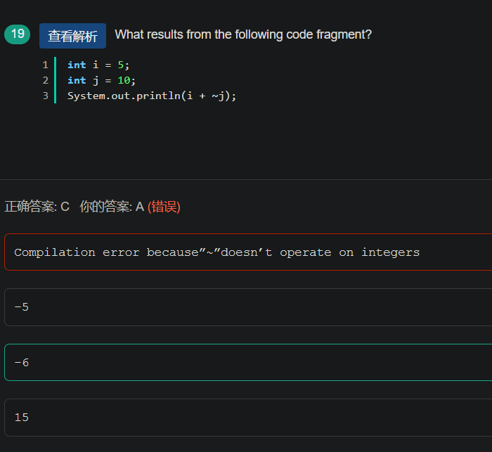
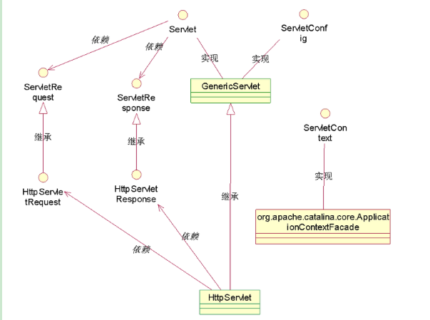
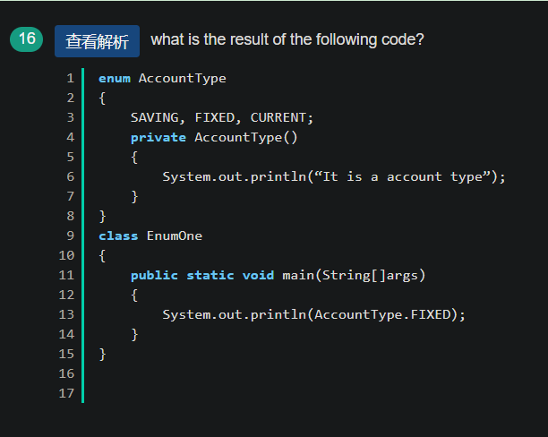

- 

1. 类的加载顺序

- 父类静态代码块（包括静态初始化块，静态属性，但不包括静态方法）
- 子类静态代码块（包括静态初始块，静态属性，但不包括静态方法）
- 父类非静态代码块（包括非静态初始化块，非静态属性）
- 父类构造函数
- 子类非静态代码块（包括非静态初始化块，非静态属性）
- 子类构造函数

注意：先加载静态代码块

选A，start是启动线程对象，使之从新建状态转入就绪状态；sleep让线程睡眠一段时间，在此期间线程不消耗CPU资源；suspend使线程挂起，暂停执行，
如果想恢复线程，必须由其他线程调用 resume方法。

答案：D

A：编译不成功，因为float浮点类型默认是double类型 所以float f=1.0f;（必须加上f 强调定义的是float）此处是精度由高(double)向低(float)转型所以会报错   但是若是float f=1;这里是默认类型是Int 类型  精度由低(int)向高转型(float)不丢失精度不会报错。

***在java中1.0默认为double类型的，此时是double向float转型***

B：this的使用时针对在方法内部使局部变量等值于实例变量而使用的一个关键字，此处的n是静态变量而非实例变量 所以this的调用会出错（试想一下，static本来是全类中可以使用的，是全局的，你非得this去调用，这不是区分局部变量和实例变量的分水线吗？但是此处是全局的，不需要区分）

C：m是实例变量，什么是实例变量：就是需要new 一个对象出来才能使用的，这里直接用类名就调用了，jvm怎么知道m是谁？

D：类变量可以通过类直接调用

 

来自 <https://www.nowcoder.com/test/question/done?tid=30264685&qid=56001#summary> 

​			Interger的范围时[-128,127]，在这个范围内比较大小，相等为true，超过范围为false

 			注意：Integer的取值范围

来自 <https://www.nowcoder.com/test/question/done?tid=30264685&qid=369706#summary

a1*a2结果为int类型，转为byte类型出错

 

来自 <https://www.nowcoder.com/questionTerminal/4cefb62973b149478bedc0ebcdbfb160> 

作者：睡眼惺忪_s

链接：https://www.nowcoder.com/questionTerminal/4cefb62973b149478bedc0ebcdbfb160

来源：牛客网

 

java中如果碰到char、byte和short参与运算时，会自动将这些值转换为int类型然后再进行运算。这里a1和a2就自动转为int类型了，结果也为Int类型。把一个int类型赋值给byte需要转型。

.一个java文件里，public 的类只能出现一个，只能出现一个，只能出现一个，否则，不管你用哪一个类名命名文件名编译器都会报错

2.关于多态。子类继承了父类的所有成员，包括private权限的成员变量，但是继承的子类具有私有变量的拥有权但是没有使用权。

3.private的成员变量，根据权限修饰符的访问控制范围，只有在类内部才能被访问，就算是他的子类，也不能访问。

 

来自 <https://www.nowcoder.com/test/question/done?tid=30264685&qid=56331#summary> 

本题是一个自动拆装箱的考题(自动拆装箱JDK需在1.5上），下面的讨论都不针对新开辟对象的情况：

1、基本型和基本型封装型进行“==”运算符的比较，基本型封装型将会自动拆箱变为基本型后再进行比较，因此Integer(0)会自动拆箱为int类型再进行比较，显然返回true；

2、两个Integer类型进行“==”比较，如果其值在-128至127，那么返回true，否则返回false, 这跟Integer.valueOf()的缓冲对象有关，这里不进行赘述。

3、两个基本型的封装型进行equals()比较，首先equals()会比较类型，如果类型相同，则继续比较值，如果值也相同，返回true

4、基本型封装类型调用equals(),但是参数是基本类型，这时候，先会进行自动装箱，基本型转换为其封装类型，再进行3中的比较。

答案：C

10原码：0000000000000000,0000000000001010；

~10： 1111111111111111,1111111111110101  变为负数，计算机用补码存储

~10反码：10000000000000000,0000000000001010

~10补码：10000000000000000,0000000000001011，等于 -11

故程序结果-6

 

来自 <https://www.nowcoder.com/test/question/done?tid=30264685&qid=7679#summary> 

构造方法每次都是构造出新的对象，不存在多个线程同时读写同一对象中的属性的问题，所以不需要同步 。

***构造函数不需要同步***

如果父类中的某个方法使用了 synchronized关键字，而子类中也覆盖了这个方法，默认情况下子类中的这个方法并不是同步的，必须显示的在子类的这个方法中加上 synchronized关键字才可。当然，也可以在子类中调用父类中相应的方法，这样虽然子类中的方法并不是同步的，但子类调用了父类中的同步方法，也就相当子类方法也同步了。详见：http://blog.csdn.net/welcome000yy/article/details/8941644

接口里面的变量为常量，其实际是 public static final ；接口里面的方法为抽象方法，其实际是public abstract。

14.

来自 <https://www.nowcoder.com/test/question/done?tid=30266154&qid=14929#summary> 

**选****B**

**堆中的内存可以为了新生代和老年代，新生代由可以分为一个****Survivor****和两个****Eden****（****From****，****To****），默认比例****8****：****1****：****1****。**

**其实这个题有问题，从****JDK7****开始，常量池就从方法区中被移了到了堆（****Hotspot****叫做永久代），****JDK8****的时候，永久代被元空间代替。但是这个字符串常量池可是一直都在堆中的。**

**这里先说一下，方法区和永久代只是针对于****HotSpot****而言，在****JDK7****之前是一个概念，对于别的虚拟机而言，可没有什么永久代，只有方法区。**

**为什么****HotSpot****把永久代取消了呢，主要是因为这块地方的****GC****机制和堆邦定在一起，但是因为它不是堆，所以每一个****GC****收集器都需要有很大一部分代码去专门实现这个区域的垃圾，其次，每次一开始为永久代分配内存的时候，因为无法估量对象的大小，所以总是很难分配合适的内存，还容易出现****OOM****，所以取代成了元空间。元空间的话相当于一个内地内存，所以基本不会出现什么****OOM****，但是内存泄漏还是有的**

 

来自 <https://www.nowcoder.com/test/question/done?tid=30267853&qid=112835#summary> 

加载驱动方法

1.Class.forName("com.microsoft.sqlserver.jdbc.SQLServerDriver");

2. DriverManager.registerDriver(new com.mysql.jdbc.Driver());

3.System.setProperty("jdbc.drivers", "com.mysql.jdbc.Driver");

