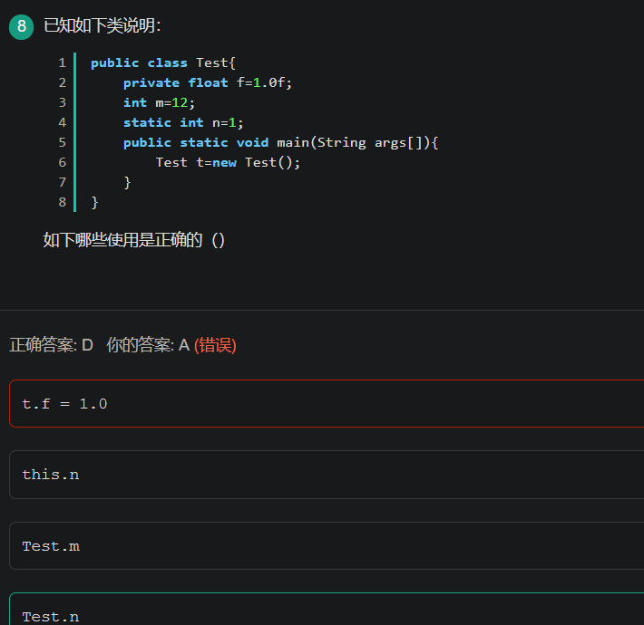

- 

1. 类的加载顺序

- 父类静态代码块（包括静态初始化块，静态属性，但不包括静态方法）
- 子类静态代码块（包括静态初始块，静态属性，但不包括静态方法）
- 父类非静态代码块（包括非静态初始化块，非静态属性）
- 父类构造函数
- 子类非静态代码块（包括非静态初始化块，非静态属性）
- 子类构造函数

注意：先加载静态代码块

选A，start是启动线程对象，使之从新建状态转入就绪状态；sleep让线程睡眠一段时间，在此期间线程不消耗CPU资源；suspend使线程挂起，暂停执行，
如果想恢复线程，必须由其他线程调用 resume方法。

答案：D

A：编译不成功，因为float浮点类型默认是double类型 所以float f=1.0f;（必须加上f 强调定义的是float）此处是精度由高(double)向低(float)转型所以会报错   但是若是float f=1;这里是默认类型是Int 类型  精度由低(int)向高转型(float)不丢失精度不会报错。

***在java中1.0默认为double类型的，此时是double向float转型***

B：this的使用时针对在方法内部使局部变量等值于实例变量而使用的一个关键字，此处的n是静态变量而非实例变量 所以this的调用会出错（试想一下，static本来是全类中可以使用的，是全局的，你非得this去调用，这不是区分局部变量和实例变量的分水线吗？但是此处是全局的，不需要区分）

C：m是实例变量，什么是实例变量：就是需要new 一个对象出来才能使用的，这里直接用类名就调用了，jvm怎么知道m是谁？

D：类变量可以通过类直接调用

 

来自 <https://www.nowcoder.com/test/question/done?tid=30264685&qid=56001#summary> 

​			Interger的范围时[-128,127]，在这个范围内比较大小，相等为true，超过范围为false

 			注意：Integer的取值范围

来自 <https://www.nowcoder.com/test/question/done?tid=30264685&qid=369706#summary

a1*a2结果为int类型，转为byte类型出错

 

来自 <https://www.nowcoder.com/questionTerminal/4cefb62973b149478bedc0ebcdbfb160> 

作者：睡眼惺忪_s

链接：https://www.nowcoder.com/questionTerminal/4cefb62973b149478bedc0ebcdbfb160

来源：牛客网

 

java中如果碰到char、byte和short参与运算时，会自动将这些值转换为int类型然后再进行运算。这里a1和a2就自动转为int类型了，结果也为Int类型。把一个int类型赋值给byte需要转型。

.一个java文件里，public 的类只能出现一个，只能出现一个，只能出现一个，否则，不管你用哪一个类名命名文件名编译器都会报错

2.关于多态。子类继承了父类的所有成员，包括private权限的成员变量，但是继承的子类具有私有变量的拥有权但是没有使用权。

3.private的成员变量，根据权限修饰符的访问控制范围，只有在类内部才能被访问，就算是他的子类，也不能访问。

 

来自 <https://www.nowcoder.com/test/question/done?tid=30264685&qid=56331#summary> 