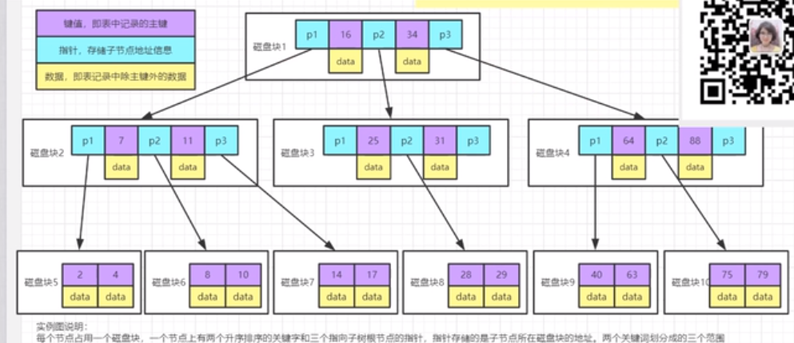
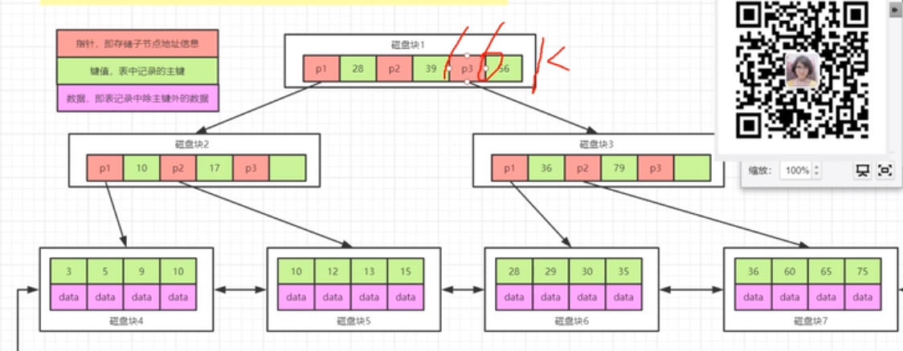
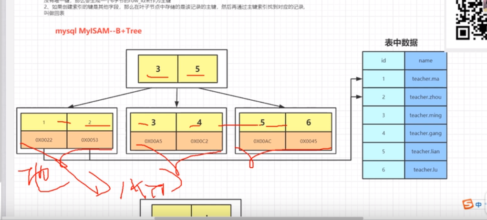
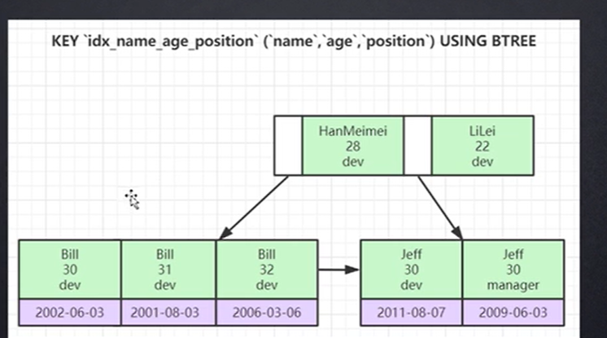
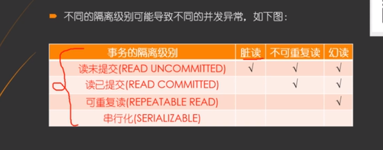
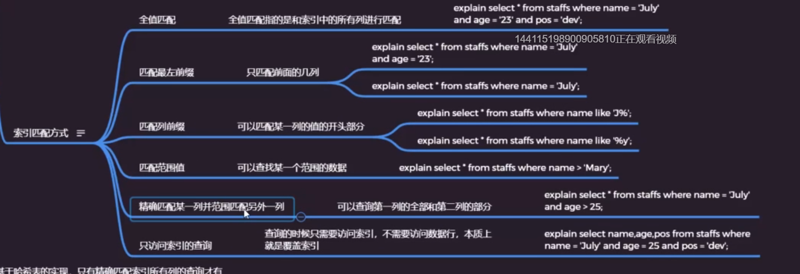

# 基本知识储备

## 局部性原理

在一段时间段中，仅使用其中一小部分（称为空间局部性）或者最近访问过的程序代码和数据很快又被访问的可能性很大（称为时间局部性）

## 磁盘预读

页是存储器的逻辑块，os往往将主存和磁盘存储区分割为连续的大小的相等的块，每个存储块称为一页（页通常为4k）主存和磁盘以页为单位交换数据

# 索引是什么

1. 帮助mysql高效获取数据的数据结构
2. 索引存储在文件系统中
3. 索引的文件存储形式和存储引擎有关
4. 索引文件的结构
   1. hash
   2. 二叉树
   3. b树
   4. b+树

bst（二叉树搜索树）插入时保持树平衡

在递增的情况下变成链表

avl树通过左右旋转进行平衡

红黑树（二叉树平衡）

# b树

# b+树

b+树的区别是只把数据放在叶子节点上面

对b+树进行两种查找运算，一种是对主键的范围查找和分页查找，另外是从根节点开始进行随机查找

# 聚集索引

innodb如果有主键，主键当索引，如果没主键选取非空唯一字段，没非空字段自动生成6B的rowid# 

# 非聚集索引

是指myisamdb的索引文件和数据文件分开存储，myisamdb节点存储的是地址而不是数据

# 回表

当查询辅助索引和二级索引的时候，需要二级索引先查询到主键，在根据主键的数据值到主键索引进行查找

select id from table where name=ma不需要回表叫索引覆盖

select * from table where name=ma要回表

# 联合索引

where name=？and age=？

给name和age添加一个索引（name，age）

如果索引列包含的是多个列，那么就称之为联合索引

# 最左匹配

在包含多个的查询过程中，会依靠先查第一列，在查第二列

where name=？and age=？

where name=？

where age=？不走组合索引，不走name他取不到age

where age=？and name=？这条会根据mysql的优化，变成（name，age）

# 索引下推icp

using index conditon

name,age

 	1. 不使用索引下推的话
      	1. 先根据name列的值把所有的数据都拉到server层，再server层对age做过滤
	2. 使用索引下推
        	1. 根据name，age两个字段把满足要求的数据拉取到server层，取出对应的数据

## 谓词下推：

select t1.name ,t2.name from t1 join t2 on t1.id =t2.id

1. 先将两个表按照id字段进行拼接，完成之后再取出name
2. 把所有需要的列都拿出来，然后再拼接

# MRR

回表：先根据普通索引查询到主键值，根据主键值去索引拉取需要的整行数据

根据name查询id之后，id是否有序，无序，根据无序的一个列表去主键b+树上查找数据，随机查找

mrr:当返回无序id之后，先排序找查

# MVCC mult version concurrcy controll (多版本控制)

mysql的隔离级别

---

# 索引的好处

1. 快速查找匹配where子句的行
2. 从cosideration中消除行，如果可以再多个索引之间进行选择mysql通常会找到最少的行索引
3. 如果表具有多列索引，则优化器可以使用索引的任何最左前缀来查找行
4. 当有表链接的时候，从其他表检索行数据
5. 查找特定索引列的min或max值
6. 如果排序或分组时可用索引的最左匹配完成的，则对表进行排序和分组
7. 在某些情况下，可以优化查询以检索值而无需查询数据行

# 索引分类

1. 主键索引
2. 唯一索引
3. 普通索引
4. 全文索引
5. 组合索引

# 索引匹配方式

1. 全值匹配
2. 匹配最左前缀
3. 匹配列前缀
4. 匹配范围值
5. 精确匹配某一列并范围匹配另一列
6. 只访问索引查询

