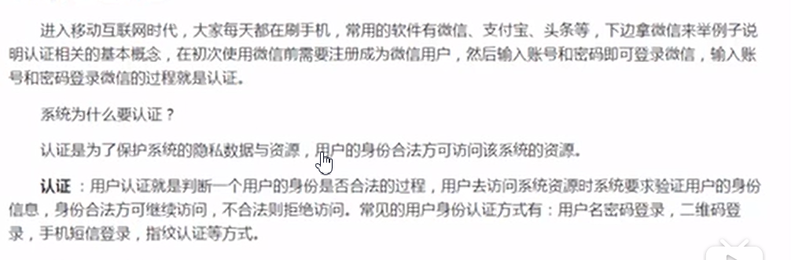
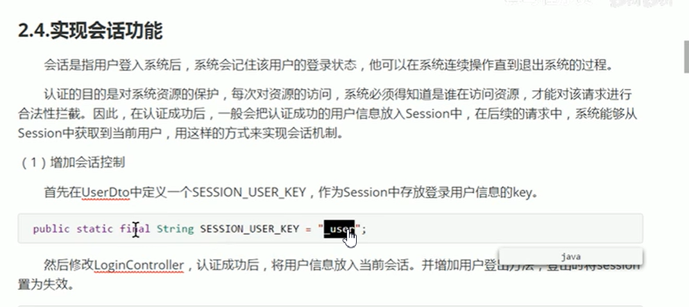
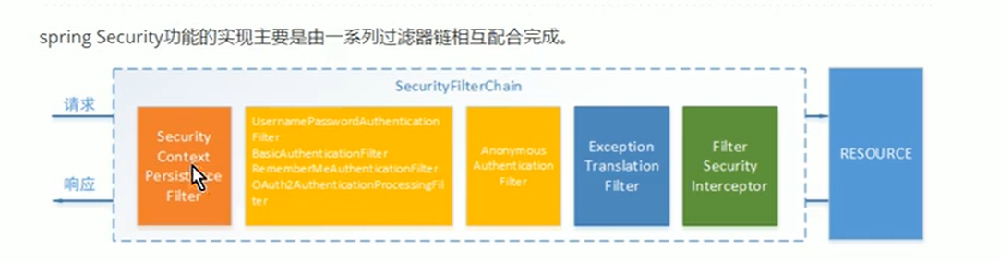

 # spring security oauth2.0认证授权

## 基本概念

### 1.1什么是认证

### 1.2什么是会话

用户认证通过后，为了避免用户的每次操作都进行认证可将用户的信息保证会话。会话就是系统为了保持当前用户的登录状态所提供的机制，常见的有基于session方式、基于token方式等

 

# 什么是授权

 

 

  

 

# 1.3RBAC

## 1.3.1基于角色的访问控制

 # 基于session的认证方式

# 2.4实现会话功能 

# spring security 快速上手

# 工作原理

# 授权流程

