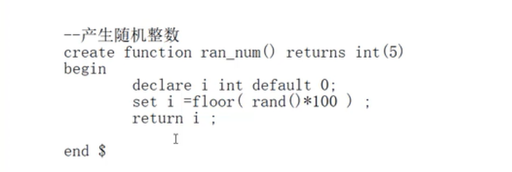

# sql优化

解析过程

from  on join where group by having select distinct order by 

https://www.cnblogs.com/annsshadow/p/5037667.html

mysql逻辑分层：连接层 服务层、引擎层。存储层

Innodb：事务优先（行锁）

myIsam：性能优先（表锁）

https://www.cnblogs.com/vianzhang/p/7922426.html

# sql性能问题

+ 分析sql的执行计划：explain，可以模拟sql优化器执行sql语句

id：编号

select_type:查询类型

table：表

possible_keys：预测用到的索引

key：实际使用的索引

key_len:实际使用的索引

ref:表之间的引用

rows:通过索引查询到的数据量

extra:额外的信息

id：id值相同，从上往下，顺序执行

表的执行顺序，因数量的个数改变而改变的原因：笛卡尔积

id值有相同，又有不同，id值越大越优先，id值相同，从上往下，顺序执行

select_type:

+ primary:包含子查询sql中的主查询（最外层）
+ subquery：包含子查询sql中的子查询（非最外层）
+ simple：简单查询
+ derived：衍生查询（使用临时表）
  + 在from子查询中只有一张表
  + 在from子查询中，如果有table union table2 则table 就是derived，table2就是union
  + union result：告知开发人员，哪些表之间存在union

## type

system》const》eq_ref>ref>range>index>all

其中system，const只是理想情况，实际能达到ref》range

system（忽略）只有一条数据的系统表，或衍生表只有一条数据的主查询

const：仅仅能查到一条数据的sql，用于primarykey 或unique索引

eq_ref:唯一性索引，对于每个索引键的查询，返回匹配唯一行数据（有且只有一个，不能多，不能为0）

ref：非唯一性索引，对于每个索引键的查询，返回匹配的所有行（0，多）

range：检索指定范围的行，where 后面是一个范围查询（between ，in ，>,<,>=）in 有时候会失效，从而转为无索引变为all

index：查询全部索引的数据

all：查询全部表中的数据

system/const：结果只有一条数据

eq_ref：结果多条，但是每条数据是唯一的

ref：结果多条，但是每条数据是0或多条

## possible_keys

可能用到的索引，是一种预测，

## key

实际使用到的索引

## key_len

索引的长度，作用：用于判断复合索引是否完全使用（a，b,c）

如果索引字段可以为null ，则会使用一个字节用于标识

如果索引字段为varchar，则用两个字节标识

# ref

注意与type中的ref值区分

作用：指明当前表中所参照字段

## rows

被索引优化查询的数据个数

## extra

using filesort ：性能消耗大，需要额外的一次排序（查询）

小结：对于单索引，如果排序和查找是同一个字段，则不会出现using filesort，如果排序和查找是不是同一个字段，则会出现using filesort

using temporary：性能损耗大，用到临时表，一般出现在groupby

using index 性能提升，索引覆盖（覆盖索引）原因：不读取源文件，只从索引文件中获取数据（不需要回表）

只要使用到的列全部都在索引中，就是索引覆盖

如果用到了索引覆盖（using index）会对possible_keys和key造成影响：

+ 如果没有where，则索引只出现在key中
+ 如果有where，则索引出现在key和possible_keys中

using where（需要回表查询）

using join buffer：extra中的选项，作用：mysql引擎使用了连接缓存

假设age是索引列

但查询语句select age，name from where age=，此语句中必须回原表查name

impossible where ：where子句一直未false

## 复合索引

小结：避免：where和order by 按照复合索引的顺序使用，不要跨列或无序使用

# 例子

如果（a,b,c,d）复合索引和使用的顺序全部一致，则复合索引全部使用

where 和order by 拼起来，不要跨列使用

## 两表优化

+ 小表驱动大表，把数据量大的表放右边
+ 索引建立在经常使用的字段上
+ 一般情况对于左外连接，给左表加索引，右外连接，给右表加索引

## 避免索引失效的一些原则

+ 复合索引，不要跨列或无序使用（最佳左前缀）
+ 复合索引，尽量使用全索引匹配
+ 不要在索引上进行任何操作（计算、函数、类型转换）
+ 复合索引不能使用不等（！= 《》）或is null (is not null )否则自身及右侧索引全部失效，包括大小于（概率出现）
+ like尽量以常量开头，不要以%开头，否则索引失效，如果必须使用like ‘%x%’ 进行模糊查询，可以使用索引覆盖
+ 尽量不要使用类型转换（显示、隐示）否则索引失效
+ 尽量不要使用or，否则索引失效，将全部索引失效

# 概率事件

原因是服务层中有sql优化器，可能会影响我们的优化

# 一些其他优化方法

## exist和in

如果主查询的数据集大，则使用in

如果子查询的数据集大，则使用Exist

exist语法：将主查询的结果，放到自查需检验中进行条件校验（是否有数据，有数据则成功），如果符合条件，就保留数据

order by 优化

using filesort 有两种算法:双路排序、单路排序（根据io的次数）

mysql4.1之前双路排序（1.从磁盘读取排序字段（在buffer中进行的排序），2.扫描其他字段）

mysql4.1之后默认使用单路排序：制度去一次（全部字段）在buffer中进行排序，（不一定是一次io可能多次io），如果数据量特别大，则无法将所有字段的数据一次读取完毕，因此会进行“分片读取，多次读取”

注意：单路排序比双路排序会占用更多buffer，单路排序在使用时，如果数据大，可以考虑调大buffer的容量大小。set max_length_forsort_data=1024,单位byte，如果buffer太低，则mysql会自动从单路-》双路

## 提高order by查询的方法

+ 选择使用单路、双路：调整buffer的容量大小；
+ 避免select * 。。。，select a,b,c,d.....
+ 复合索引不要跨列使用，避免using filesort
+ 保证全部的排序字段，排序的一致性（都是升序或降序）

# sql排序

慢查询日志：mysql提供的一种日志记录，用于记录mysql响应时间超过阈值的sql

show variables like '%slow_query_log%'

临时开启：set global showe_query_log=1

永久开启：/etc/my.cnf中追加配置

查看阈值时间：show variables like '%long_query_time%'

临时设置阈值：set global long_query_time=5

查询超过阈值的sql：show global status like '%slow_queries%'

## 通过mysqldumpslow工具查看慢sql

nysqldumpslow --help

s:排序方式

r:逆序

l：锁定时间

g:正则匹配模式

# 分析海量数据

a.模拟海量数据，存储过程/存储函数

create function randstring

# 全局查询日志：记录开启之后的全部sql语句

  

# 锁机制

解决因资源共享，而造成的并发问题

## 分类：

操作类型：

+ 读锁（共享锁）
+ 写锁（互斥锁）：无法进行读锁和写锁

操作范围

+ 表锁
+ 行锁
+ 页锁

会话0给a表加了锁，其他会话的操作

+ 可以对其他表进行读写操作
+ 对a表可以读，写一直等待

## 写锁

会话0可以对加了写锁的表，进行任何操作（增删改查）但不能操作其他表

其他会话：要等待会话0释放写锁，

#  分析表锁定

查看哪些表加了锁：show open tables ;1代表被加了锁

show status like '%table%';

table_locks_immediate:即可能获取到的锁数

table_locks_waited:需要等待的表锁数

Table_locks_immediate/Table_locks_waited>5000建议采用innodb

# 行锁

+ 如果没有索引，则行锁会转为表锁
+ 行锁的一种特殊情况：间隙锁，值在范围内，但不存在

通过for update 都select语句进行加锁