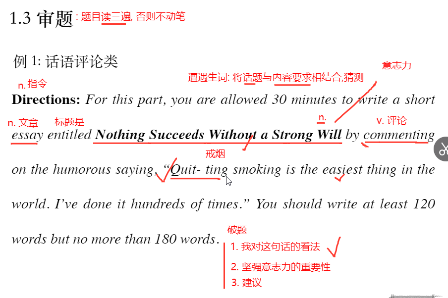
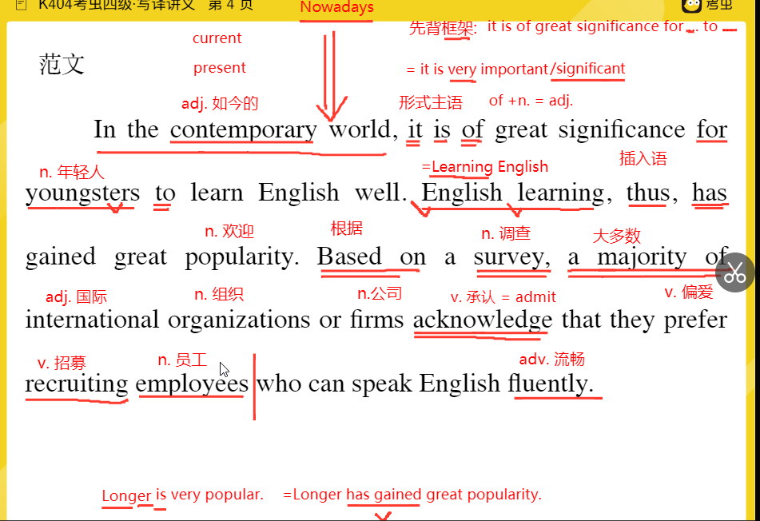
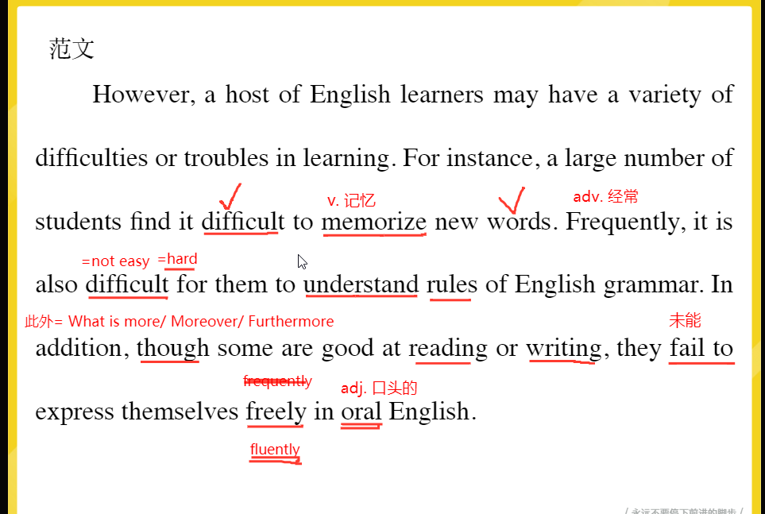
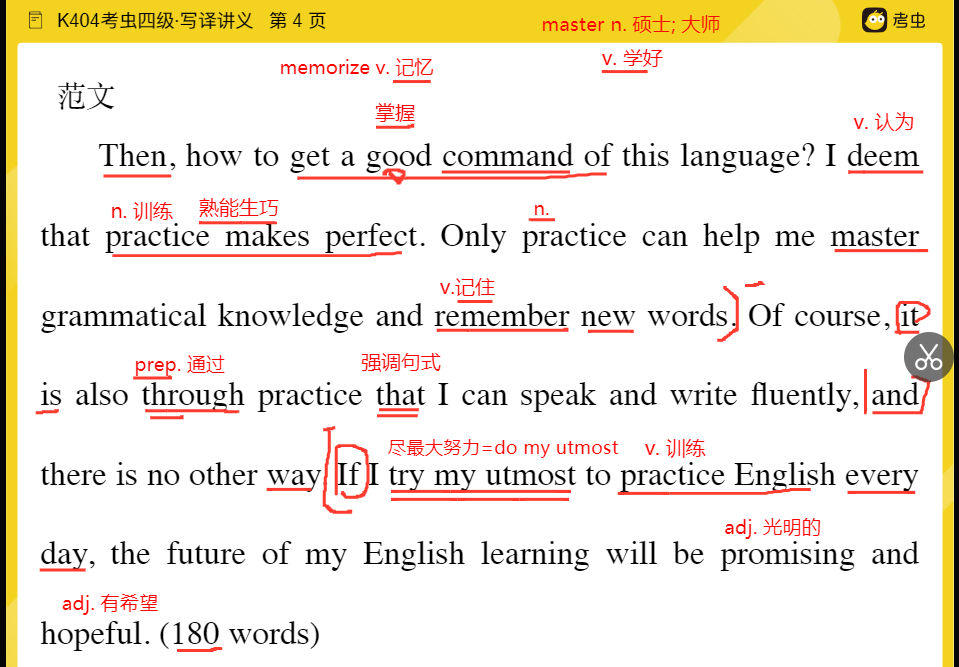
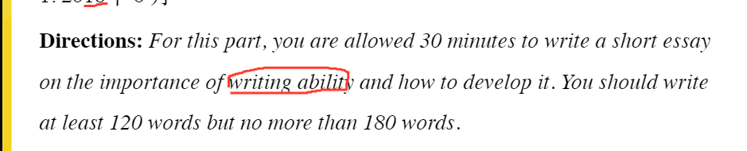
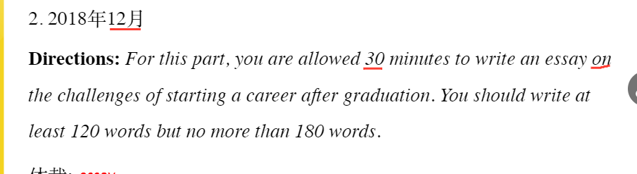

# 第一节立体化审题

作文题在命题时采用的形式包括提纲、情景、图画、图表

 # 救命作文

1. in the contemporary如今的
2. it is of  great significance for youngsters to do sth=it is very important/significant
3. thus ,插入语
4. popularity=sb has gained great popularity
5. base on 根据
6.  a majority of 大多数
7. international organizations 
8. acknowledge 承认

 

1. a host of =a lot of= a great many 
2. a variety of = various 大量的
3. difficulties or troubles 苦难
4. for instance 例如 for example
5. a large number of= quantity
6. sb find it +adj to do sth 
7. memorize 记忆
8. frequently 经常
9. it is also diffcult for them
10. in addition= what is more /moreover/furthermore另外
11. fail to 未能
12. oral 口头的

1. then 
2. how to get a good command of 掌握
3. i deem 我坚信
4. practice 训练
5. master 掌握
6. through 通过 
7. it is also through practice that 强调句
8. try my utmost to 尽最大努力=do my utmost
9. promising 光明的
10. hopeful

# 背作文的方法七步法

1. 抄写英文
2. 英译汉
3. 汉译英
4. 对比找差别
5. 有针对性地写出错或差异之处
6. 背写全文到没有错误
7. 思考每句话如何用来写其他话题
8. 有点道理

# 课后作业

