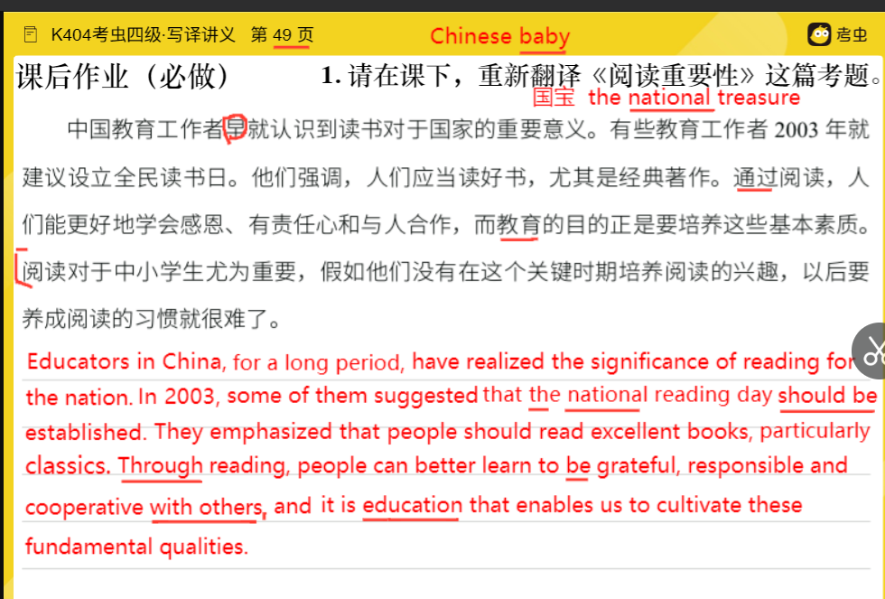

中国教育工作者早就认识到读书对于国家的重要意义

for a long period，educators in China have recognized the significance of reading for the nation

有些教育工作者2003年就建议设立全民读书日

some educators were adviced all people reading in 2003

in 2003,some of them suggested that the national reading day should be founded /set up /established

他们强调，人们应当读好书，尤其是经典著作

they think people should read good book ,especialy speical book 

they emphasized that people should read good/excellent books ,particularly  classics works

Through reading ,people could better learn to be grateful,responsible and cooperative,and the purpose of education is to cultivate these basic qualities.

 

reading is  important for the middle of students，if they train  

---

reading is especially important for students in middle and primary schools，reading is of great importance/significant ，since if  cannot foster the interest in reading during this key period ，it will be very difficult for them to develop the habit of reading in future。

