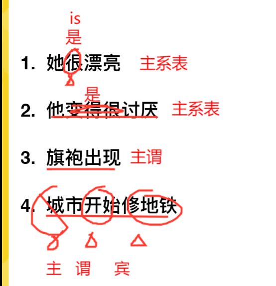
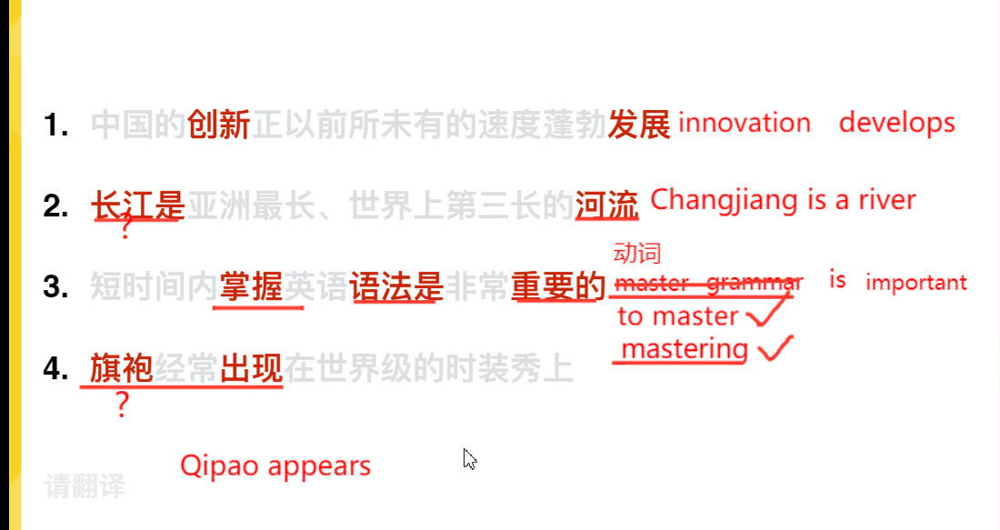
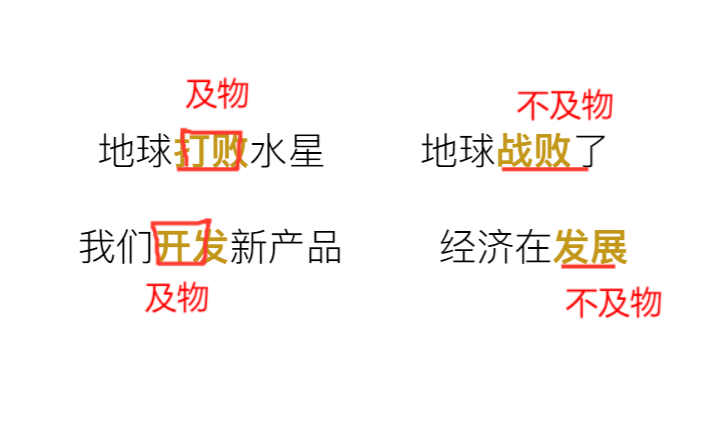
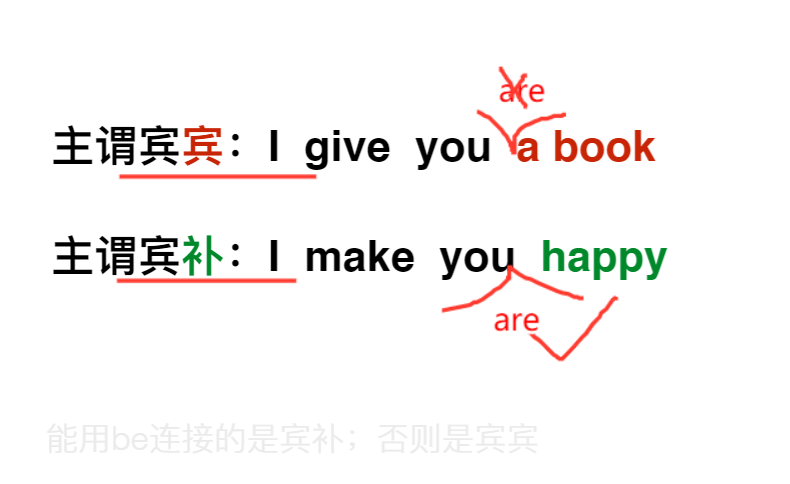
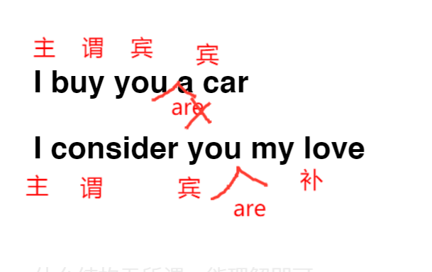

# 英汉语法差异

## 三大基本结构

### 主谓宾

我爱你，i love you ，i am loving you，i can love you

### 主系表

我是老师，i am not Madame bovary

### 主谓

我跑，you cry ，you walk 

# 练习

# 动词

## 实义动词

### 及物动词、

stop sucking your thumb 停止吮吸你的指头

### 不及物动词

he sucks不及物动词，他很差劲

## 系动词（能用be替换）

for example:

1. she become beautiful=she is beautiful
2. the music sounds nice=the music is nice

## 助词

### 时态

will

never mind,i will find someone like you

### 情态

can  should 

i should wish nothing but the best for you

### 否定

dont didnot

dont forget me

# 三 大特殊结构

  ## 主谓宾宾 

i give you ***<u>a book***</u>

## 主谓宾补

i make you ***happy*** =i make you are happy

# 强调句

例句：

Brother zhuo  is singing in the swimming pool

## 强调主语

it is brother zhuo who is singing in the swimming pool

## 强调状语

it is in the swimming pool that brother zhuo is singing  

# 语法工具

英语语法网

linggle.com

thesaurus.com

