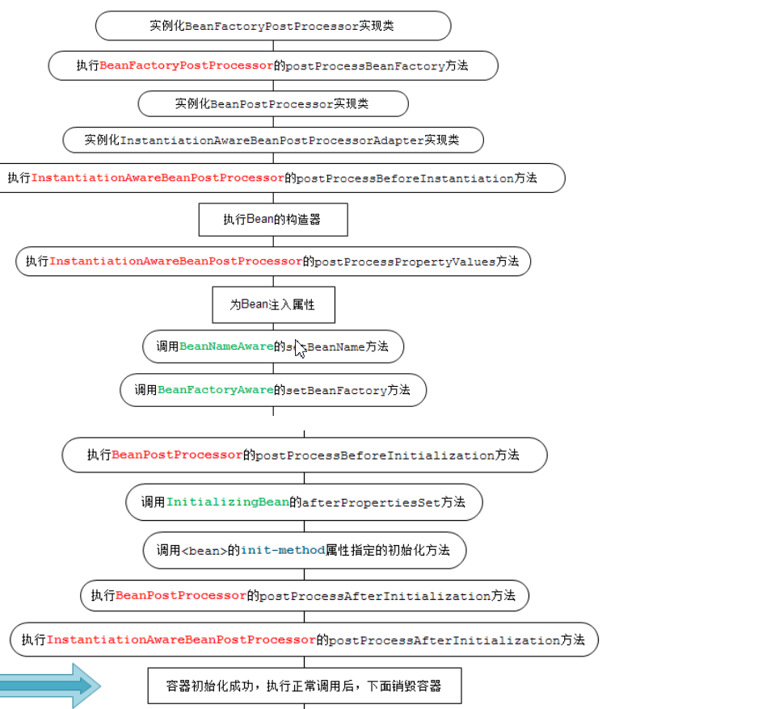

# SSM简答题

## 请简述Spring框架的优点

1. 使用SpringIOC容器，将对象之间依赖关系交给Spring

，降低组件的耦合性，让我们更专注于应用逻辑

2.  可以提供众多服务，事务管理，ws等。

3. aop的很好支持，方便面向编程。

4. Spring di机制降低了业务对对象替换的复杂性

5. Spring属于低侵入，代码污染极低

6. Spring的高度可开放性，并不强制依赖于Spring，开发者可以自由选择Spring部分或全部分

   ## 请简述什么是Spring的IOC和di

   IOC（控制反转）：所谓控制反转就是把对象（bean）对象和维护对象之间的权利转移 到Spring容器中去了（applicationContext.xml）儿程序本身不在维护了

   di（依赖注入）实际上di和IOC是同一个概念，因为在ApplicationContext.xml配置文件中bean和bean之间通过ref来维护的时候是相互依赖的，所以叫做依赖注入 

## 请简述Bean的生命周期

1. 根据配置情况调用Bean构造方法或工厂方法实例化Bean 
2. 利用依赖 注入完成Bean中的属性值的配置注入
3. 如果Bean实现了BeanNameAware接口，则Spring调用setBeanName()方法传入当前Bean的ID值
4. 如果Bean实现了BeanFactoryAware接口，则Spring调用setBeanFactory（）方法传入当前工厂实例的引用。
5. 如果Bean实现了ApplicationContextAware接口，则 Spring调用setApplicationContext（）方法传入当前ApplicationContext的实例的引用
6. 如果BeanPostProcssor和Bean关联，则Spring 将调用接口的预初始化方法postProcessBeforeInitialzation（）对bean进行加工操作，这个非常重要，Spring的aop就是用它来实现的

## 请简述Bean的集中装配方法的基本用法

1. 基于xml的装配

   bean类必须提供一个默认的无参构造方法

   bean类必须为需要注入的属性提供的setter方法

   2. 基于注解的装配

   3. 自动装配

      ## 请列举你所知道Aop专业术语并解释

      

通知，连接点，切入点，切面，引用，目标 ，代理，织入

## 请列举你 所知道的Spring的通知类型并解释

before   前置

after      后置

around  环绕

throws  抛出异常

## 请简述Spring jdbc 是如何进行配置的

## 请简述MyBatis框架与Hibernate框架的区别

hibernate开发中，sql语句已经被封装，直接可以使用，加快系统开发； 

Mybatis 属于半自动化，sql需要手工完成，稍微繁琐； 

 Hibernate 自动生成sql,有些语句较为繁琐，会多消耗一些性能；
   Mybatis 手动编写sql，可以避免不需要的查询，提高系统性能；

## 请简述Mybatis的工作流程

1. 读取Mybatis配置文件mybatis-config.xml
2. 加载映射文件Mapper.xml
3. 构造会话工厂
4. 创建SqlSession对象
5. Mybatis低层定义了一个Executor接口来操作数据库
6. 在executor接口执行方法中，包含MapperStatement类型的参数
7. 输入参数映射
8. 输出结果映射

## 请简述Mybatis核心对象 sqlsessionFactory获取的方法

## 请简述Mybatis映射文件的主要元素及其作用

## 请简述@Controller注解的使用步骤

1. 在配置文件的声明中引入Spring-context
2. 使用<contexta:compent-scan>元素指定需要扫描的类包

## 请简述简单数据类型中的@RequestParam注解及其属性作用

## 请简述包装pojo类型绑定时的注意事项

## 请简述静态资源访问的几种配置方式

