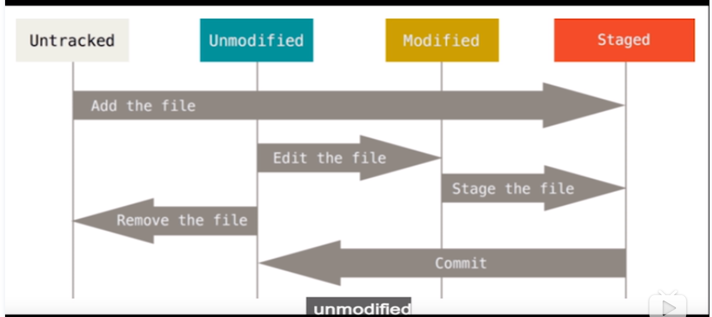
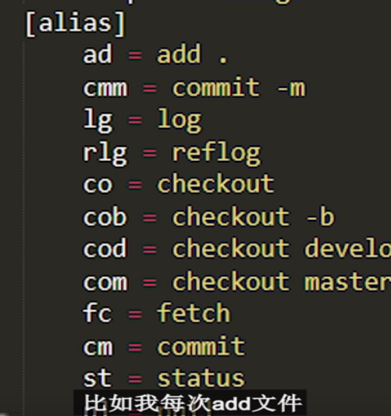

git status 查看当前文件信息

git add . /文件名 把文件加入暂存区

git  commit -m '***'  对变更文件进行描述

git log 可以查看提交记录

git reset <filename> 在git commit 之前把变绿的文件变红

# 文件的状态

新建文件时处于untracked的状态

Git add后变成staged

git commit后变成unmodified状态

已经git commit过的文件为modified

git 可以进行别名设置，alias

git reset <commitid>可以回退到指定的commitid上

git reflog 查看全部的提交记录

# git reset 的参数

# 分支

git checkout -b <name> <template> 新建分支

git checkout 分支名 ,回到指定分支名

git branch 查看所有的分支

git  merge <branchName>合并分支的变更

git rebase

