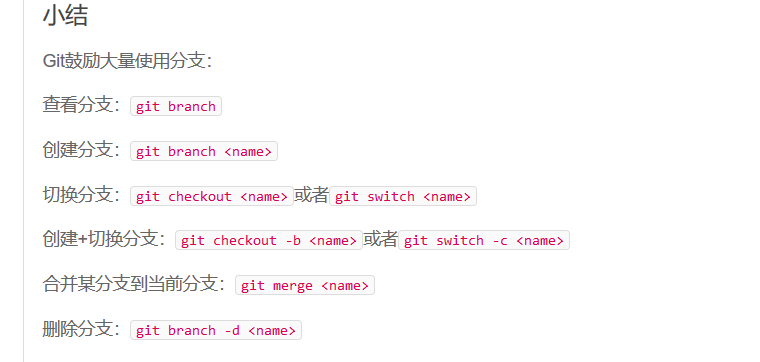
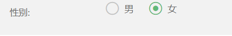
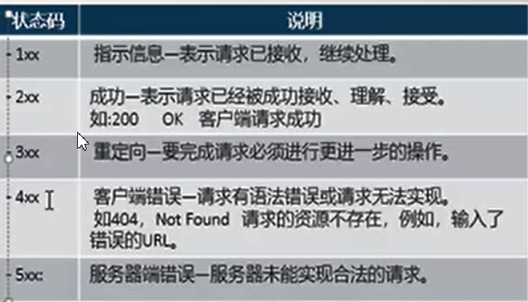
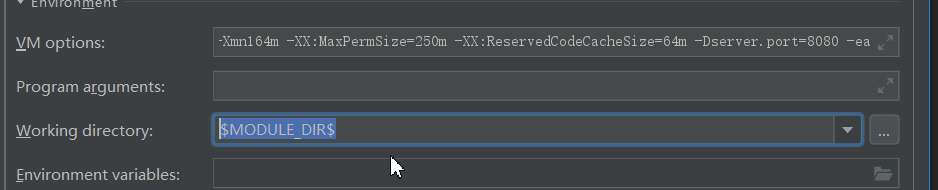

# 什么是dispaly：inline-block


<a herf="https://www.cnblogs.com/Ry-yuan/p/6848197.html">连接</a>

# Git仓库的合并

+ git merge <name>



# 两个json合并

一，保存object1和2合并后产生新对象，若2中有与1相同的key，默认2将会覆盖1的值

```
`var` `object = $.extend({}, object1, object2);`
```

  二，将2的值合并到1，同key时 默认2将会覆盖1的值

```
`// Merge object2 into object1``$.extend( object1, object2 );`
```

 三，将2的值合并到1，设置递归为true， 同key时 将进行递归合并

```
`// Merge object2 into object1``$.extend( ``true``, object1, object2 );`
```

# # 当写入的id为null，但要用id时

在xml文件中加入

```xml
<selectKey keyProperty="id" resultType="Integer" order="BEFORE">
           select if(max(id) is null,1,max(id)+1) as newId from person
  </selectKey>
```

# js修改layui中的单选框的选中事件



```javascript
var  radio=document.getElementsByName("sex");
              console.log(radio);
              var radioLength=radio.length;
              for(var i=0;i<radioLength;i++){
                  if(data.sex==radio[1].value){
                      $(radio[i]).next().click();
                  }
              }
```

参考：https://blog.csdn.net/h1173756970/article/details/85158227

# 给多个标签循环绑定事件并清除其他标签的样式


```JavaScript
 var imgs=document.getElementById("imgs").childNodes;
              for (var i=0;i<imgs.length;i++){

                    imgs[i].onclick=function () {
                    /*this.style.border='2px solid red';*/
                        var this1=this;
                        /*加样式时给其他标签清除样式*/
                        $(this).siblings('img').removeClass('style_img');
                        $(this1).toggleClass("style_img");
                    }
              }
```

# js无法给动态标签绑定事件

参考：https://blog.csdn.net/applek_case/article/details/78698187

# http响应协议的状态码




# mysql建数据库的字符集与排序说明

**一般选择utf8.下面介绍一下utf8与utfmb4的区别。**

utf8mb4兼容utf8，且比utf8能表示更多的字符。至于什么时候用，看你的做什么项目了，到http://blog.csdn.net/leelyliu/article/details/52879685看unicode编码区从1 ～ 126就属于传统utf8区，当然utf8mb4也兼容这个区，126行以下就是utf8mb4扩充区，什么时候你需要存储那些字符，你才用utf8mb4,否则只是浪费空间。

排序一般分为两种：utf_bin和utf_general_ci

bin 是二进制, a 和 A 会别区别对待.

例如你运行:

SELECT * FROM table WHERE txt = 'a'

那么在utf8_bin中你就找不到 txt = 'A' 的那一行, 而 utf8_general_ci 则可以.

utf8_general_ci 不区分大小写，这个你在注册用户名和邮箱的时候就要使用。

utf8_general_cs 区分大小写，如果用户名和邮箱用这个 就会照成不良后果

utf8_bin:字符串每个字符串用二进制数据编译存储。 区分大小写，而且可以存二进制的内容

utf8_unicode_ci和utf8_general_ci对中、英文来说没有实质的差别。

utf8_general_ci校对速度快，但准确度稍差。（准确度够用，一般建库选择这个）

utf8_unicode_ci准确度高，但校对速度稍慢。

参考：https://blog.csdn.net/qq_38224812/article/details/80745868

# springboot调试参数设置

-Xms512m -Xmx512m -Xmn164m -XX:MaxPermSize=250m -XX:ReservedCodeCacheSize=64m -Dserver.port=8080 -ea

$MODULE_DIR$

