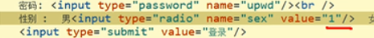
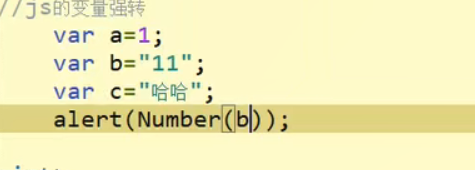
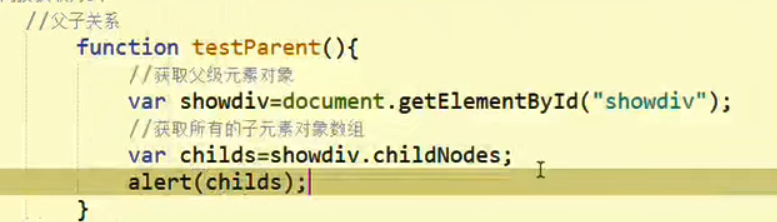
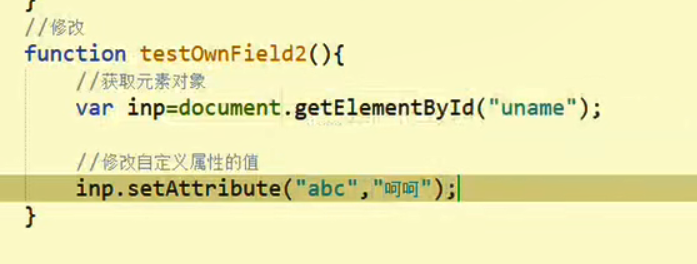
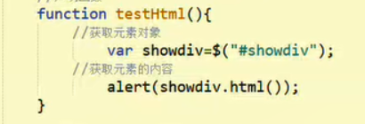

# html学习

## html的概念

概念：html：超文本标记语言

作用：

需要将java在后台根据用户请求处理的请求结果在浏览器中显示给用户

在浏览器中数据需要友好的格式呈现给用户

html是告诉浏览器接收的数据使用什么样的数据组织形式进行显示

使用：

## html的三大基石

URL：统一资源定位符（唯一的定位网络资源）

HTTP：超文本传输协议（规范浏览器和服务器之间数据交互的格式）

HTML：超文本标记语言（有效的组织数据在浏览器的显示）

文档声明：

.html,.htm

标准的文档结构：

## html的头标签

<head></head>
<meta charset="utf-8">
</meta>设置中文字符html5之前的设定

<meta http-equiv=“content-type” content="text/html";charset="utf-8"/>

h4之前的写法

提升搜索引擎的搜索

<meta name="keyword" content=""/>
网页关键字

<meta name="description" content=""/>
网页描述

<meta name="author" content=""/>
作者的描述

<meta http-equiv="refresh" content="5";url="http://www.baidu.com"/>

五秒后自动跳转到指定的网页

其他标签：

例如：css引入标签和js引入标签

 

## html的主题标签

### 标题标签：

h1到h6：会将其中的数据加粗加黑显示，并且依次减小，标题标签自带换行标签

属性：

align：center left right

### 水平线标签

hr会在页面上显示水平线

属性:

width=“600px” 设置水平线的宽度

size=“20px” 设置水平线的高度

color=“red” 设置颜色

align=“left” 设置位置 水平线默认据中

像素单位占据的是电脑屏幕的大小，百分比占据的是浏览器的大小

### 段落标签

p:会将一段内容换行，主要是进行css和js操作是比较方便

特点：会自动换行块级元素，段间距比较大

### 换行符

br：告诉浏览器在此换行

### 空格符

$nbsp（牛逼视频）

### 权重标签

b：加黑显示

i：将内容斜体显示

u：字体的下划线

del：增加中划线

可以嵌套使用

### 列表标签

ul 代表列表

li 代表列表的一行，默认数据前有一个黑圆圈符号

ol：有序列表，默认以一二三开头

属性：

type=“a” 可以以abc开头，A以大写开头，I以罗马数字开头

dl：

dt

dd：

### body标签（文本标签学习）

### 标题标签：

从h1到h6共六个标签，显示级别依次减小，会自动换行

使用align属性可以调整显示位置

### 水平线

hr

### 段落标签

br p

### 换行符

### 空格符

## html的图片标签

图片标签img

路径：相对路径：从当前文件查找别的一个文件经过的路径

结对路径：从根盘符出发所查找文件的路径

属性：

width：设置图片的宽度，如果是单独设置，则在图片不失真的情况下自动缩小，单位可以是px或百分比

height：设置图片的高度

图片是自动换行的（行内元素）

使用网络资源

ait：当图片显示不出来是显示出信息

title：图片标题，鼠标放在图片上时候会显示出标题

## html的超链接

a:超链接的标签

href：要跳转的网页资源路径

本地资源：相对路径

网络资源：网络资源的url

 

---

target=“_blank”表示在新标签页中打开

指明要跳转的网页资源显示的位置

_self 在当前页中刷新显示

_blank 在新的标签中显示

_top 在顶层页面中显示

_parent 在父级页面中显示

注意：超链接中一定要声明访问方式，访问方式可以是文字和图片

 ### 锚点学习

当前网页中自己跳转

第一步：先把网页撑开

第二步：

使用：先使用超链接在指定的网页位置中加锚点，格式为：

<a name="锚点名"/>

然后在指定的位置使用a标签可以跳转到指定的锚点，达到网页中内部资源的跳转的目的格式：

<a href="#锚点名"/>

刷新网页，相当自动回到顶部

## html的表格标签

table： 声明一个表格

tr:行，设置行高一行全部都这么高

td：列默认居左显示

th：声明一个单元格，表头格默认居中加黑显示

属性：

border：边框的大小

width：宽度

height：高度

cellpadding=“0”内容离边框的大小

cellspacing=“0”边框的大小

特点：默认数据的多少使用表格的大小的显示

按回车一键生成表格

### 表格合并

合哪行哪行就要删哪行

## html的内嵌和框架

内嵌标签：

### iframe

src：要显示的网页资源的路劲

注意：

默认打开当前打开得及加载src指向的资源

a标签指定的网站到iframe中显示

作用：

在当前网页中加载其他网页的资源，达到不同网页资源之间不相互干扰，并能在同一个网页中显示

name：设置内嵌区域的名字，结合超链接标签的target属性使用

### frameset

注意：

第一步：一定要删除body标签

框架学习

framset：rows：按照 行进行切分页面

cols：按照列进行拆分 

子标签：

frame：进行切分区的占位，一个frame可以被单独加载网页资源

src：本地或网络资源

## html的表单

form：表单标签的学习

作用:收集并提交用户数据给指定服务器

注意form标签会收集标签内部的数据

属性：

Action：收集的数据提交地址也就是URL

method：收集的数据提交方式

get：适合小量的数据

post：适合大量的数据，kan

注意2：表单数据的提交，要提交的数据项里必须要有name属性，否则不会提交

提交的表单数据为键值对，键为name的值，值为用户书写的数据

注意3：form表单的数据的提交要依赖于submit提交数据

当属性为text，value的属性为默认值

type=“radio”为单选框name必须是同一个数据提交的是value值

多选框：

input：

​	type：

​		CheckBox：

name：一个多选值需要使用相同的name属性值

value：要提交的数据

checked：使用此属性的多选框是默认选择状态

下拉框：

select

name：数据提交的键名，必须声明

子标签：option：表示一个下拉选项

value：要提交的数据

文本域：

textarea：声明一个可以书写大量文字的文本域

name：数据提交的键名，js，css也会使用

rows：声明文本的行数

cols：声明文本域的列数

普通标签

input：

​	type：

button：

隐藏标签：

input

type

hidden

name

value

# css的学习

## 为什么要使用css

问题一：

## 什么是css

## 使用css

### css的声明

1. 在head标签中使用style标签的声明

   作用：此声明一般当前网页的公共的样式或者单独样式

2. 在标签上使用style属性进行声明

    作用：此声明会将css样式直接作用于当前标签

   3.   在head标签中使用link标签引入外部声明好的css文件

       作用：此声明相当于声明，解决了不同网页中样式重复使用的问题

      一次声明到处使用

   4.如果css的声明都在head标签中，则遵循就近原则，谁离标签近，谁就会显示

   

   

CSS的选择器

### 标签选择器：

标签名｛样式名1：样式值1；。。。。。｝

### id选择器

#标签的ID属性值｛样式名1，样式值1；。。。。。。｝

作用：给指定的标签添加指定的样式

作用：会将当前网页内的所有标签增加相同标签

### 类选择器

.类选择器名｛样式名1，样式值1；。。。。｝

作用：给不同的标签添加相同的样式

### 全部选择器

*｛样式名1，样式值1；。。。｝

作用选择所用的html标签，并添加相同的样式

  

### 组合选择器：

选择器1，选择器二。。。。。｛样式名1，样式值1；。。。｝

作用：解决不同的选择器之间重复的样式

### 子标签选择器

选择器1 子标签选择器｛样式名1，样式值1；。。。｝

属性：

ul标签中的li标签中a标签使用该样式

### 属性选择器

标签名[属性名=属性值]｛样式名1，样式值1；。。。｝

作用：选择标签指定具备属性并且属性值为属性值的标签

### css使用的过程

1.声明 css的代码域

2.使用选择器选择要添加的标签

根据需求来

​		使用*选择器给整个页面添加基础样式

​		使用类选择器给不同的标签添加样式

​		使用标签选择器给不同的标签添加样式

​		使用ID选择器给不同的标签添加样式

3.书写样式单

边框设置

border：solid 1px

字体设置

font-size：10px

font-family:"黑体"

font-weight：bold（加粗）

字体颜色设置

color：颜色；

背景颜色设置

background-color：

背景图片设置

background-img：url（图片的相对地址）

background-repeat：no-repeate;设置图片不重复

background-size：cover；图片平铺整个页面

高和宽设置

浮动设置

float：left|right

行高设置

line-height：10

## css的常用的样式

## css的盒子模型

div标签：

块级标签：主要用来进行网页布局的，会将其中子元素内容作为一个独立的整体存在

特点：

默认宽度是页面的宽度，但可以设置。

高度默认是没有的，但可以设置（可以顶开）

如果子元素设置了百分比的高度或者搞。占据的是div的百分比，不是页面

盒子模型：

margin

作用：用来设置元素和元素之间的间距

边框：border

作用：用来设置元素的边框的大小

可以单独设置上下左右

内边距：padding

设置内容边框之间的距离

也可以设置上下左右对的内边距

内容区域：

 设置宽和高即可改变区域的大小

作用

作用：

margin：0px auto盒子居中，上下间隔是0px

外边框离其他边框的距离 

## css的定位

相对定位：相对元素原有的位置移动指定的距离

可以使用top，left，right，bottom来进行设置 

z-index：优选显示div，此属性是声明元素显示的优选级的

注意：其他元素的位置是不改动的

 

dashed：虚线

 

 使用了postion后就有了层级，就可以自由挪动盒子

相对自己的位置挪动

结对 定位：默认参照的位置是页面，可以在父容器中的加入相对定位，就可以在父级容器中移动

作用：可以使用元素参照界面或者参照父元素来进行移动

注意：如果父级元素成为参照元素，必须使用相对定位属性

默认使用界面为基准进行移动的。

固定定位：fixed

作用：将元素固定在指定在指定的位置，不会随着滚动条的移动改变位置

以上定位都可以使用top，left，right，bottom来进行定位。

怎么把图片变成标题图片

要把图片变成ico格式

## css的布局

# js的学习

在head标签装配那个引入script标签

作用：

js的代码只会作用于当前网页

2.在head标签中使用script标签外部声明好的js文件

作用：

引入外部声明的js文件

特点：实现js代码的重复使用，避免代码的

注意：因为js在html是单独的语言，可以声明在文档中任意位置

一般在head

### js的变量声明的学习

js的变量名是严格区分大小写的

js中字符串可以使用双引号也可以使用单引号

js的数据类型

number：数字类型

String：字符串类型

boolean：true，false

object：对象

null：空对象赋值，主要跟undefined进行区分

Undefined:变量为声明后没赋值的情况下

var d;

alert(d);

alert(typeof c);

在js代码中尽可能给声明变量赋值；

### js的变量学习：

1.js的变量声明

使用var关键字进行声明，格式如下：

var 变量名=“初始量”

例如：var a=“呵呵”

2.js变量的特点

a.变量声明只有var关键字，声明变量可以是任意类型的数据

b.js中的代码可以不适用分号结尾，但是为了提高代码的阅读性，建议使用分号

c.js中变量可以同名被覆盖

变量强转

使用Number（）函数，将其他数据类型转换为数值类型，转换失败返回NaN（not a number）

使用Number（）函数，将其他数据类型转换为布尔类型，有值返回ture无值返回false

5.特殊的值

null 

undefined

NaN

# js的运算符的学习

算数运算符：

加法：+

减法：-

乘法：*

除法：/

取余：%

number类型和number类型的

number类型和boolean类型（true=1 false=0）

number类型和String类型（-*/）

String和String类型的数字（-*/）

String类型数字和boolean类型

在算数运算中两边数据不是number类型，会使用Number（）强转后进行运算，字符串的加法会作为连接符

注意：

在字符中的+代表字符串的连接符，不会参与运算， 

逻辑运算符：

！ & && || | （与java中的一致）

关系运算符：

++：

--：

+=：

-=：

！=：

==：

# js的特殊运算符

等值运算符==

先判断类型，类型一致则直接比较

类型不一致，则先使用Number（）进行强转后进行比较

等同运算符===

先判断类型，类型一致则再比较内容，内容一致则返回true

类型不一致，则返回false

注意：null和undefined在做==判断时候返回true

# js的逻辑结构

js的逻辑结构

## if结构

​		单分支结构：

​			if(判断条件)｛执行体｝｝

​		双分支：

​		if(判断条件)｛执行体｝elseif（判断条件）｛执行体｝else｛执行体｝

##  switch跟java一样

## 循环结构：

for（变量；条件；迭代条件）｛循环体｝循环

while（循环条件）｛循环体｝

do｛｝while｛｝

# js的数组的学习

1.数组的声明

var arr=new Array（） 声明一个空数组

var arr=new Array（length）声明一个指定长度的数组

var arr=【元素】声明数组（最常用）

2.数组的复制和取值

数组可以存储任意类型的数据

​	数组名【角标】=值；//角标可以是任意的正整数或零

数组的取出

​	数组名【角标】//返回角标的对应的值

 	如果角标不存在，返回undefined

注意：js中的数组声明不用指定长度，js的数组长度是不固定的，会随着元素的数量改变而改变。

3.数组的length属性

​		作用一：数组名.length//返回当前数组的长度

​		作用二：数组名.length=新的值//动态改变数组的长度

​				注意：length>原有长度，则使用空进行填充。

​						length<原有长度，则从后面进行截取，最后数据会被清空 

4.数组的遍历

​		普通for循环

​		for-in

# js的数组的常用操作

数组的操作学习：

​		1.数组的合并arr.concat（b,c）//数组的合并

​		2.数组指定间隔转换字符串：var  b=arr.join("-");

​		3.数组移除最后一个元素并返回

​		4.数组的追加

​		5.数组的反转

​		6.在数组的开始位置插入到指定元素

​		7.数组删除指定的元素

# js的函数学习

js的函数的学习一。减少代码的重复

​		作用：功能性代码块封装

​		1.函数的声明

 				方式一：function 函数名（形参名1，形参名2。。。）｛执行体｝

​				方式二：var 函数名=new Function（“形参1”，“形参2”，"函数体"）

​					注意：此声明表明在js中的函数是作为对象存在的。

​				方式三：var 变量名=function（形参名1，形参名2....）｛函数体｝

​		2.函数的参数

​					js中的函数在调用时，形参可以不赋值，不会报错

​					js中的函数在调用时，形参可以不用全部赋值

​		3.函数的返回值

​					在js中如果函数有返回值则直接返回，没有返回值返回undefined 

js的函数学习二：

​			1.在js中函数执行符值（）

​					没有小括号则函数名其实就是一个变量

​					加上小括号则会函数会被执行

​			2.函数作为实参传递

​					在js中函数是可以作为实参传递的

注意：

​			js的代码声明区域和执行区域是一起的，都是在js代码区域中

# js的类学习

​				1.类的声明

​							function 类名（形参1,形参2......）｛

​										this.属性名=形参1；

​										this.属性名=形参名2；

​										this.属性名=fn

｝

​				2.类的使用

​							var p1=new person（“张三”，32）；

​							注意：

​									js中类的内容只是对象的公共部分，每个对象									还可以自定义的进行扩充

​				3.类的继承：prototype关键字

​							通过prototype关键字实现了不同对象的数据共享

​							作用一：实现某个类的所有对象的方法区的共享，减少内存

​						

 

# js的自定义类学习

js创建自定义对对象

​            对象的作用：用来存储整体数据。

​             原因：很多时候我们没有办法预先知道一个对象应该有哪些属性，所以只能临时创建一个对象来自定义属性存储数据。

​				应用：ajax中会使用

​				使用：

   						1.创建自定义对象

​	 						var 对象名=new Object（）；

​								对象名.属性名=属性值

​						第二种方式：

​									var 对象名=｛｝；

​									对象名.属性名=属性值

​							2.一般用来存储数据，不会再自定义对象中存储函数对象

​							3.js中的对象属性和内容是可以自定义的扩充的，不是依赖于类的声明的，类只是对象公共部分的一种声明，为了解决代码的冗余

​							

# js事件机制 

解释：当我们的行为动作满足一定的条件后，会触发事件的执行

作用：主要结合js函数进行 

内容：

1.单点击事件shuang'g

单击：onclick

双击：ondblclick

2.鼠标事件

oneouseover

onmousemove

onemouseout

3.键盘事件

onkeyup 

onkeydown

4.焦点事件

onfocus

onblur

5.页面加载事件 

​	onload 

注意：

js中添加事件的第一种方式

在html上直接使用事件属性进行添加，属性为所监听执行的函数

js中的事件只有当前html执行

js的事件机制学习2：

​		1.结合合适的HTML标签添加合适的事件

​					onchange------select下拉框

​					onload------body标签

​					单双击-------用户进行点击动作的html元素

​					鼠标事件-----用户会进行鼠标移动操作

​					键盘事件------用户会进行键盘操作的html元素

​			2.给HTML元素添加多个事件时，注意事件之间的冲突

​						举个例子：单击和双击

​						当事件的触发条件包含相同部分的时候，会产生事件之间的冲突

​				3.事件的阻断

​						当事件监听的函数返回值返回给事件时：

​								false：则会阻断当前事件所在的html标签的功能。true：则继续执行当前事件所在的html标签的功能

​					4.超链接调用js函数

# Window对象的学习			

​				BOM浏览器对象模型：是规范浏览器对js语言的支持（js调用浏览器本身的功能）

​				BOM的具体实现是window对象

​				window对象使用学习：

​						1.window对象不用new，直接进行使用即可，类似Math的使用方式，window的关键字可以省略不写

​						2.框体方法 

​							alert：警告框，提示一个警告信息，没有返回值

​							confirm：确认框，提示用户选择一项操作，确定/取消						点击确定返回true，点击取消返回false

​							prompt提示框：提示用户信息的录入或者收集

​									点击确定，返回当前录入的数据，默认返回值为空字符串，点击取消返回null

​						3.定时和间隔执行方法

​				setTimeout：指定的时间执行指定的函数

​							参数1：函数对象

​							参数2：时间，单位毫秒

​				setinterval：每间隔指定时间执行指定的函数

​							参数1：函数对象

​							参数2：时间，单位毫秒

​							返回值：返回当前定时器的id

​				clearTimeout:用来停止定时器

​								参数：定时器的id

​				clearInterval：用来停止指定的间隔器

​								参数：间隔器的id

​						4.子窗口方法

#  document对象学习

​				1.document对象的概念

​						 浏览器对外提供的支持js的用来操作HTML文档的一个对象，此对象封存着HTML文档的所有信息。

​				2.使用document

​						获取Html元素对象

​							直接获取方式

​								通过id

​								通过name属性值

​								通过标签名

​								通过class属性值

​							间接获取方式

​									父子关系

​									子父关系

​									兄弟关系

​					

# js操作HTML的元素属性

js操作HTML元素属性学习

​		获取元素对象

​		操作元素属性：

​				获取：元素对象名.属性名//返回当前属性的属性值

​							元素对象名.getAttribute("属性名")

​				修改：元素对象名.属性名=属性值

​							元素对象名.setAttribute（"属性名"，“属性值”）

​				注意：尽量不要去修改元素的id和name

​							使用自定义方式获取固有属性内容，value的值获取的是默认值，不能获取到实时的用户数据。

​		自定义属性

# js操作内容学习

操作元素内容学习

​		获取元素对象

​				获取

​						元素对象名.innerHTML//返回当前元素对象的所有内容，包括HTML标签

​						元素对象名.innerText//返回当前元素文本内容，不包括HTML标签

​				修改

​						元素对象名.innerHTML="新的值"//会将原来的内容覆盖，并HTML标签会被解析

​						元素对象名.innerHTML=元素对象名.innerHTML+"新的值"//追加效果

​						元素对象名.innerText="新的值"//会将原有的内容覆盖，但HTML标签不会被解析执行，会做为普通文本显示。

 # js操作元素样式

js给元素添加样式

​		通过style属性

​				元素对象名.style.样式名=“样式值”

​				元素对象名.style.样式名=“”//删除样式

​				注意：

​						以上操作，操作的是HTML的style属性声明的样式，而不是其他css的样式	

js修改元素样式

js删除样式

 

# js操作classname属性

通过classname

​				元素的对象名.className=“新的值”//添加类选择器样式或者修改类选择器样式

​				元素对象名.className=“”删除样式

# js操作元素的文档结构

js操作HTML的文档结构

​		增加节点

​		删除节点

​		第一种方式：使用innerHTML

​				div.innerHTML=div.innerHTML+"内容"//增加节点

​				div.innerHTML=“”//删除所有子节点

​				父节点.removeChild（子节点对象）//删除指定子节点

js操作文档结构2

获取元素对象

​		var obj=document.createElement（“标签名”）；

​		元素对象名.appendChild（obj）；

​		

# js操作form表单

获取form表单对象：

​		使用id ：var fm=document.getElementById（“”）

​		使用name属性：var frm=document.frm 

​		获取form下的所有表单元素对象集合

​				fm.elements

​		form表单的常用方法

​			表单对象.submit（）；//提交表单数据

​		form的属性操作：

​			表单对象.action=“新的值”//动态的改变数据的提交路径

​			表单对象名.method=“新的值”//动态的改变提交方式

​		js表单元素的通用属性

​				只读模式：

​						readonly：“readonly”//不可以更改，但是数据可以提交

​				关闭模式

​						disabled=“disabled”//不可以进行任何的操作，数据不会提交

# 操作表单元素

js操作多选框、单选框

​		被选中状态在js中checked属性值为true，为选中状态为false；

​		被选择的option对象在js中select属性为true，未选中为false

​		

 

# js操作表格学习

​		1.删除行

​				行对象.rowIndex//返回行对象的角标

​				表格对象.deleteRow（要删除的行对象的角标）

# jQuery学习介绍

## 什么是jQuery

jQuery全称JavaScript query是js的一个框架，本质上任然是js

## jQuery的特点

支持各种主流的浏览器

使用特别简单

拥有便捷的插件扩展机制和丰富的插件

## 使用jQuery

​		引用jQuery文件

​			jQuery的封装原理

​				1.s的全局代码区只有一个，这样就会造成同名变量的值会被覆盖

​				2.使用对象封装，将代码封装到对象中，但是对象如果被覆盖则全部失效，风险极高

​				3.使用工厂模式，将代码进行封装，但是并没有解决问题

​				4.将封装的函数名字去除，避免覆盖。但是函数没有办法调用了

​				5.匿名自调用，可以在页面加载的时候调用一次。但是不能重复调用，并且数据没有办法获取

​				6.使用闭包,将数据一次性挂载在window对象下

​				

​			jQuery的选择器、

​				基本选择器

​					id选择器

​					标签选择器

​					类选择器

​					组合选择器

​				层级选择器

​					注意：jQuery中选择器获取的是存储了HTML元素对象的数组

​					jQuery获取的元素不能直接使用js的内容，按照数组的取出方式取出后可以使用使用js的内容

​					子选择器

			## jQuery操作元素的属性

​		获取：对象名.attr（“属性名”）//返回当前属性值

​					注意此种方式不能获取value属性的实时数据，使用对象名.val（）进行获取。

​		修改

​					对象名.attr("属性名"，“属性值”)

			## jQuery操作元素内容

​	获取元素对象

​		1.获取

​				对象名.html（）//返回当前对象的所有内容，包括HTML标签

​				对象名.text（）//返回当前对象的文本内容，不包括html标签

​		2.修改

​					对象名.html（“新的内容”）//新的内容会将原有的内容覆盖，html标签会被解析执行

​					对象名.text(“新的内容”)//新的内容会将原有的内容覆盖，html标签不会被解析

## jQuery操作元素样式

​		1.使用css（）

​				对象名.css（“属性名”）//返回当前属性的样式值

​				对象名.css("属性名"，“属性值”)//增加、修改样式

​				对象名.css({"样式名":"样式值"，"样式名":"样式值"})使用json传参，提升代码的书写效率

​		2.使用addClass（）

​				对象名.addClass（“类选择器名”）//追加一个样式

​				对象名.removeClass（“类选择器名”）//删除一个指定的样式

			## jQuery操作元素的文档结构

1.内部插入

​		append（“内容”）将指定的内容追加对对象的内部

​		appendTo（“元素对象或者选择器”）将指定的元素对象追加到指定的对象内容

​		prepend（）将指定的内容追加对指定的内部的前面

​		prependTo（）将指定的元素对象追加到指定的对象内容前面

2.外部插入

​		after将指定的内容追加到指定的元素后面

​		before将指定的内容追加到指定的元素前面

​		insertAfter把所有匹配元素插入另一个、指定的元素集合的后面

​		insertBefore把所有匹配的元素插入到另外、指定的元素集合的前面

3.包裹

4.替换

5.删除

 

			## jQuery中事件

​		元素对象.bind（"事件名"，fn）//动态的给指定的元素对象追加指定的事件及其监听的函数。

​		注意：

​				js中的是一次添加，多次添加时覆盖的效果

​				jQuery是追加的效果，可以实现给一个事件添加不同的监听。

​		元素.unBind(“事件名”)//移除指定的元素对象的指定事件

​				注意：js方式添加的事件不能移除。

​				元素对象.one("事件名"，fn)//给指定的元素添加一次性事件，事件被执行一次即失效

​				注意：可以给事件添加多个一次函数，unBind可以用来解绑!

​			页面载入事件

​					$(document).ready（fn）

​				注意：

​					此方式可以给页面载入动态的增加函数对象，不会被覆盖

​			页面载入成功后会调用传入的函数对象

    

			## jQuery中的动画事件

​			案例

