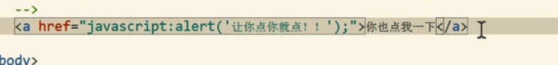
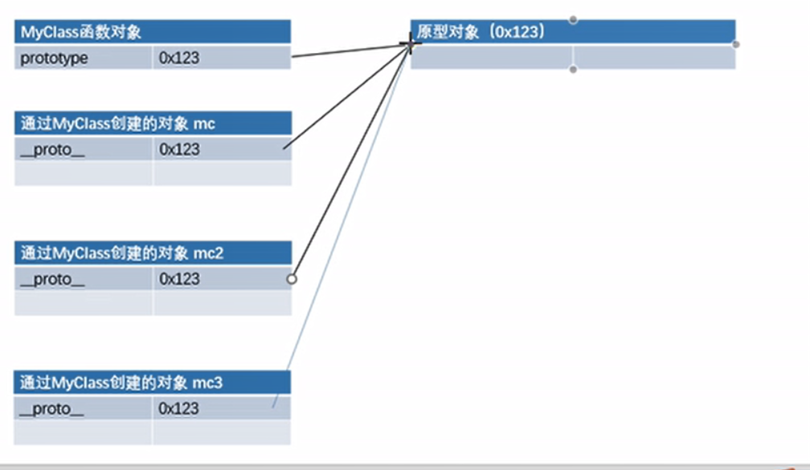
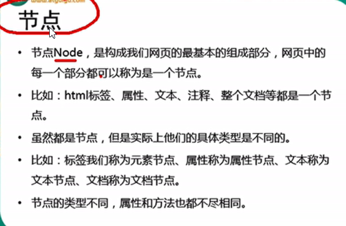

# JavaScript的学习

+ document.write();可以向body中输出一个内容；
+ console.log()在控制台输出

## 可以在将代码写在

+ <button onclick="alert('djjdj')">点我一下</button>
+ 可以将js代码写在超链接的href属性中，这样点连接时，会执行js代码

+ 虽然可以写在标签属性中，但是他们属于结构与行为耦合，不方便维护
+ 可以写在外部文件，也可以利用浏览器的缓存机制

# JavaScript的基本语法

+ 注释跟java一样

+ js中严格区分大小写

+ js中的每一条语句以分局结尾

  ​	- 如果不写分号，浏览器会自动添加，但会 消耗一些系统资源而且会加错分号

+ js会忽略多个空格和换行

# js的变量和字面量

+ 字面量都是一些不可改变的值
  - 比如1 2 3 4 5
  - 字面量都是可以直接使用的 

变量 可以保存字面量，而且变量是可以任意改变的

声明变量 在js中使用var关键词来声明一个变量

var a；

# js的标识符

+ 在js中所有的由我们自主命名的都可以成为标识符

+ 列如：变量名，函数名，属性名都属于标识符

+ 命名一个标识符是遵行如下的规则：

  ​	1.标识符中可以含有字母，数字，_，$

  ​	2.标识符不能以数字开头

  ​	3.标识符不能是es中关键字或保留字

  ​	4.标识符一般采用驼峰命名法
  
  ​			- 首字母小写，每个单词的开头字母大写，其余字母小写
  
  

# js的字符串

数据类型指的是字面量的类型

在js中一共有六种数据类型

String 字符串

Number 数值

Boolean 布尔值

Null 空值

Undefined 未定义

---

以上属于基本数据类型

Object 对象 属于数据类型

## String字符串

+ 在js中字符串需要使用引号引起来
+ 使用双引号或单引号都可以，但是不能混着用
+ 引号不能嵌套，双引号不能放双引号，单引号不能放单引号
+ 在字符串中我们使用\作为转义字符

var str=“hello”；

# js中的Number

在js中所有的所有的数值都是Number类型

包括整数和浮点数（小数）

可以使用一个运算符typeof来检查一个变量的类型

语法：typeof变量

js中可以表示数字的最大值

Number.MAX_VALUE

如果使用Number表示的数字超过了最大值，则会返回一个infinity表示正无穷

NaN是一个特殊的数字，表示Not A Number 使用typeof检查一个NaN也会返回number

Number.MIN_VALUE  大于0的最小值

5e-324

如果使用js进行浮点数运算，可能得到一个不精确的结果

所以千万不要使用js进行精确度要求比较高的运算

# js的布尔类型

布尔值只有两个，主要用来做逻辑判断

+ true 表示真
+ false 表示假 

# js的Null和Undefined

+ Null类型的值只有一个，就是null
+ null这个值专门来表示一个空的对象
+ 使用typeof检查一个null值时，会返回object

Undefined类型的值只有一个，就Undefined

+ 当声明一个变量，但是并不给变量赋值时，他的值就是Undefined
+ 使用typeof检查一个Undefined时也会返回Undefined

# js的强制类型转换

+ 指将一个数据类型强制转换为其他数据类型
+ 类型转换主要指，将其他类型数据，转换为String，Number Boolean

将其他数据类型转换为String

方式一：

+ 调用被转换数据类型toString（）方法
+ 该方法不会影响原变量，他会将转换的结果返回
+  null和Undefined这两个值没有toString()

方式二：

+ 调用String（）函数，并将被转换的数据作为参数传递给函数

+ 使用String（）函数做强制类型转换时

   + 对于Number和Boolean实际上就是调用toString（）方法

   + 但是对于null和Undefined，就不会调用toString()方法

     ​	他会将null直接转换为“null”

     ​	将Undefined直接转换为“Undefined”

将其他的数据类型转换为Number

转换方式一：

+ 使用Number（）函数

  ​	字符串---》数字

  		+ 如果是纯数字的字符串，则直接起转换为数字
  		+ 如果字符串有非数字的内容，则转换为NaN
  		+ 如果字符串是一个空字符串或者是一个全是空格的字符串，则转换为0

  布尔--->数字

  + true转成1

  + false转成0

  null---->数字 0

  Undefined---》数字  NaN

  

  转换方式二：

  + 这种方式专门对付字符串
  + parseInt（）把一个字符串转换为一个整数
  + parseFloat（）把一个字符串转换为一个浮点数
  + parseInt（）可以将一个字符串中的有效的整数内容取出来
  + parseFloat（）作用和parseInt（）类似，不同的是他可以获得有效的小数
  + 如果对非String使用parseInt（）或parseFloat（）他会先将其转换为String然后在操作

  

  

# 其他进制的数字

+ 在js中，如果需要表示16进制的数字，则需要0x开头
+ 如果需要表示8进制的数字，则需要0开头
+ 如果需要表示2进制的数字，则需要0b开头
+ 二进制是所有的浏览器都支持
+ 可以在paseInt（）中传递一个第二个参数，来指定数字的进制

# 将其他数据类型转换为Boolean

+ 使用Boolean()函数
+ ​     数字----》布尔
  + 除了0和NaN，其余的都是true
+ 字符串---》布尔
  + 除了空字符串，其余的都是true
+ null和Undefined都会转换为false
+ 对象也会转换为true

# 算数运算符

+ 运算符也叫操作符

+ 通过运算符可以对一个或多个值进行运算

+ 比如typeof就是运算符，可以来获得一个值的类型

  + 他会将值得类型以字符串的形式返回
  + number String boolean Undefined object

  算数运算符

  + 当对非Number类型的值进行运算时，会将这些值转换为Number
  + 任何值和NaN做运算都是NaN
  + 如果对两个字符串进行加法运算，则会做拼串会将两个字符串拼接为一个字符串，并返回

  

  # js的一元运算符

  +“2” 可以将2转换为整数2相当于Number（）

  # 自增和自减

  + 通过自增可以是变量在自身的基础上增加1
  + 对于一个变量自增以后，原变量的值会立即自增1
  + 自增分成两种后++（a++）a++和前++（++a）
  + 不同的是a++和++a的值不同

  

# js的逻辑运算符

！ 非

+ 可以用来对一个值进行非运算
+ 就是进行取反运算
+ 隐式类型var a="hello " a=!!a//true

&& || 非布尔值的情况

+ 会将非布尔值进行与或运算时
  + 会将其转换为布尔值，然后再运算，并且返回原值
  + true && true  5&&6 如果两个值都为true，则返回后边的
  + 如果两个值中有false，则返回靠前的false
  + 如果第一个值为true，则必然返回第二个值
  + 如果第一个值为false，则返回第一个值
  + false && true  0&&2
  + false && false NaN&&0

---

跟java一样

&& 与

|| 或

# js的相等运算符

+ 如果相等会返回true，否则会返回false
+ 使用== 来做相等运算
  + 当使用==来比较两个值时，如果值的类型不同会转换为相同的类型再比较，
+ NaN不和任何值相等，包括他本身
  + 可以通过isNaN（）函数来判断一个值是否是NaN
  + 如果该值是NaN则返回true，否则返回false

不相等

+ 不相等用来判断两个值是否不相等，如果不相等返回true，否则返回false
+ 不相等也会对变量进行自动的类型转换，如果转换后相等也会返回false

===

+ 全等
  + 用来判断两个值是否全等，他和相等类似，不同的是他不会做自动类型转换，如果两个值的类型不同，直接返回false

！==

不全等

+ 用来判断两个值是否不全等，和不等类似，不同的是他不会自动的类型转换，如果两个值类型不同，直接返回true

# 运算符的优先级

+ 使用，可以分割多个语句，一般可以在声明多个变量使用，
+ 先乘除后加减

# js的对象

+ 对象属于一种复合的数据类型，在对象中可以保存多个不同数据类型的属性

对象的分类

+ 内建对象
  + 有es标准中定义的对象，在任何的es的实现中都可以使用
  + 比如Math String Number Boolean Function Object
+ 宿主对象
  + 由js的运行环境提供的对象，目前来讲主要指由浏览器提供的对象
  + 比如Bom DOM 
+ 自定义对象
  + 有开发人员自己创建的对象

# 对象的基本操作

创建对象

+ 使用new关键字调用的函数，是构造函数constructor
  + 构造函数是专门创建对象的函数
+ 使用typeof检查一个对象时，会返回object
+ 在对象中保存的值称为属性
+ 向对象添加属性
  + 语法：对象.属性名=属性值；
+ 读取对象中属性
  + 语法：对象.属性名
+ 如果读取对象中没有的属性，不会保错而会返回Undefined
+ 修改对象的属性值
  + 语法：对象.属性名=新值
+ 删除对象的属性
  + 语法：delete 对象.属性名

# 属性名和属性值

+ 如果要使用特殊的属性名，不能采用.的方式来操作
  + 需要使用另一种方式
    + 语法：对象【“属性名”】=属性值
  + 读取也需要采用这种方式
+ 使用【】这种形式去操作属性，更加灵活
  + 在【】中可以直接传递一个变量，这样变量值是多少就会读取那个属性
+ 属性值
  + js对象的属性值，可以是任意的数据类型
    + 甚至也可以是一个对象
+ in运算符
  + 通过该运算符可以检查一个对象中是否含有指定的属性
    + 如果有则返回true，没有就返回false
  + 语法：
    + “属性名”in 对象

# 基本类型和引用数据类型

+ js中的变量都是保存到栈内存中的

  +  基本数据类型的值直接在栈内存中存储
  + 值与值之间是独立存在，修改一个变量不会影响到其他的变量

  + 对象是保存到堆内存中，每创建一个新的对象，就会在堆内存中开辟出一个新的空间
  + 而变量保存的是对象的内存地址（对象的引用）
  + 如果两个变量保存的是同一个对象引用，当一个通过一个变量属性时，另一个也会受到影响

  

# 对象的字面量

 使用对象字面量创建对象var obj=｛｝

+ 使用对象字面量，可以在创建对象时，直接指定对象中的属性
+ 语法：｛属性名：属性值，属性名：属性值。。。。｝
+ 对象字面量的属性名可以加引号也可以不加，建议不加
+ 如果要使用一些特殊的名字，则必须加引号
+ 名和值之间使用：连接，多个名值之间使用，隔开
+ 如果一个属性之后没有其他属性了，就不要写，

# 函数的简介

+ 函数也是一个对象
+ 函数中可以封装一些功能（代码），在需要时可以执行这些功能（代码）
+ 函数中可以保存一些代码在需要的时候调用
+ 使用typeof检查一个函数对象时，会返回function
+ 函数也可以是对象的属性
  + 如果一个函数作为一个对象的属性保存
  + 那么我们称这个函数时这个对象的方法
  + 调用函数就说明调用对象的方法

创建一个函数对象

+ 可以将要封装的代码以字符串的形式传递给构造函数
  + var fun=Function("console.log('hello')")
+ 我们在实际开发中很少使用构造函数来创建一个函数对象

使用函数声明来创建一个函数

语法：

​	function 函数名（【形参1，形参2，....形参N】）｛

​			语句.......

｝

枚举对象的属性

+ for（var 变量in 对象）｛｝
+ 每次执行时，会将对象中一个属性的名字赋值给变量

# 函数的形参

# 立即执行函数

+ 函数定义完，立即被调用，这种函数叫做立即执行函数
+ 立即执行函数往往只会执行一次

（function（）｛

........

｝）（）；

# 作用域

+ 作用域指一个变量的作用的范围
+ 在js中一共有两种作用域
  + 全局作用域
    + 直接编写在script标签中的js代码，都在全局作用域
    + 全局作用域在页面打开中创建，在页面关闭时销毁
    + 在全局作用域中有一个全局对象window，我们可以直接使用
      + 他代表的是一的 是一个浏览器的窗口
    + 在全局作用域中
      + 创建的变量都会作为window对象的属性保存
      + 创建的函数都会作为window对象中方法保存
+ 我们可以直接使用

函数的声明提前

+ 使用函数声明形式创建的函数function 函数（）｛｝

  + 他会被所有的代码执行之前就被创建，我们可以再函数前调用函数

  + 使用函数表达式创建的函数，不会被声明提前，所以不能再声明前调用 var a=function（）｛｝

    

# js的this

+ 解析器在调用函数每次都会向函数的内部传递一个隐含的参数
  + 这个隐含的参数就是this，this指向的是一个对象，这个对象我们称为函数执行的上下文对象
  + 根据函数调用方式不同，this会指向不同的对象
    + 以函数的形式调用时，this永远都是window
    + 以方法的形式调用时，this就是调用方法的那个对象
    + 当以构造函数的形式调用时，this就是新创建的那个对象
    + 使用call和apply调用函数时 ，this是指定的那个对象

# 使用工厂方法创建对象

+ 通过该方法可以大批量的创建对象
+ 

# 构造函数

+ 使用工厂方法创建的对象，使用的构造函数都是Object
  + 所以创建的对象都是Object这个类型
  + 就导致我们无法区分多种不同类型的对象

创建一个构造函数，专门用来创建Person对象的

+ 构造函数就是一个普通的函数，创建方式和普通函数没有区别
+ 不同的是构造函数习惯上首字母大写

+ 构造函数和普通的函数的区别就是调用方式不同
+ 普通函数就是直接调用，而构造函数需要使用new关键字来调用

构造函数的执行过程

+ 立即创建一个新的对象
+ 将新建的对象设置为函数中的this，在构造函数中可以使用thisl来引用新建的对象
+ 顺序执行函数中的代码
+ 将新建的对象作为返回值返回

使用instanceof可以检查一个对象是否是一个类的实例

+ 语法：

  + 对象instanceof构造函数
  + 如果是则返回true，否则返回false

  

所有的对象都是Object的后代

所以任何对象Object做instanceof检查时都会返回true

# js原型

+ 原型prototype
+ 我们所创建的每一个函数，解析器都会向函数添加一个属性prototype
  + 这个属性对应着一个对象，这个对象就是我们所谓的原型对象
+ 如果函数作为普通函数调用prototype没有任何作用
+ 当函数以构造函数的形式调用时，他所创建的对象都会有一个隐含的属性，指向该构造函数的原型对象，我们可以通过_proto_来访问该属性
+ 原型对象就相当于一个公共区域，所有同一个类的实例都可以访问到这个原型对象
  + 我们可以将对象中共有的内容，统一设置到原型对象中
+ 当我们访问对象的一个属性或方法时，他会先在对象自身中寻找，如果有直接使用，如果没有则会去原型对象中寻找，如果找到则直接使用
+ 

可以使用对象的hasOwnProperty（）来检查对象自身中是否含有该属性

使用该方法只有当对象中含有属性时，才会返回true

+ 原型对象也是对象，所有他也有原型
  + 当我们使用一个对象的属性或方法时，会先从自身中寻找
    + 自身中如果有，则直接使用
    + 如果没有则去原型对象中寻找，如果原型对象中有，则使用
    + 如果没有则去原型的原型中寻找，直到找到Object对象的原型
    + Object对象的原型没有原型，如果在Object中依然没有找到，则返回Undefined

# js中toString()

当我们直接在页面中打印一个对象时，事实上是输出对象tostring（）方法的返回值

如果我们希望在输出对象时不输出【Object Object】，可以为对象添加一个tostring（）方法

# 垃圾回收（GC）

+ 当一个对象没有任何变量或属性对他进行引用，此时我们将永远无法操作该对象，此时这种对象就是一个垃圾，这种对象过多会占用大量的内存空间，导致程序变慢
+ 在js中拥有自动的垃圾回收机制，会自动将这些垃圾对象从内存中删除我们不需要也不能进行垃圾回收的操作
+ 我们只需要做的是将不再使用的对象设置为null即可

# js数组

+ 创建数组对象
  + var arr=new Array（）
+ 向数组中添加元素
  + 语法：数组【索引】=值
+ 读取数组中的元素
  + 语法：数组【索引】
+ 如果读取不存在的索引，他不会报错而是返回Undefined
+ 读取数组的长度
+ 可以使用length属性来获取数组的长度
  + 语法：数组.length
+ 修改length
  + 如果修改的length大于原长度，则多出去除

# 数组的字面量

+ 使用字面量来创建数组
  + var arr=【】
+ 使用构造函数创建数组
  + var arr=new Array（10）
+ 数字可以放任何类型的数据

# 数组常用的方法

+ push（）
  + 该方法可以向数组的末尾添加一个或多个元素，并返回数组的新长度
  + 可以将要添加元素作为方法的参数传递
    + 这样这些元素将自动添加到数组的末尾
  + 该方法会将数组的长度作为返回值返回
+ pop（）
  + 该方法可以删除数组的最后一个元素
  + 该方法可以删除数组的最后一个元素，并将被删除的元素作为返回值返回

unshift（）

shift（）

# 遍历数组

# forEach（）

+ 一般我们都是使用for循环遍历数组

+ forEach（）

  + 这个方法只支持IE8以上的浏览器

+ foreach()方法需要一个函数作为参数

  + 像这种函数，有我们创建但是不由我们调用，我们称为回调函数
  + 数组中有几个元素函数就会执行几次，浏览器会将遍历到的元素以实参的形式传递进来，我们可以来定义形参，来读取这些内容
  + 浏览器会在回调函数中传递三个参数
    + 第一个参数，就是当前正在遍历的元素
    + 第二参数，就是当前正在遍历的元素的索引
    + 第三个参数，就是正在遍历的数组

  

# slice（）

+ 可以用来从数组提取指定元素
+ 该方法不会改变元素的数组，而是将截取到的元素封装到一个新的数组中返回
+ 参数
  + 截取开始的位置的索引
  + 截取结束的位置的索引
  + -1倒数一个
  + -2倒数第二个

# splice（）

+ 可以用于删除数组中指定元素
+ 使用splice（）会影响到原数组，会将指定元素从原数组中删除
+ 参数
  + 第一个，表示开始位置的索引
  + 第二个，表示删除的数量
  + 第三个及以后
    + 可以传递一些新的元素，这些元素将会自动插入到开始位置索引前的位置

# concat（）

+ 连接两个或多个数组，并将新的数组返回

# join（）

+ 该方法可以将数组转换为一个字符串
+ 在join（）中可以指定一个字符串作为参数，这个字符串将会成为数组中元素的连接符

# reverse（）

+ 该方法用来反转数组

# sort（）

+ 可以用来对数组中的元素进行排序
+ 我们可以在sort（）添加一个回调函数，来制定排序规则
+ 如果返回一个大于0的值，则元素会交换位置
+ 如果返回一个小于等于0的值，则元素不会交换位置

# call（）和apply（）

+ 这两个方法都是函数对象的方法，需要通过函数来调用
+ 当对函数调用call（）和apply（）都会调用函数执行
+ 在调用call和apply可以将一个对象指定为第一个参数
  + 此时这个对象将会成为函数执行时的this
+ call（）方法可以将实参在对象之后依次传递
+ apply（）方法需要将实参封装到一个数字中统一传递

# argument（）

+ 在调用函数时，浏览器每次都会传递两个隐含的参数
  + 函数的上下文对象this
  + 封装实参的对象argument
    + argument是一个类数组对象，他可以通过索引来操作数据，也可以获取长度
    + 在调用函数时，我们所传递的实参都会在argument中保存
    + argument.length可以用来获取实参的长度
  + 他里边有一个属性叫做callee
    + 这个属性对应一个函数对象，就是当前正在指向的函数的对象

# Date对象

# 包装类

# 字符串方法

chatAt（）

+ 可以返回字符串中指定位置的字符
+ 根据索引获取指定的字符

charCodeAt（）

+ 获取指定位置的字符编码

formCharCode（）

+ 可以根据字符编码去获取字符

concat（）

+ 可以用来连接两个或多个字符串

indexof（）

+ 该方法可以检索一个字符串是否含有指定内容
+ 如果字符串含有该内容，则会返回其第一次出现的索引
  + 如果没有找到指定的内容，则会返回-1
+ 可以指定一个第二个参数，指定开始查找的位置

lastIndexof（）

+ 该方法的用法和indexof()一样，
  + 不同的是indexof是从前往后找
  + 而lastIndexof是从后往前找

slice（）

+ 可以从字符串截取指定的内容
+ 不会影响到原字符串，而是将截取到内容返回
+ 参数：
  + 第一个，开始的位置的索引（包括开始位置）
  + 第二个，结束的索引（不包括结束位置）

split（）

+ 可以将一个字符串拆分为一个数组
+ 

# 正则表达式

+ 正则表达式用于定于一些字符串的规则
+ 计算机可以根据正则表达式，来检查一个字符串是否符合规则
+ 获取字符串符合规则的内容提取出来

创建正则表达式的对象

+ 语法：
  + var 变量=new RegExp（“正则表达式”，“匹配模式”）
  + 使用typeof检查正则对象，会返回Object
  + 在构造函数中传递一个匹配模式作为第二参数
    + i 忽略大小写
    + g 全局匹配模式

正则表达式的方法

+ test（）
  + 使用这个方法可以检查一个字符串是否符合正则表达式的规则
  + 如果符合返回true，否则返回false

# 正则表达式的语法

使用字面量创建正则表达式

+ 语法：var 变量=/正则表达式/匹配模式
+ var reg=new RegExp（“a”，“i”）；
+ reg=/a/i；
+ 使用字面量的方式创建更加简单
+ 使用构造方法创建更加灵活

创建正则表达式，检查一个字符串是否含有a或b

+ 使用 | 表示或者的意思

创建一个正则表达式来检查一个字符串是否有字母

+ 【】里的内容也是或的关系
+ 【ab】==a|b
+ 【a-z】任意小写字母
+ 【A-Z】任意大写字母
+ 【A-z】任意字母
+ 【^a】除了a之外所有的字母
+ 【0-9】
+ reg=/[a-z]/

# 字符串和正则相关的方法

split（）

+ 可以将字符串拆分为一个数组
+ 方法中可以传递一个正则参数表达式作为参数，这样方法将会根据正则表达式拆分字符串

search()

+ 可以搜索字符串是否含有指定内容
+ 如果搜索到指定内容，则会返回第一次出现的索引，如果没有搜索到返回-1
+ 他可以接受正则表达式作为参数，然后会根据正则表达式去检查字符串

match（）

+ 可以根据正则表达式，从一个字符串将符合条件的内容提取出来
+ 我们可以设置正则表达式为全局匹配模式，这样会匹配到所有的内容
+ 可以为一个正则表达式设置多个匹配模式，且顺序无所谓
+ match（）会将匹配到的内容封装到一个数组中返回，即使只查询到一个结果

replace（）

+ 可以将字符串中指定内容替换为新的内容
+ 参数
  + 1.被替换的nrong
  + 2.新的内容
  + 默认只会替换第一个

量词

+ 通过量词可以设置一个内容出现的次数
+ ｛n｝正好出现n次
+ 量词只对他前边的一个内容起作用
+ ｛m,n｝出现m-n次
+ ｛m,｝m次以上
+ /+ 至少一个，相当于｛1，｝
+ /* 0个或多个，相当于｛0，｝
+ ？ 0个或1个，相当于｛0，1｝

检查一个字符串中是否以a开头

+ ^表示开头
+ 注意在^在[]表示除了
+ $表示结尾
+ 如果在正则表达式中同时使用^ $则要求字符串必须完全符合正则表达式

检查一个字符是否含有.

+ . 表示任意字符
+ 在正则表达式中使用\作为转义字符
+ \.来表示.
+ 注意：使用构造函数时，由于他的参数是一个字符串，而\是字符串中的转移字符
+ 构造函数时字面量的两倍
+ \w任意字母和数字和_相当于【A-z0-9_】
+ \W除了字母、数字、_【^A-z0-9_】
+ \d任意的数字【0-9】
+ \D除了数字
+ \s 空格
+ \S除了空格
+ \bQ单词边界
+ \B除了单词边界

# Dom简介

+ dom全称document Object model文档对象模型
+ js中通过dom来对html文档进行操作
+ 文档
  + 文档表示的就是整个的html的网页文档
+ 对象
  + 对象表示将网页中每一部分都转换为了一个对象
+ 模型
  + 使用模型来表示对象之间的关系，这样方便我们获取对象

# 事件

可以为按钮的对应事件绑定处理函数的形式来响应事件

# 文档的操作

浏览器在加载一个页面时，是按照自上向下的顺序加载的

+ 读取到一行就运行一行，如果将script标签写到页面的上边
+ 在代码执行时，页面还没加载
+ 将js代码编写到页面的下部就是为了可以在页面加载完毕以后再执行js代码

onload事件会在整个页面加载完成之后才触发

+ 为window绑定一个onload事件
+ 这样可以确保我们代码执行时所有的dom对象已经被加载完毕

# dom查询

innerHTML用于获取元素内部的html代码的

+ 对于自结束标签，这个属性没有意义
  + 直接使用元素.属性名
    + 列子：元素.id 元素.name 元素.value
    + 注意：class属性不能采用这种方式
      + 读取class属性需要使用元素.className

childNodes属性会获取包括文本节点在内所有的节点

+ 根据dom标签空间也会当成文本节点
+ 注意，在ie8及以下的浏览器中，不会将空白文本当空节点

返回phone.childNodes[0];

firstChild可以获取到当前元素的第一个子节点（包括空白文本节点）

var fir=phone.fristChild

+ firstElementChild获取当前元素的子一个子元素
+ 如果需要兼容他们尽量不要使用

lastChild

innerText

+ 该属性可以获取到元素内部的文本内容
+ 他和innerHtml类似，不同的是他会自动将html去除

# js全选

# dom剩余的方法

在document中有一个属性body，他保存的是body的引用

var body=document.body

document.documentElement保存的是html的根标签

var html=document.documentElement;

document.all代表页面中所有的元素

document.querySelector（）

+ 需要一个选择器的字符串作为参数，可以根据css选择器来查询一个元素节点对象
+ 虽然ie8中没有getElementByClassName（）但是可以使用querySelector
+ 如果有多个节点他只会返回第一个节点

document.querySelectorAll()

+ 该方法和querySelector用法类似，不同的是他会将会符合的元素封装到一个数组中返回

# dom的增删改查

document.createElement（）

+ 可以用于创建一个元素节点对象
+ 他需要一个标签名作为参数，将会根据标签名创建节点对象
+ 并将创建好的对象作为返回值返回

document.createTextNode()

+ 可以用来创建一个文本节点对象
+ 需要一个文本内容作为参数，将会根据内容创建文本节点，并将新的节点返回

insertBefore（）

+ 可以在指定的子节点前插入新的子节点
+ 语法：
  + 父节点.insertBefore（新节点，旧结点）

replaceChild（）

+ 可以使用指定的子节点替换已有的子节点
+ 语法：父节点.replaceChild（新节点，旧节点）

removeChild（）

+ 删除一个子节点
+ 语法：父节点.removeChild（子节点 ）

confirm（）用于弹出一个带有一个确认和取消的询问框

# 操作内联样式

+ 通过js修改元素的样式
+ 语法：元素.style.样式名
+ 注意如果css的样式名中含有-
  + 这种名称在js中是不合法的比如background-color
  + 需要将这种样式名修改为驼峰命名法
  + 去掉-，然后将-后的字母大写
+ 我们通过style属性设 置的样式都是内联样式
+ 而内联样式有较高的优先级，所以通过js修改往往立即显示
+ 但是如果在样式中写了！important，则此时样式会有最高的优先级
+ 即使通过js也不能覆盖该样式，此时将会导致js修改样式失败

读取样式

+ 语法：元素.style.样式名

获取元素的当前显示的样式

+ 语法：元素.currentStyle.样式名
+ 他可以用来读取当前元素正在显示的样式
+ currentStyle只有ie浏览器支持，其他不支持
+ 在其他浏览器中可以使用
+ getComputedStyle（）这个方法来获取元素当前的样式
  + 需要两个参数
  + 第一个：要获取样式的元素
  + 第二个：可以传递一个微元素，一般传null
+ 该方法会返回一个对象，对象中封装了当前元素对应的样式
+ 

通过currentStyle和getComputedStyle（）读取的样式都是只读的

clientWidth

clientHeight

+ 这两个属性可以获取元素的可见宽度和高度
+ 这些属性都是不带px的，返回都是一个数字，可以直接计算
+ 会获取元素宽度和高度，包括内容区和内边距
+ 这些属性都是只读的，不能修改

offsetwidth offsetHeight

+ 获取元素的整个宽度和高度，包括内容区，内边距和边框

offsettParent

+ 可以用来获取当前元素的定位父元素
+ 会获取到高当前元素最近的开启定位的祖先元素
+ 如果所有的祖先元素都没有开启定位，则返回body

offsetLeft offsetTop

+ 当前元素相对于其定位父元素的水平偏移量
+ 当前元素相对于其定位父元素的垂直偏移量

onmousemove

+ 该事件将会在鼠标在元素中移动时被触发

事件对象

+ 当事件的响应函数被触发时，浏览器每次都会将一个事件作为实参传递进响应函数
+ 在事件对象中封装了当前事件相关的一切信息，比如，鼠标的坐标
+ 在ie8中，响应函数被处理时，浏览器不会被传递事件对象
+ 在ie8及以下浏览器中，是将事件对象作为window对象的属性保存的

# 事件的冒泡

事件的冒泡（bubble）

+ 所谓的冒泡指的是事件向上传导，当后代元素上的事件被触发时，其祖先元素的相同事件也会被触发
+ 大部分的冒泡是有用的
+ 取消冒泡event.canceBubble=true

# 事件的委派

事件的委派

+ 指将事件统一绑定给元素的共同的祖先元素，这样当后代元素上的事件触发时，会一直冒泡到祖先
+ 事件委派是利用了冒泡，通过委派可以减少事件绑定的次数，挺高程序的性能

target

+ event中的target表示的触发事件的对象
+ 如果触发事件的对象使我们期望的元素，则执行否则不执行
+ 

****

# 事件的绑定

+ 使用对象.事件=函数的形式绑定响应函数
+ 他只用同时为一个元素的一个事件绑定一个响应函数
+ 不能绑定多个，如果绑定了多个，则后边会覆盖掉前边的 

addEventListener()

+ 通过这个方法可以为元素绑定响应函数
+ 参数：
  + 事件的字符串，不要on
  + 回调函数，当事件触发时 该函数会被调用
  + 是否在捕获阶段触发事件，需要一个布尔值，一般都传false
+ 使用addEventListener（）可以同时为一个元素的相同事件同时绑定多个事件
+ 这个方法不支持ie8及以下的浏览器

attachEvent（）

+ 在ie8中可以使用attachEvent（）来绑定事件
+ 参数：
  + 事件的字符串，要on
  + 回调函数
+ 这个方法可以同时为一个事件绑定多个处理函数
+ 不同的是他是后绑定先执行，执行顺序和addEventListener（）相反

定义一个函数，用来指定元素绑定响应函数

+ 参数：
  + obj 要绑定事件的对象
  + eventStr 事件的字符串
  + callback 回调函数

​	

# bind（）

# 事件的传播

+ 关于事件的传播网景公司和微软有不同的理解
+ 微软认为事件应该是有内向外传播，是就是事件触发时，应该先触发当前元素上的事件
+ 网景认为事件应该是有外向内传
+ w3c综合了两个公司的方案，将事件传播分成了三个阶段
  + 捕获阶段
    + 在捕获阶段从最外层的祖先元素

如果希望在捕获阶段就触发事件，可以将addEventListener（）的第三个参数设置为true

ie8及以下的浏览器中没有捕获阶段

# bom

+ 浏览器对象模型
+ bom可以使我们通过js来操作浏览器
+ 在BOM中为我们提供了一组对象，用来完成对浏览器的操作
+ BoM对象
  + window
    + 代表的是整个浏览器的窗口，同时window也是网页中的全局对象
  + navigator
    + 代表 当前浏览器的信息，通过对象可以用来识别不同的浏览器
  + Location
    + 代表当前浏览器的地址信息，通过Location可以获取地址栏信息，或者操作浏览器跳转页面
  + history
    + 代表浏览器的历史记录，可以通过该对象来操作浏览器的历史记录
    + 由于隐私原因，该对象不能获取到具体的历史记录，只能操作浏览器向前向后
  + screen
    + 代表用户的屏幕的信息，通过对象可以获取到用户的显示器的相关的信息
+ 这些Bom对象在浏览器都是作为window对象的属性保存的
  + 可以通过window对象来使用，也可以直接使用

navigator

+ 代表的当前浏览器的信息，通过对象可以识别不同的浏览器
+ 由于历史原因，navigator对象已经不能帮助我们识别浏览器了
+ 一般我们只会使用userAgent来判断浏览器的信息
  + userAgent是一个字符串，这个字符串中包含有用来描述浏览器信息的内容
  + 不同的浏览器会有不同的userAgent

Mozilla/5.0 (Windows NT 10.0; Win64; x64; rv:68.0) Gecko/20100101 Firefox/68.0

如果通过userAgent不能判断，还可以通过一些浏览器中特有的对象，来判断浏览器的信息

比如：activeXObject

history

+ 对象可以用来操作浏览器向前向后
+ length
  + 属性：可以获取到当前访问的连接数量
+ back（）
  + 可以用来回退到上一个页面，作用和浏览器的回退按钮一样
+ forward（）
  + 可以跳转下一个页面，作用和浏览器的前进按钮一样
+ +go（）
  + 可以用来跳转指定的页面
  + 他需要一个整数作为参数
    + 表示向前跳转一个页面
    + 表示向前跳转两个页面

Location

+ 该对象封装了浏览器的地址栏的信息
+ 如果直接将Location属性修改为一个完整的路径，或相对路径
+ 则我们页面会自动跳转到该路径，并且会生成相应的历史记录

assign（）

+ 用来跳转到其他页面，作用和直接修改Location一样

  

reload（）

+ 用于重新加载当前页面，作用和刷新按钮一样
+ 如果在方法中传递一个true，作为参数，则会强制清空缓存刷新页面

replace（）

+ 可以使用一个新的页面替代当前页面，调用完毕也会跳转页面
+ 不会生成历史记录，不能使用回退按钮回退

# 定时器的简介

setInterval（）

+ 定时调用

+ 可以将一个函数，每隔一段时间执行一次

+ 参数：

  + 回调函数，该函数会每隔一段时间会被调用一次
  + 每次调用间隔时间，单位是毫秒

  返回值：

  + 返回一个Number类型的数据
  + 这个数字用来作为定时器的唯一标识

  clearInterval（）

  + 方法需要一个定时器标识作为参数，这样关闭标识对应的定时器

  

  

  延时调用

  set

  + 延时调用一个函数不马上执行，而是隔一段时间以后执行，而且只会执行一次

  延时调用和定时调用的区别

  + 定时调用会执行多次，而延时调用只会执行一次

  

  

  使用clearTimeout（）来关闭一个延时调用

  

# 类的操作

+ 我们可以通过修改元素的class属性来间接的修改样式

+ 这样一来，我们只需要修改一次，即可同时修改多个样式

+ 浏览器只需要修改页面一次，性能比较好
+ 并且这种方式，可以使表现和行为进一步分移

# json

+ js中的对象只有js认识，其他语言不认识
+ json就是一个特殊的字符串，这个字符串可以被任何语言所识别
+ 并且可以转换为任意语言的对象，json在开发中主要用来数据交互
+ json和js的格式一样，只不过json字符串中的属性名必须加双引号
+ json的分类
  + 对象｛｝
  + 数组【】
+ json中允许的值
  + 字符串
  + 数值
  + 布尔值
  + null
  + 对象
  + 数组

将json字符串转换为js中的对象

+ 在js中，为我们提供了一个工具类，背胶json
+ 这个对象可以帮助我们将一个json转换为js对象，可以以将js对象

json---》js对象

+ 可以将json字符串转换为js对象

js对象---》json

+ json.stringify（）
  + 可以将js对象转换为json字符串
  + 需要一个js对象作为参数，会返回一个json字符串
+ json对象在ie7以下不支持

eval（）

+ 这个函数可以用来执行一段字符串形式的js代码，并将执行结果返回
+ 如果使用eval（）执行的字符串中含有｛｝，他会将｛｝当成代码块
  + 如果不希望将其当成代码块解析，则需要在字符串前后各加一个（）
+ eval（）这个函数的功能很强大，可以直接执行一个字符串中的js代码
+ 但是在开发中尽量少用，执行性能比较cha

