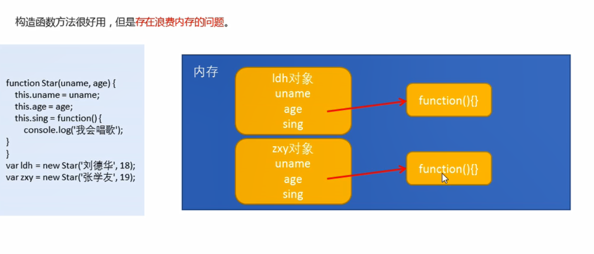
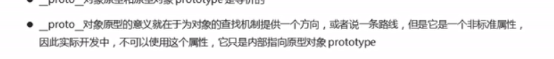
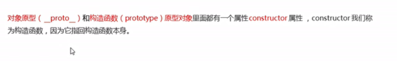
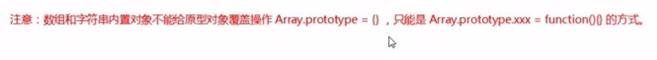
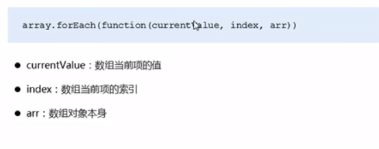
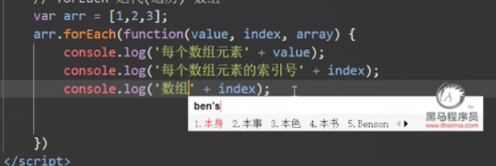
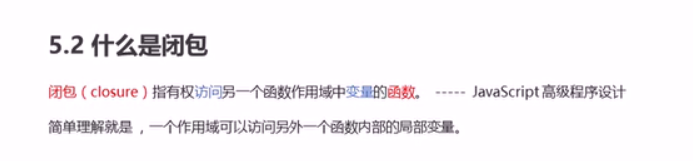
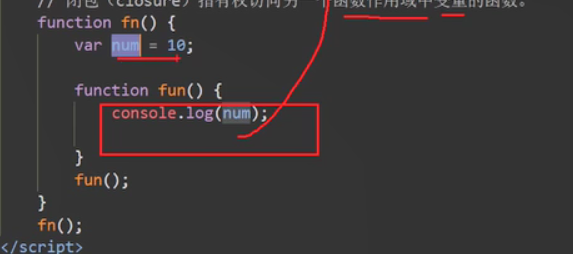
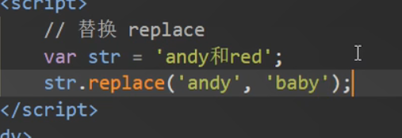

# es6中的类和对象

类 class

# 类中添加共有的方法

+ 类中不需要写function关键字
+ 多个函数方法之间不需要添加逗号分隔

# 继承

super

# super关键字

# 使用类的两个注意点

# this的指向问题

 

# 构造函数和原型

# 静态成员和实例成员

# 构造函数原型对象

 

一般情况下，我们的公共属性定义到构造函数里面，公共的方法我们放到原型对象上

# 对象原型

+ 方法的查找规则：首先看对象，对象身上是否有相应的方法，如果有就执行这个对象上的sing

+ 如果没有相应的方法，因为有_proto_的存在，就去构造函数原型对象prototype身上去查找方法

# 构造函数和原型

+ 很多情况下，我们需要手动的利用constructor这个属性只会原来的构造函数
+ 

# 构造函数。实例。和原型对象三者之间的关系

# 原型链

# JavaScript的成员查找机制

# 原型对象this指向

+ 1.在构造函数中，里面this指向的是对象实例
+ 2.原型对象函数里面的this指向的是实例对象

# 原型对象的应用

对Array（数组）对象扩展对象方法

# 继承

call（）

# 用原型对象实现继承

# 类的本质

+ 类的本质其实还是一个函数，我们可以简单的认为类就是构造函数的另外一种写法

# es5中新增的方法

## 数组方法

some（）

+  filter也是查找满足条件的元素，返回的是一个数组，而且是把所有满足条件的元素返回回来
+ some也是查找满足条件的元素是否存在，返回的是一个布尔值，如果查找到第一个满足条件的元素就终止循环

##  forEach和some的区别

## 字符串方法

trim（）

## 对象方法

# 函数的定义和调用

+ 函数声明方式function关键字（命名函数）
+ 函数表达式（匿名函数）
+ new Function（）

 

# 函数内的this的指向

# call方法

bind()

# call apply bind 总结

主要应用场景

# 严格模式

开启严格模式

‘use strict’

# 严格模式中的变化

# 高阶函数

+ 高阶函数是对其他函数操作的函数，他接收函数作为参数或将函数作为返回值输出

此时fn就是一个高阶函数

函数也是一种数据类型，同样可以作为参数，传递给一个参数使用。最典型就是作为回调函数

# 闭包

 # 闭包的作用

闭包的主要作用：延伸了变量的作用范围

闭包的案列

# 闭包的案例

# 正则表达式

正则表达式（regular Expression是用于 匹配字符串中字符组合中模式，在JavaScript中，正则表达式也是对象

# 边界符

# 字符类

# 量词符

# 正则表达式的特殊字符

# 正则表达式中的替换

replace替换

+ replace（）方法可以实现替换字符串操作，用来替换的参数可以是一个字符串或是一个正则表达式
+ 

 

# es6的新增语法

let

+ es6中新增的用于声明变量的关键字
+ let声明的变量只在所处的块级有效
+ 在一个大括号中使用let关键字声明的变量才具有块级作用域，var关键字是不具备这个特点的 
+ 防止循环变量变成全局变量
+ 

let的特性

+ 不存在 变量提升
+ 暂时性死区（var 跟let的变量名相同，相互不会影响）

# const关键字

+ 作用：声明常量，常量就是值（内存地址）不能变化的值
+ 具有块级作用域
+ 

# let const  var 的区别

# 解构赋值

es6中允许从数组中提取值，按照对应的位置，对变量赋值，对象也可以实现解构

## 数组解构

### 对象解构

# 箭头函数

+ 箭头函数是用来 简化函数定义语法的
+ 在箭头函数中，如果函数中只有一句代码并且代码的执行结构就是函数的返回值，函数体大括号可以省略
+ 如果形参只有一个，可以省略小括号 

# 箭头函数的this关键字

+ 箭头函数不绑定this关键字，箭头函数中的this，指向的是函数定义位置的上下文this

# 剩余参数

## 剩余参数和解构配合使用

可以变成

