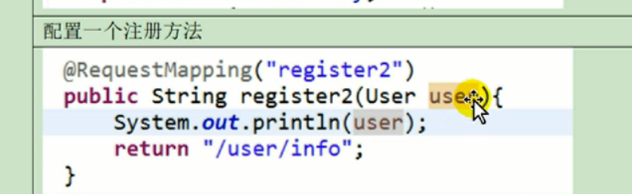
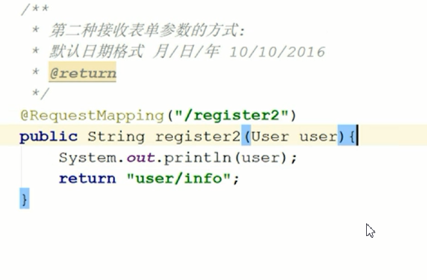
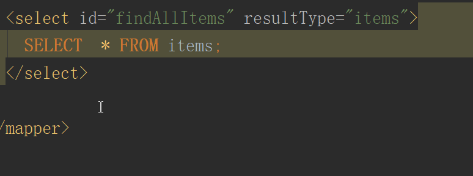

## SpringMvc入门

1.1 简介


Mvc M：Model V:view C:Controller-servlet/action/controller

### 第一步导入jar包


### 第二步在web.xml配置DispatcherSevlet


```
<?xml version="1.0" encoding="UTF-8"?>
<web-app xmlns="http://xmlns.jcp.org/xml/ns/javaee"
         xmlns:xsi="http://www.w3.org/2001/XMLSchema-instance"
         xsi:schemaLocation="http://xmlns.jcp.org/xml/ns/javaee http://xmlns.jcp.org/xml/ns/javaee/web-app_3_1.xsd"
         version="3.1">

    <!-- 配置：所有请求由SpringMVC管理 -->
    <servlet>
        <servlet-name>DispatcherServlet</servlet-name>
        <servlet-class>org.springframework.web.servlet.DispatcherServlet</servlet-class>
        <load-on-startup>1</load-on-startup>
    </servlet>

    <servlet-mapping>
        <servlet-name>DispatcherServlet</servlet-name>
        <url-pattern>*.do</url-pattern>
    </servlet-mapping>
</web-app>
```

### 第三步：在WEB_INF目录下创建Dispatch-Sevlet.xml

### 第四步：配置DispatchSevlet-servlet.xml


```
<?xml version="1.0" encoding="UTF-8"?>
<beans xmlns="http://www.springframework.org/schema/beans"
       xmlns:xsi="http://www.w3.org/2001/XMLSchema-instance" xmlns:mvc="http://www.springframework.org/schema/mvc"
       xmlns:context="http://www.springframework.org/schema/context"
       xmlns:aop="http://www.springframework.org/schema/aop" xmlns:tx="http://www.springframework.org/schema/tx"
       xsi:schemaLocation="http://www.springframework.org/schema/beans
		http://www.springframework.org/schema/beans/spring-beans-3.2.xsd
		http://www.springframework.org/schema/mvc
		http://www.springframework.org/schema/mvc/spring-mvc-3.2.xsd
		http://www.springframework.org/schema/context
		http://www.springframework.org/schema/context/spring-context-3.2.xsd
		http://www.springframework.org/schema/aop
		http://www.springframework.org/schema/aop/spring-aop-3.2.xsd
		http://www.springframework.org/schema/tx
		http://www.springframework.org/schema/tx/spring-tx-3.2.xsd">


    <!-- 1.配置url处理映射-->
    <bean class="org.springframework.web.servlet.handler.BeanNameUrlHandlerMapping"/>

    <!-- 2.配置控制器处理适配器-->
    <bean class="org.springframework.web.servlet.mvc.SimpleControllerHandlerAdapter"></bean>

    <!-- 3.配置控制器-相当于配置了访问路径-->
    <bean name="/user.do" class="com.lfm.backoffice.web.controller.UserController"/>

    <!-- 4.配置资源视图解析器-->
    <bean class="org.springframework.web.servlet.view.InternalResourceViewResolver">
        <!--前缀-->
        <property name="prefix" value="/WEB-INF/views/"></property>
        <!--后缀-->
        <property name="suffix" value=".jsp"></property>
    </bean>
</beans>
```

### 第五步创建个Controller控制器


```java
public class UserController implements Controller {
    @Override
    public ModelAndView handleRequest(HttpServletRequest httpServletRequest, HttpServletResponse httpServletResponse) throws Exception {
        ModelAndView mav=new ModelAndView("/user/userlist");
       mav.addObject("name","gyf");
        return mav;
    }
}
```

## 流程图


## URL处理器的映射【了解】

### BeanNameUrlHandlerMapping

功能：寻找Controller，根据URL请求去匹配bean的name属性，从而获取Controller，通过URL名字，找到对应的bean的name的控制器

SimpleUrlHandlerMapping：简单URL处理映射通过key的找到bean的id的控制器

有两种方式：

1. SimpleUrlHandlerMapping执行控制器，调用控制器的handleRequest方法，返回modelAndView

```xml
<bean class="org.springframework.web.servlet.handler.SimpleUrlHandlerMapping">
        <property name="mappings">
            <props>
                <prop key="/user1.do">userController</prop>
                <prop key="/user2.do">userController</prop>
                <prop key="/user3.do">userController</prop>
            </props>
        </property>
    </bean>
```

2.  HttpRequestHandlerAdapter

   ```xml
    <bean  name="/http.do" class="com.lfm.backoffice.web.controller.httpController"/>
   ```

```java
public class httpController implements HttpRequestHandler {
    @Override
    public void handleRequest(HttpServletRequest request, HttpServletResponse response) throws ServletException, IOException {
        request.setAttribute("name","lfm02");
        request.getRequestDispatcher("/WEB-INF/views/user/userlist.jsp").forward(request,response);
    }

```


## ControllerClassNameHandlerMapping

功能：寻找Controller

根据类名（Mycontroller）类名.do来访问，类名首字母小写

ControllerClassNameHandlerMapping【控制器的类名处理映射】-不用配置访问路径，默认的访问就是类名，类的首字母变小写

```xml
 <bean class="org.springframework.web.servlet.mvc.SimpleControllerHandlerAdapter"></bean>
```

```xml
 <bean  class="com.lfm.backoffice.web.controller.UserController"/>
```

SpringMvc 主要由DispatcherSevlet、处理器映射【找控制器】、适配器【调用控制器的方法】、控制器【业务】、视图解析器、视图组成

## 命令控制器【了解】

springMVC通过命令设计模式接受页面参数

### 添加一个页面


```html
<form action="${pageContext.request.contextPath}/command.do" method="post">
    用户名:<input type="text" name="username"><br>
    密码:<input type="text" name="password"><br>
    性别:<input type="text" name="gender"><br>
    生日:<input type="text" name="birthday"><br>
    <input type="submit">
</form>
```

### Command控制器

```java
public class CommandController extends AbstractCommandController {

    public  CommandController(){
        //告诉springmvc把表单存在user模型里去
        this.setCommandClass(User.class);
    }
    protected ModelAndView handle(HttpServletRequest request, HttpServletResponse response, Object o, BindException e) throws Exception {
        User user=(User)o;
        System.out.println(user);
        ModelAndView mav=new ModelAndView();
        mav.setViewName("user/info");
        mav.addObject("user",user);
        return mav;
    }
}
```

views结构


DispatchSevlet-servlet的配置文件

```xml
<bean class="org.springframework.web.servlet.mvc.SimpleControllerHandlerAdapter"></bean>
```

```xml
    <bean  name="/command.do" class="com.lfm.backoffice.web.controller.CommandController"/>
```


## 乱码问题的解决

post请求乱码

```xml
<filter>
    <filter-name>EncodingFilter</filter-name>
    <filter-class>org.springframework.web.filter.CharacterEncodingFilter</filter-class>
    <init-param>
        <param-name>encoding</param-name>
        <param-value>UTF-8</param-value>
    </init-param>
</filter>

<filter-mapping>
    <filter-name>EncodingFilter</filter-name>
    <url-pattern>/*</url-pattern>
</filter-mapping>
```
在tomcat里配置可以解决控制台的乱码


##  2 springmvc的注解开发

### 注解开发入门案例

修改springmvc的配置文件

把前面的项目更新一份，修改一个DispatchServlet-Servlet.xml

```xml
 <context:component-scan base-package="com.lfm.backoffice.web.controller"/>

    <!-- 2. 配置处理器映射，通过注解来查找 -->
    <bean class="org.springframework.web.servlet.mvc.method.annotation.RequestMappingHandlerMapping"/>
    <!-- 3.配置注解处理适配器来执行控制器的方法 -->
    <bean class="org.springframework.web.servlet.mvc.method.annotation.RequestMappingHandlerAdapter"/>

    <!-- 配置springmvc视图解析器
                视图解析器解析的视频路径为：前缀 + 后缀 -->
    <bean class="org.springframework.web.servlet.view.InternalResourceViewResolver">
        <property name="prefix" value="/WEB-INF/views"/>
        <property name="suffix" value=".jsp"/>
    </bean>
```


## RequestMapping讲解

### 配置请求路径映射路径


在DispatcherServlet-servlet.xml下配置

```xml
 <!-- 注解配置控制器-->
    <!-- 1.配置扫描包-->
    <context:component-scan base-package="com.gyf.backoffice.web.controller"/>

    <!-- 2.配置注解处理映射-->
    <bean class="org.springframework.web.servlet.mvc.method.annotation.RequestMappingHandlerMapping"/>

    <!-- 3.配置适配器-->
    <bean class="org.springframework.web.servlet.mvc.method.annotation.RequestMappingHandlerAdapter"/>

    
    <!-- 4.配置资源视图解析器-->
    <bean class="org.springframework.web.servlet.view.InternalResourceViewResolver">
        <!--前缀-->
        <property name="prefix" value="/WEB-INF/views/"></property>
        <!--后缀-->
        <property name="suffix" value=".jsp"></property>
    </bean>
```

```java
@Controller
@RequestMapping("/user")
public class UserController{
    @RequestMapping("/list")
    public String list(){

        return "user/userlist";
    }
}
```

## 自定义根路径


## 接收请求参数

封装参数分析

Struts2参数：基于属性封装，在action会添加属性，提供set方法

springmvc参数封装：基于方法进行封装

### 接受int，String，Date，数组 类型

建议个register页面

```html
<form action="${pageContext.request.contextPath}/user/register3.do" method="post">
    用户名:<input type="text" name="user.username"><br>
    密码:<input type="text" name="user.password"><br>
    性别:<input type="text" name="user.gender"><br>
    年龄:<input type="text" name="user.age"><br>
    生日:<input type="text" name="user.birthday"><br>
    爱好:<input type="checkbox" name="user.hobbyIds" value="1">打球
    <input type="checkbox" name="user.hobbyIds" value="2">打人
    <input type="checkbox" name="user.hobbyIds" value="3">打假<br>
    <input type="submit">
</form>
```


第一种接受表单的方法就是有什么类型就写在方法参数上

默认的日期格式是月/日/年 6/29/2019


## 接收pojo类型

创建一个pojo类型

配置一个注册方法





## 接收包装类型参数

把User写成一个类的属性（模型里有模型）


## 接收集合List类型


## 接收集合Map类型参数

在UserExt上添加一个Map


## spring与Struts的区别[面试题]

### 实现机制

Struts2是 基于过滤器实现的

springmvc基于servlet实现的，servlet比过滤器更快

### 运行速度

Struts2是多例

请求来了之后，Struts2创建多个对象：ActionContext、valuestack、UserAction，ActionSupport、ModelDriven

UserAction里面属性：User对象，userlist集合等 

springmvc是单例

同一个Controller请求，只会创建一个Controller

### 参数封装来分析

Struts2基于属性进行封装的Action有参数属性

springmvc基于方法封装参数是写在Controller的方法里

## 页面回显


在一个页面显示

```xml
用户列表
<table border="1">
    <tr>
        <td>名字</td>
        <td>年龄</td>
        <td>性别</td>
        <td>生日</td>
    </tr>
    <c:forEach items="${userList}" var="user">
        <tr>
            <td>${user.username}</td>
            <td>${user.age}</td>
            <td>${user.gender}</td>
            <td>${user.birthday}
                <a href="${pageContext.request.contextPath}/user/edit.do?id=${user.id}">修改</a>
                &nbsp;<a href="${pageContext.request.contextPath}/user/edit1/${user.id}.do">修改</a>

            </td>
        </tr>
    </c:forEach>
</table>
```


修改功能

eidt方法


编辑的页面


效果


## URL模板映射

url模板映射可以restfull软件架构


在web.xml中配置rest路径


## 转发和重定向

转发到同一个控制器的方法


转发到不同的控制器的方法


重定向，只需要把forward改成redirect

## RequestParam

required=“true”表示必须要传值defaultValue为默认值

## ResponseBody和RequestBody

### 简介

@ResponseBody把 后台pojo转换为json对象，返回到页面

@RequestBody接受前台json对象，把json数据自动封装JavaBean

### 使用

第一步导入json的jar


第二步：配置文件

添加个json转换器


RequestBody：把json数据转成模型对象


@ResponseBody返回json数据,把对象转成json字符串返回客户端

## SpringMVC多视图

多视图是一个方法可以返回json/xml等格式的数据

第一步：导入xml格式支持的jar包


第二步配置xml

## SSM整合

第一步导包

第二步配置springmvc

```xml
<?xml version="1.0" encoding="UTF-8"?>
<beans xmlns="http://www.springframework.org/schema/beans"
       xmlns:xsi="http://www.w3.org/2001/XMLSchema-instance" xmlns:mvc="http://www.springframework.org/schema/mvc"
       xmlns:context="http://www.springframework.org/schema/context"
       xmlns:aop="http://www.springframework.org/schema/aop" xmlns:tx="http://www.springframework.org/schema/tx"
       xsi:schemaLocation="http://www.springframework.org/schema/beans
      http://www.springframework.org/schema/beans/spring-beans-3.2.xsd
      http://www.springframework.org/schema/mvc
      http://www.springframework.org/schema/mvc/spring-mvc-3.2.xsd
      http://www.springframework.org/schema/context
      http://www.springframework.org/schema/context/spring-context-3.2.xsd
      http://www.springframework.org/schema/aop
      http://www.springframework.org/schema/aop/spring-aop-3.2.xsd
      http://www.springframework.org/schema/tx
      http://www.springframework.org/schema/tx/spring-tx-3.2.xsd">

    <!-- 1.注解扫描位置-->
    <context:component-scan base-package="com.gyf.backoffice.web.controller" />

    <!-- 2.配置映射处理和适配器-->
    <bean class="org.springframework.web.servlet.mvc.method.annotation.RequestMappingHandlerMapping"/>
    <bean class="org.springframework.web.servlet.mvc.method.annotation.RequestMappingHandlerAdapter"/>

    <!-- 3.视图的解析器-->
    <!--<bean
            class="org.springframework.web.servlet.view.InternalResourceViewResolver">
        <property name="prefix" value="/WEB-INF/views/" />
        <property name="suffix" value=".jsp" />
    </bean>-->

    <!-- 配置freemarker -->
    <bean class="org.springframework.web.servlet.view.freemarker.FreeMarkerConfigurer">
        <property name="templateLoaderPath" value="/WEB-INF/views/" />
        <property name="defaultEncoding" value="UTF-8"></property>
    </bean>

    <bean class="org.springframework.web.servlet.view.freemarker.FreeMarkerViewResolver">
        <property name="contentType" value="text/html;charset=utf-8"/>
        <property name="suffix" value=".ftl" />
    </bean>

    <!-- 4.文件上传，并限制文件上传大小
    注：一定要配置id,id的名字是固定的，multipartResolver
    -->
    <bean id="multipartResolver" class="org.springframework.web.multipart.commons.CommonsMultipartResolver">
        <property name="maxUploadSize" value="2048000"/>
    </bean>
</beans>
```

配置web.xml

```xml
<?xml version="1.0" encoding="UTF-8"?>
<web-app xmlns="http://java.sun.com/xml/ns/javaee"
         xmlns:xsi="http://www.w3.org/2001/XMLSchema-instance"
         xsi:schemaLocation="http://java.sun.com/xml/ns/javaee
		  http://java.sun.com/xml/ns/javaee/web-app_2_5.xsd"
         version="2.5">

    <!-- 配置spring-->
    <!--<context-param>
        <param-name>contextConfigLocation</param-name>
        <param-value>classpath:applicationContext.xml</param-value>
    </context-param>
    <listener>
        <listener-class>org.springframework.web.context.ContextLoaderListener</listener-class>
    </listener>-->

    <!-- 配置springmvc-->
    <servlet>
        <servlet-name>DispatcherServlet</servlet-name>
        <servlet-class>org.springframework.web.servlet.DispatcherServlet</servlet-class>
        <!-- 3.0的springmvc 默认加载WEB-INF下的dispatcher-servlet.xml文件
             3.2的springmvc 加载DispatcherServlet-servlet.xml文件 -->
        <init-param>
            <!-- 修改默认springmvc加载的配置文件路径 -->
            <param-name>contextConfigLocation</param-name>
            <param-value>classpath:springmvc.xml</param-value>
        </init-param>
        <load-on-startup>1</load-on-startup>
    </servlet>
    <servlet-mapping>
        <servlet-name>DispatcherServlet</servlet-name>
        <url-pattern>*.do</url-pattern>
    </servlet-mapping>


    <!-- 配置编码过滤器  -->
    <filter>
        <filter-name>EncodingFilter</filter-name>
        <filter-class>org.springframework.web.filter.CharacterEncodingFilter</filter-class>
        <init-param>
            <param-name>encoding</param-name>
            <param-value>UTF-8</param-value>
        </init-param>
    </filter>

    <filter-mapping>
        <filter-name>EncodingFilter</filter-name>
        <url-pattern>/*</url-pattern>
    </filter-mapping>

    <!-- 配置页面缓存 -->
    <!--<filter>
        <filter-name>oscache</filter-name>	<filter-class>com.opensymphony.oscache.web.filter.CacheFilter</filter-class>
        <init-param>
            <param-name>time</param-name>
            <param-value>3600</param-value>
        </init-param>
        <init-param>
            <param-name>scope</param-name>
            <param-value>application</param-value>
        </init-param>
    </filter>

    <filter-mapping>
        <filter-name>oscache</filter-name>
        <url-pattern>/items/list.do</url-pattern>
    </filter-mapping>-->
</web-app>

```

先配置一个Controller跑出一个页面

```
@Controller
@RequestMapping("user")
public class UserController {
    @RequestMapping("list")
    public String list(){
    return "user/list";
    }
}
```

分别建立dao service controller





## 配置SqlMappingConfig.xml、mybatis.xml

```xml
<?xml version="1.0" encoding="UTF-8" ?>
<!DOCTYPE configuration
        PUBLIC "-//mybatis.org//DTD Config 3.0//EN"
        "http://mybatis.org/dtd/mybatis-3-config.dtd">
<configuration>
    <!-- 别名配置 -->
    <typeAliases>
        <!-- 批量配置别名：指定批量定义别名的类包，别名为类名（首字母大小写都可） -->
        <package name="com.gyf.backoffice.model"/>
    </typeAliases>
    <mappers>
        <!-- 批量加载映射文件 -->
        <package name="com.gyf.backoffice.mapper"/>
    </mappers>
</configuration>
```

## 创建Spring的applicationContext.xml

```xml
<?xml version="1.0" encoding="UTF-8"?>
<beans xmlns="http://www.springframework.org/schema/beans"
       xmlns:xsi="http://www.w3.org/2001/XMLSchema-instance"
       xmlns:context="http://www.springframework.org/schema/context"
       xmlns:aop="http://www.springframework.org/schema/aop"
       xmlns:tx="http://www.springframework.org/schema/tx"
       xsi:schemaLocation="http://www.springframework.org/schema/beans
		http://www.springframework.org/schema/beans/spring-beans-3.2.xsd
		http://www.springframework.org/schema/context
		http://www.springframework.org/schema/context/spring-context-3.2.xsd
		http://www.springframework.org/schema/aop
		http://www.springframework.org/schema/aop/spring-aop-3.2.xsd
		http://www.springframework.org/schema/tx
		http://www.springframework.org/schema/tx/spring-tx-3.2.xsd">

    <context:property-placeholder location="classpath:db.properties"/>

    <!-- 配置数据源 -->
    <bean id="dataSource" class="com.mchange.v2.c3p0.ComboPooledDataSource">
        <property name="driverClass" value="${jdbc.driver}"/>
        <property name="jdbcUrl" value="${jdbc.url}"/>
        <property name="user" value="${jdbc.username}"/>
        <property name="password" value="${jdbc.password}"/>
        <property name="maxPoolSize" value="30"/>
        <property name="minPoolSize" value="2"/>
    </bean>
    <!-- 配置sessionFactory -->
    <bean class="org.mybatis.spring.SqlSessionFactoryBean" id="sqlSessionFactoryBean">
        <property name="dataSource" ref="dataSource"/>
        <!-- 指定配置文件位置 -->
        <property name="configLocation" value="classpath:mybatis.xml"/>
    </bean>

    <!-- 自动生成dao,mapper-->
    <bean class="org.mybatis.spring.mapper.MapperScannerConfigurer">
        <property name="basePackage" value="com.gyf.backoffice.mapper"/>
        <property name="sqlSessionFactoryBeanName" value="sqlSessionFactoryBean"/>
    </bean>

    <!--自动扫描Service-->
    <context:component-scan base-package="com.gyf.backoffice"/>


    <!-- 配置事务-->
    <!-- 5.配置事务管理器 -->
    <bean id="transactionManager" class="org.springframework.jdbc.datasource.DataSourceTransactionManager">
        <property name="dataSource" ref="dataSource"/>
    </bean>
    <!-- 6.开启事务注解-->
    <tx:annotation-driven></tx:annotation-driven>
</beans>
```

配置web.xml

```xml
<?xml version="1.0" encoding="UTF-8"?>
<web-app xmlns="http://java.sun.com/xml/ns/javaee"
         xmlns:xsi="http://www.w3.org/2001/XMLSchema-instance"
         xsi:schemaLocation="http://java.sun.com/xml/ns/javaee
		  http://java.sun.com/xml/ns/javaee/web-app_2_5.xsd"
         version="2.5">

    <!-- 配置spring-->
    <context-param>
        <param-name>contextConfigLocation</param-name>
        <param-value>classpath:applicationContext.xml</param-value>
    </context-param>
    <listener>
        <listener-class>org.springframework.web.context.ContextLoaderListener</listener-class>
    </listener>

    <!-- 配置springmvc-->
    <servlet>
        <servlet-name>DispatcherServlet</servlet-name>
        <servlet-class>org.springframework.web.servlet.DispatcherServlet</servlet-class>
        <!-- 3.0的springmvc 默认加载WEB-INF下的dispatcher-servlet.xml文件
             3.2的springmvc 加载DispatcherServlet-servlet.xml文件 -->
        <init-param>
            <!-- 修改默认springmvc加载的配置文件路径 -->
            <param-name>contextConfigLocation</param-name>
            <param-value>classpath:springmvc.xml</param-value>
        </init-param>
        <load-on-startup>1</load-on-startup>
    </servlet>
    <servlet-mapping>
        <servlet-name>DispatcherServlet</servlet-name>
        <url-pattern>*.do</url-pattern>
    </servlet-mapping>


    <!-- 配置编码过滤器  -->
    <filter>
        <filter-name>EncodingFilter</filter-name>
        <filter-class>org.springframework.web.filter.CharacterEncodingFilter</filter-class>
        <init-param>
            <param-name>encoding</param-name>
            <param-value>UTF-8</param-value>
        </init-param>
    </filter>

    <filter-mapping>
        <filter-name>EncodingFilter</filter-name>
        <url-pattern>/*</url-pattern>
    </filter-mapping>

    <!-- 配置页面缓存 -->
    <!--<filter>
        <filter-name>oscache</filter-name>	<filter-class>com.opensymphony.oscache.web.filter.CacheFilter</filter-class>
        <init-param>
            <param-name>time</param-name>
            <param-value>3600</param-value>
        </init-param>
        <init-param>
            <param-name>scope</param-name>
            <param-value>application</param-value>
        </init-param>
    </filter>

    <filter-mapping>
        <filter-name>oscache</filter-name>
        <url-pattern>/items/list.do</url-pattern>
    </filter-mapping>-->
</web-app>

```

添加bean的注释装配

```xml
<!--自动扫描Service--><context:component-scan base-package="com.gyf.backoffice"/>
```

控制器

```java
@Controller
@RequestMapping("items")
public class ItemsController {

    @Autowired
    private IItemsService itemsService;

    @RequestMapping("list")
    public String list(Model model){
        //1.查数据
        List<Items> itemsList = itemsService.findAllItems();

        //2.存数据
        model.addAttribute("itemsList",itemsList);
        return "items/list";
    }
```


## 事务配置


```XML
 <!-- 5.配置事务管理器 -->
    <bean id="transactionManager" class="org.springframework.jdbc.datasource.DataSourceTransactionManager">
        <property name="dataSource" ref="dataSource"/>
    </bean>
    <!-- 6.开启事务注解-->
    <tx:annotation-driven></tx:annotation-driven>
```

```java
@RequestMapping("save")
    public String save(){
        //创建商品
        Items items = new Items();
        items.setName("iphone11");
        items.setPrice(7999.00F);
        items.setCreatetime(new Date());
        items.setDetail("666好用");

        //保存数据
        itemsService.saveOrUpdate(items);

        return "items/list";
    }
```


### 增删改查

显示商品数据

```java
 @RequestMapping("list")
    public String list(Model model){
        //1.查数据
        List<Items> itemsList = itemsService.findAllItems();

        //2.存数据
        model.addAttribute("itemsList",itemsList);
        System.out.println(itemsList);
        return "items/list";
    }
```

建一个页面

```jsp
<%--
  Created by IntelliJ IDEA.
  User: gyf
  Date: 2018/5/25
  Time: 10:25
  To change this template use File | Settings | File Templates.
--%>
<%@ page contentType="text/html;charset=UTF-8" language="java" %>
<%@ taglib prefix="c" uri="http://java.sun.com/jsp/jstl/core" %>
<html>
<head>
    <title>商品列表</title>
</head>
<body>
商品：<br>
<table border="1">
    <tr>
        <td>名称</td>
        <td>价格</td>
        <td>描述</td>
        <td>日期</td>
        <td>操作</td>
    </tr>
    <c:forEach items="${itemsList}" var="items">
        <tr>
            <td>${items.name}</td>
            <td>${items.price}</td>
            <td>${items.detail}</td>
            <td>${items.createtime}</td>
            <td>
                <a href="${pageContext.request.contextPath}/items/delete.do?id=${items.id}">删除</a>
                &nbsp;<a href="${pageContext.request.contextPath}/items/edit.do?id=${items.id}">编辑</a>

            </td>
        </tr>
    </c:forEach>
</table>

</body>
</html>

```


删除数据

```java
 @RequestMapping("delete")
    public String delete(Integer id,Model model){
        //保存数据
        itemsService.deleteById(id);
        return "forward:list.do";
    }
```

编辑页面

```jsp
<%--
  Created by IntelliJ IDEA.
  User: gyf
  Date: 2018/5/25
  Time: 10:25
  To change this template use File | Settings | File Templates.
--%>
<%@ page contentType="text/html;charset=UTF-8" language="java" %>
<%@ taglib prefix="c" uri="http://java.sun.com/jsp/jstl/core" %>
<html>
<head>
    <title>编辑商品</title>
    <script src="${pageContext.request.contextPath}/js/jquery-1.8.3.js"></script>
    <script src="${pageContext.request.contextPath}/js/jquery.form.js"></script>
    <script>
        function submitImage() {
            alert("提交图片到后台");

            //封装请求数据
            var options = {
                type:'post',
                data:{
                    username:'gyf'
                },
                dataType:'json',
                url:'${pageContext.request.contextPath}/upload/itemspic.do',
                success:function (respData) {
                    //var jsonObj = $.parseJSON(respData);
                    console.log(respData.imgUrl);
                    $('#pic').attr('src',respData.imgUrl);
                    $('#hiddenPic').val(respData.imgUrl)
                }
            }

            //提交表单
            $('#itemsForm').ajaxSubmit(options)
        }
    </script>
</head>
<body>
<form id="itemsForm" action="${pageContext.request.contextPath}/items/update.do" method="post">
<table border="1">
    <tr>
        <td>名称</td>
        <td>
            <input type="text" name="name" value="${items.name}"></td>
            <input type="hidden" name="id" value="${items.id}"></td>
    </tr>
    <tr>
        <td>价格</td>
        <td><input type="text" name="price" value="${items.price}"></td>
    </tr>
    <tr>
        <td>描述</td>
        <td><textarea cols="20" rows="5" name="detail">${items.detail}</textarea> </td>
    </tr>
    <tr>
        <td>图片</td>
        <td>
            
            <input type="file" name="itemspic1" onchange="submitImage();">
            <input id="hiddenPic" type="hidden" name="pic" value="${items.pic}">
        </td>
    </tr>
    <tr>
        <td colspan="2">
            <input type="submit" value="更新">
        </td>
    </tr>
</table>

</form>
</body>
</html>

```

## 解决乱码

```html
<filter>
        <filter-name>EncodingFilter</filter-name>
        <filter-class>org.springframework.web.filter.CharacterEncodingFilter</filter-class>
        <init-param>
            <param-name>encoding</param-name>
            <param-value>UTF-8</param-value>
        </init-param>
    </filter>

    <filter-mapping>
        <filter-name>EncodingFilter</filter-name>
        <url-pattern>/*</url-pattern>
    </filter-mapping>
```

## 文件上传(学习JavaScript和ajax)

导包


Springmvc.xml配置支持文件上传


## oscashe页面缓冲


缓存的刷新时间


固定存储的key


缓存持久化


### oscache整合ssm项目

在web.xml中配置页面缓存

```
<filter>
        <filter-name>oscache</filter-name>	<filter-class>com.opensymphony.oscache.web.filter.CacheFilter</filter-class>
        <init-param>
            <param-name>time</param-name>
            <param-value>3600</param-value>
        </init-param>
        <init-param>
            <param-name>scope</param-name>
            <param-value>application</param-value>
        </init-param>
    </filter>

    <filter-mapping>
        <filter-name>oscache</filter-name>
        <url-pattern>/items/list.do</url-pattern>
    </filter-mapping>
```

## freemark


导包


SpringMVC配置freeMark


遍历不用c标签了


## springmvc的拦截器


登录页面


控制器


拦截器的编写

配置springmvc


## 默认跳转到登录页面

在index.jsp下添加jsp转发标签


相当于


总结拦截器

拦截所以请求用/**

如果拦截的路径在项目中不存在，直接报错