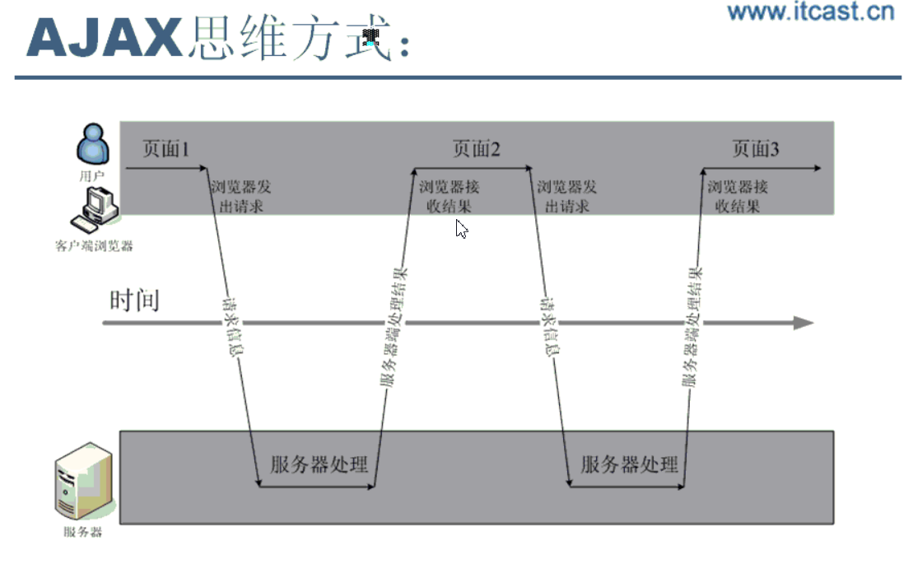
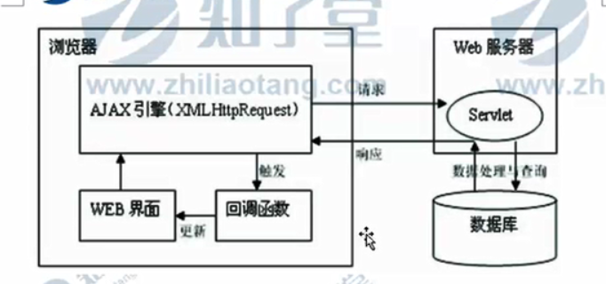

# 走进ajax

Asynchronous，JavaScript，And，xml

| 使用xhtml和css的基于标准的表示       |
| ------------------------------------ |
| 使用Dom进行动态显示的交互            |
| 使用xml和xslt进行数据交换和处理      |
| 使用xmlHttpRequest上进行异步数据检索 |
| 使用JavaScript将以上技术融合在一起   |

 ## 用处

| 改善表单验证方式，不再需要打开新页面，也不再需要将整个页面数据提交 |
| ------------------------------------------------------------ |
| 不需要刷新页面就就可改变页面内容，减少用户等待时间。         |
| 按需获取数据，每次只从服务器获取需要的数据                   |
| 读取外部数据，进行数据处理整合                               |
| 异步与服务器进行交互，在交互过程中用户无需等待，仍可继续操作 |

## 扩展技术

jQuery，fastjson，js跨域

## ajax是什么

| 传统web应用所采用的的同步交互方式实现数据呈现，这样导致服务器处理请求的时候，客户端必须等待，这种方式让用户体验不连贯 |      |
| ------------------------------------------------------------ | ---- |
| ajax相当于浏览器客户端之间架设一个桥梁，在他帮助下，可以消除网络交互过程中处理一等待一处理的缺陷 |      |

# ajax异步交互

| 浏览器发送请求到服务器                                       |
| ------------------------------------------------------------ |
| 服务器端通过后台业务框架进行数据处理                         |
| 服务器处理好的数据转换成xml、json、text，同时将数据发送给客户端 |
| 客户端通过xmlhttprequest核心对象对数据进行解析处理           |
| 最后再将解析好数据通过html，css等技术进行装饰                |

# 第一个ajax程序

## 案例要求

| 利用ajax实现登录验证                                         |
| ------------------------------------------------------------ |
| 目标：重点观察数据（浏览器与服务器之间的数据交互）是怎么进行交互，网页是不是控模型OMG |

## 编码

设计一个简单的登录表单

通过js发送一个人ajax的请求

后台开发商一个sevlet完成请求处理与响应

最后浏览器返回登录验证的信息

注意：

| xml就是一种数据结构，数据模型，且是有关联的数据模型          |
| ------------------------------------------------------------ |
| WebService应用，就是以xml数据进行数据之间的传递与交互        |
| 设计一个数据结构，能够体现出数据之间的关系，例如：使用xml来完成一个学生信息的呈现 |

<Students>

​	<student></student>

</Students>

然后利用js DOM将数据放到响应的HTML里面

