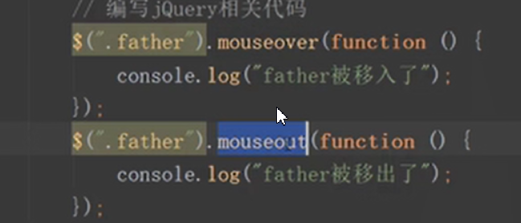
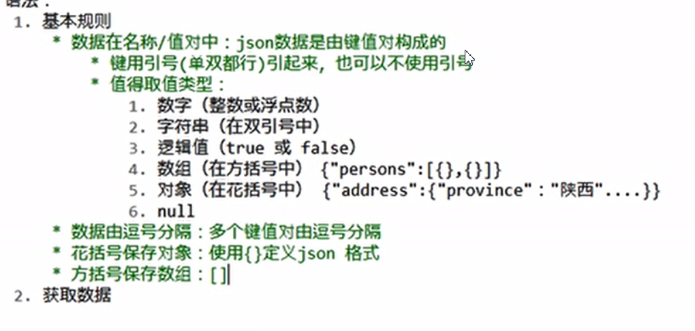

# 零玩转jQuery-初识jQuery

## jQuery是什么？

jQuery是一款优秀的JavaScript库，从命名可以看出jQuery最主要的用途是用来查询（jQuery=js+query），正如query官方logo副标题所说（with  less do more）使用jQuery能让我们对html文档遍历和操作，事件处理、动画以及ajax变得更简单

```xml
<!DOCTYPE html>
<html lang="en">
<head>
    <meta charset="UTF-8">
    <title>Title</title>
    <script src="js/jquery.js"></script>
    <style>
        *{
            margin:0;
            padding:0;
        }
        div{
            width:100px;
            height: 100px;
            border:1px solid #000000;

        }
    </style>
    <script>
        window.onload=function (ev) {
            //1.利用原生的js查找dom元素
            //利用原生的js修改背景颜色
            /*var div1=document.getElementsByTagName()("div")[0];*/
            var div2=document.getElementsByClassName("box1")[0];
            var div3=document.getElementById("box2");
          /*  console.log(div1);*/
            console.log(div2);
            console.log(div3);
            div2.style.backgroundColor="red";
            div3.style.backgroundColor="red";
        }
        $(function () {
            var $div1=$("div");
            var $div2=$(".div1");
            var $div3=$("#div");
            console.log($div1);
            console.log($div2);
            console.log($div3);
            console.log("hah");
            $div1.css(
                {
                    background:"red",
                    heihgt:"100px"
                }
            );
        });
    </script>


</head>
<body>
<div></div>
<div class="box1"></div>
<div id="box2"></div>
</body>
</html>
```

# 如何使用jQuery

下载jQuery库

引入下载的的jQuery库

```
<script src="js/jquery.js"></script>
```

原生js入口函数

```javascript
 //原生js的写法
        window.onload=function (ev) {

        }
```

jQuery的写法

```javascript
 $(document).ready(function () {
            alert("hello lnj");
        });
```

注意：

| 原生js和jQuery入口函数的加载模式不同                        |
| ----------------------------------------------------------- |
| 原生js会等到dom元素加载完毕，并且图片也加载完毕才会执行     |
| jQuery会等到dom元素加载完毕，但不会等到图片加载完毕就会执行 |

```javascript
window.load=function (ev) {
            //通过原生的js入口函数可以拿到DOM元素
            var img=document.getElementsByTagName("img")[0];
            console.log(img)
            //通过原生的js入口函数可以拿到DOM元素的高度
            var with1=window.getComputedStyle(img).width;

        }
        $(document).ready(function () {
            //通过jQuery入口函数可以拿到dom元素
            var img=$("img");
            console.log(img);
            var $width=img.width();
            
            console.log($width);
        });
```

```
//原生的js如果编写了多个入口函数，后面编写会覆盖前面编写
 window.onload=function (ev) {
            alert("hello1");
        }
        window.onload=function (ev) {
            alert("hello2");
        }
   //jquery中编写多个入口函数，后面不会覆盖前
          $(document).ready(function () {
            alert("hello1")
        });
        $(document).ready(function () {
            alert("hello1")
        });
```

jQuery的四种写法

```JavaScript
/*  <!--第一种写法-->
        $(document).ready(function () {
            alert("hello");
        });*/
        //第二种写法
       /* jQuery(document).ready(function () {
            alert("hello");
        });*/
        //第三种写法（推荐）
       /* $(function () {
            alert("hello ")
        })*/
        //第四种写法
      jQuery(function () {
          alert("hello ")
      })
```

# jQuery的冲突问题

释放$的使用权

```
        //释放$的使用权
        //注意点：释放操作必须在编写其他jQuery代码之前编写
        //释放之后就不能再使用$,改为使用jQuery
        //2.自定义一个访问符号
        var nj=jQuery.noConflict();
        
        jQuery.noConflict();
        jQuery(function () {
            alert("hello ");
        })
```

# jQuery的核心函数

```JavaScript
  //$()就代表调用jQuery的核心函数

    // 接收一个函数
        $(function () {
            alert("hello");

        })
    //    接收一个字符串
    //    接收一个字符串选择器
    //    返回一个jQuery对象，对象中保存了找到的dom元素
        var  box1=$(".box1");
        var  box2=$("#box2");
        console.log(box1);
        console.log(box2);

    //    接收一个代码片段
    //     返回一个jQuery对象，对象中保存了创建的dom元素
        var  p=$("<p>我是代码片段</p>")
        console.log(p)
        box1.append(p)

    //    接收一个dom元素
    //    会被包装成一个jQuery对象返回给我们
        var span=document.getElementsByTagName("span")[0]
        console.log(span)
        var $span=$(span)
        console.log($span)
```

# jQuery的对象

```
 /*
        * 1.什么是jQuery对象
        * jQuery对象是一个伪数组
        * 2.什么是伪数组
        * 有0到length-1的属性，并且有length属性
        * 
        * */
        $(function () {
            var $div=$("div");
            console.log($div)
            var arr=[1,2,3]
            console.log(arr)

        })
```

# jQuery的静态方法

```JavaScript
<!DOCTYPE html>
<html lang="en">
<head>
    <meta charset="UTF-8">
    <title>Title</title>
    <script src="js/jquery.js"></script>
    <script>
        // 定义一个类
        function AClass() {

        }
        AClass.staticMethod=function () {
            alert("staticMethod'")
        }
    //    静态方法通过类名调用
        AClass.staticMethod()
    //    2.给这个类添加一个静态方法
    //    直接添加给类的就是静态方法
    //3.给这个类添加一个实例方法
        AClass.prototype .instanceMethod=function () {
            alert("0instanceMethod")
        }
    //    实例方法通过类的实例调用
    //    创建一个实例（创建一个对象）
        var a=new AClass()
    //    通过实例调用实例方法
        a.instanceMethod()
    </script>
</head>
<body>

</body>
</html>
```

# jQuery的静态方法

each方法

```JavaScript
 <script>
        /*第一个参数：遍历到的元素
        * 第二个参数：当前遍历的索引
        * 注意点：
        * 原生的forEach方法只能遍历数组，不能遍历为伪数组
        * */
        var arr=[1,3,5,7,9]
        var obj={0:1,1:3,2:5,3:7,4:9,length:5}
        arr.forEach(function (value,index) {
            console.log(index,value)
        })
    //    利用jQuery的each静态方法遍历数组
        /*
        * 第一个参数：当前遍历的索引
        * 第二个参数：遍历到的元素
        * 注意点：
        * jQuery的each方法是可以遍历到伪数组
        * */
        $.each(arr,function (index,value) {
            console.log(index,value)
        })
        $.each(obj,function (index,value) {
            console.log(index,value)
        })
    </script>
```

# jQuery其他静态方法

```
<!DOCTYPE html>
<html lang="en">
<head>
    <meta charset="UTF-8">
    <title>Title</title>
    <script src="js/jquery.js"></script>
    <script>
        /*
        *$.trim()
        * 作用：去除字符串两端的空格
        * 参数：需要去除空格的字符串
        * 返回值：去除之后的字符串
        * */
        /*var  str="     lnj    "
       var  res=$.trim(str)
        console.log("------"+str+"-------")
        console.log("------"+res+"-------")*/
        //真数组
        var arr=[1,3,5,7,9]
        //伪数组
        var arrlike={0:1,1:3,2:5,3:7,4:9,length:5}
        //对象
        var  obj={"name":"lnj","age":"33"}
        //函数
        var fn=function () {
            
        }
        //window对象
        /*
        * $.isWindow()
        * 作用：判断传入的对象是否是window
        * 返回值：true，false
        *
        * */
       /* var  w=window
        var res=$.isWindow(arr)
        console.log(res)*/

        /*
        * $.isArray()
        * 作用：判断传入的对象是否是数组
        * 返回值：true，false
        *
        * */
        var res=$.isArray(arr)
        console.log(res)
         /*
         * jQuery框架本质是一个函数
         * */

    </script>
</head>
<body>

</body>
</html>
```

# jQuery的holdReady方法

```javascript
<!DOCTYPE html>
<html lang="en">
<head>
    <meta charset="UTF-8">
    <title>Title</title>
    <script src="js/jquery.js"></script>
</head>
<script>
    //$.holdReady(true)作业：暂停ready的执行
    $.holdReady(true)
    $(document).ready(function () {
        alert("ready")
    })
</script>
<body>
<button>回复ready事件</button>
<script>
    var btn=document.getElementsByTagName("button")[0]
    btn.onclick=function () {
        alert("btn")
    }
</script>

</body>
</html>
```

# jQuery的内容选择器

```JavaScript
<!DOCTYPE html>
<html lang="en">
<head>
    <meta charset="UTF-8">
    <title>Title</title>
    <script src="js/jquery.js"></script>

</head>
<style>
    div{
        width: 50px;
        height: 100px;
        background: red;
        margin-top:5px;
    }

</style>
<script>
    <!--:empty-->
    /*
    * 作用：找到既没有文本内容也没有子元素的指定元素
    * */
    var div=$("div:empty")
    console.log(div)
//   :parent 作用：找到文本内容或子元素的指定元素
    var div=$("div:parent")
    console.log(div)
//    :contains(text)作用：找到包含指定文本内容的指定元素
    var div=$("div:contains('我是div')")
    console.log(div)
//    ：has（selector）
    var div=$("div:has('span')")
    console.log(div)
</script>
<body>
<div></div>
<div>我是div</div>
<div>他们我是div123</div>
<div><span></span></div>
<div><p></p></div>
</body>
</html>
```

# jQuery的属性和属性节点

```JavaScript
<!DOCTYPE html>
<html lang="en">
<head>
    <meta charset="UTF-8">
    <title>Title</title>
    <script src="js/jquery.js"></script>
     <script>
          $(function () {
                 //编写相关代码

              /*
              *  1.什么是属性
              *  对象保存的变量就是属性
              *  2.如何操作属性
              *  对象.属性名称=值
              *  对象.属性名称
              *  对象["属性名"]=值
              *  对象["属性名"]
              *  3.什么是属性节点
              *  <span name="it666"></span>
              *  在编写html代码时，在html标签中添加的属性是属性节点
              *  在浏览器中找到span这个dom元素后，展开看到的是属性
              *  在attribute属性中保持的所有内容都是属性节点
              *  4.如何操作属性节点
              *  Dom元素：setAttribute（“属性名称”，“值”）
              *  5.属性和属性节点有什么区别
              *任何对象都有属性，但是只有dom对象才有属性节点
              * */
           })
         var  span=document.getElementsByTagName("span")[0]
          span.setAttribute("name","lnj")
         console.log(span)
     </script>

</head>
<body>
<span>swwo</span>
</body>
</html>
```

# jQuery设置属性

```JavaScript
<!DOCTYPE html>
<html lang="en">
<head>
    <meta charset="UTF-8">
    <title>Title</title>
    <script src="js/jquery.js"></script>
    <script>
        $(function () {
            /*
            * 1.attr(name)
            * 作用：获取或者设置属性节点的值
            * 可以传递一个参数，也可以传递两个参数
            * 如果传递一个参数，代表获取属性节点的值
            * 如果传递两个参数，代表设置属性节点的值
            * 注意点：
            * 如果是获取：无论找到多少个元素，都只会返回第一个元素指定的属性节点的值
            * 如果是设置：找到多少个元素就会设置多少个元素
            * 如果是设置：如果设置的属性节点不存在，那么系统就会自动新增属性
            *
            * */
            // var res=$("span").attr("class")
            // console.log(res)
            // console.log($("span").attr("class","box"))
        //    removeAttr(name)
            /*
            * 注意点：会删除所有找到元素指定的属性的节点
            *
            * */

            $("span").removeAttr("class name")
        })

    </script>
</head>
<body>
<span class="span1" name="it666"></span>
<span class="span2" name="lnj"></span>

</body>
</html>
```

# prop和removeProp方法

```JavaScript
<!DOCTYPE html>
<html lang="en">
<head>
    <meta charset="UTF-8">
    <title>Title</title>
    <script src="js/jquery.js"></script>
  <script>
       $(function () {
              //编写相关代码
      /*
      *   1.prop()
      *   特点和attr方法一致
      *
       *    2.removeProp()
       *    特点：和removeAttr方法一致
      *
      *
      * */
      $("span").eq(0).prop("demo","it666")
         console.log($("span").prop("demo"))
           $("span").removeProp("demo")
           /*
           * 注意点：
           * prop方法不仅能够操作属性，还能操作属性节点
           * 官方推荐在操作属性节点时，具有true和false两个属性节点如checked、selected或者disabled使用prop（），其他使用attr（）
           * */
           console.log($("input").prop("checked"))//true  false
           console.log($("input").attr("checked"))//checked undefined
        })
  </script>

</head>
<body>
<span class="span1" name="it666"></span>
<span class="span2" name="lnj"></span>
<input type="checkbox" checked>
</body>
</html>
```

## 更换图片练习

```
<!DOCTYPE html>
<html lang="en">
<head>
    <meta charset="UTF-8">
    <title>Title</title>
    <script src="js/jquery.js"></script>

         <script>
              $(function () {
                     //编写相关代码
                  //给按钮添加点击事件
                  var btn=document.getElementsByTagName("button")[0]
                  btn.onclick=function () {
                      //   获取输入框输入的内容
                      var input=document.getElementsByTagName("input")[0]
                      var text=input.value
                      //   修改img的src属性节点的值
                      $("img").attr("src",text)
                  }


               })
         </script>

</head>
<body>
<input type="text">
<button>切换</button><br/>
<img src="data:image/jpeg;base64,/9j/4AAQSkZJRgABAQAAAQABAAD/2wCEAAkGBxMSEBUQExMVFRUVFxgVFRYVFRUVFRAWGBUYFhcVFRUYHSggGBolHxcXITEhJSkrLi4uFx8zODMtNygtLisBCgoKDg0OGxAQGy8lHSIuKy0rLSstKy0tLS0rLS0tLS0tLS0tLS0tLS0tLS0tLS0tLS0tLS0tLS0tLS0tKy0tLf/AABEIAMIBAwMBIgACEQEDEQH/xAAbAAACAwEBAQAAAAAAAAAAAAADBAECBQAGB//EAEUQAAEDAQQHBgMFBgMIAwAAAAEAAhEDBBIhMRNBUWFxgZEFIqGxwdEGMvBCUmJy4RQVgpKy8RYzg0NTVJOio8LiIzRj/8QAGAEBAQEBAQAAAAAAAAAAAAAAAQACAwT/xAAqEQACAgAGAgEEAQUAAAAAAAAAAQIRAxITITFBFFFhBDJCkfAFIlKBof/aAAwDAQACEQMRAD8A82GK4YitYrhi9Z4wQYrBqOGKQxRAg1SGIwYrBiQsCGKwajBitcUVgAxSGI4YpuKKwFxTcR7im4oQFxSGI4YpFNBAAxTcTAYp0aBF7ikMTGjUhiBABikU0yKasKaiFRTRm0NqZp0kYUVls0JFig00+KC7QhAiFzcu0G1aVOzk5CArPohuWe3Ys2JnmlHHZs4oLmJ1zUPRJATLFU009olU0lEImmqmmnjTVDTRZCejXJrRrlWRnCmrimjtpq4prscRcU1cU0cU0QU0kLBisGJgU1YU0mRcMUimmdGp0ahFgxTcTIpqRTRZCwYpuJkU1IposRYU1YU00KasKarEVFNWFJNCkrCks2IoKSuKSbFJWFJFiKCkriinBTUikixF6dNMBkBEZTRW0pWWzSFbiLTpjWExoYUFqLEBUfswCVewlP6KV2gRYGfoV2hWgaaqaSrKjPNJVNJaBpKDSVZGcaSoaS0TSVDSRZGdolKd0SlVkZLaau2mmRSRBSXeziKimrCmmhSVxSTYCmjUiknBSUikqyFBTU6NN6JTolWVCmjUimmxSVhSRY0KaNSKSbFNWFJFjQqKSsKSbFJWFNFjQqKSuKSaFNXbTRZpIUFJXFJNimrCks2NCopKwpJwUlYUkWNCjaKM1iYbSRdEstmkhHRKdEnm0lOjhFjQjoVGiTujXaJFjQloVGiT2jUXFWVCOhUaBaF0BVciyoz30UJ1Faf7MdfupFBo1Tx9kZiymRoVy2L24dFysxUebbTRBTTDaauKa9FnnoXFJXFJMCmrimqyoVFJWFNNCmp0arKhXRrtEnBTU6NVlQpolIpJsU1OjRY0KimpFNN6NSKarNUKimrCmmhTUimixSFxTVxTTApq4prLY0Ltpq4po4pogpos1QuKauKaOGK4YixoAKasGI4YrBizZpIBcUXEzcXaNFjQto11xM3F1xVjQsWKtxNOCqWosKFtGojYmCxVLFWVC7sc5QixNFqqWIsqFbi5M3FyrKjMFJWFJFCIF2s4UBFJWFJHCuFZhyi2jVhTTICkNCsxZRYU1OjTIYFYU1ZhyiwpqQxNaNdo1ZiyiwYraNHuKYRY0BFNWFNGAVgxFjlAimrCmihisGos0kCDFIajhm5SKarFIEGqwYihiu1izY0DDFYU0ZtNFbTUaFhTXaNNimuNNNMrFNGqliacxULFliLFiqWpgtVCFmxygC1ULUchVIWXMcgAtVS1GIVHBYcxyArqhXXLOoWmzMDUQNWAz4mpbHdUQfElP7p/mHsunkR9mfHkboCsFhj4kp62O6iFYfEtL7ruoV5ES8eRuhSFhf4mpbHdQrf4lpbD1CPJj7Hx5G6FYLAPxDTMEDIzi6MwR93epPxIwfZH/M/9UeTD2PjSPQAKQFgj4hacqc/6g9lb9/nVRJ/1Go8qHsfGkbwlWhYLe3nf8O7/AJjFP+IXf8O/+ZqPKh7HxpejegqzZWCfiN3+4qdWlVHxORJ0FXE7BhgB6I8qPsfGkejDSrAHYvMt+LW/7up/Kpd8YsGBY8TgAWkSdgnWryUPjs9OCdisJ2Lyj/jemM2kfm7qC/49pj7nOo0J8hBos9nMK4cvD/48YY+TD8c6iNQKKfjN0AtY0yf/ANY34imeiH9Sh0WbXxd2y6zWcOpkB7nBokTAglxgoXYHxW2qKbajmhzgBIkG/JGIIiDhBGvDDBeS7X7abWDnV3tIuxThtVjaJJzBcO845cMtad+Gu3m0qVxmjqS6ZxkG6BAH1mta9Rzt0h0vxrc+jgrpXnrN8RExeZnsDh4lB7S7XqPDmNF0EReAMxux9FP+o4KWxlfSYl1R6YoDzvXz20We0kPAruh0TN45byMErVs1ucCDangHA5g68oE9Fwf10ZfB08WS7Po7nrGb8SWY1DSFVt4EjJ0SASZcRAiDr2bV4uy2SvSYWaQvl14kuqkycMhwCT/cxFR1YU2Xj95tQgEzJAnGZK5vHT7NrBo+kvt9MC8ajIOIN5sEbZlKv7boD/atP5Zf/SCvCfsloBIbohwpVTjtkKH9n2szNVg/0KnhezWHi/K/ZtYR6Dtv4rqscG2ag6rtc5tRreABA6rDtvxD2k8uDWU6TT8supAt1Ylz5nkgfui0kT+0Rrws5nkM9Sr+47QTBtdRs7KbmjrKtWPtf9HT+BJn7wAwtTRu02vM5CFKO74ZrT/9uv8Ay1ly3qr/ACX6LI/Rih7cDDgCJaTEGMEb94NvXYAAAxJmRGvwGCQbZdTnExJImMJyPERihU7M114hxgZSM2nV+YA+C60uzzWzZp2puQukzjN6WZ+AxUUq9MkAvaCQcgSJgnXnhHUoNStQklrCZIMEmDjt3x4obbZTBJFMcznIWKfSNWuxupUuzD+9Py3XYzllMa0u61x3XTM4ANgnX5ea49ugSIA1ExOHeGe7ao/xOcyA46jrORjwI5qSn6C4+wjbY0/arHYRiBOqeqap1i/FrK7gDGLs93L0Wf8AvZ4utbTAmC0CMYQmWy0PAcTAw1xqEEjn/wBQU4sVI3n2NzvkvCADL3nXIuxxHKUZvZxLQXVACCZaaj4wkCIOuB1WFRbXdUZLoBkTOUzPuj/srD3nPdLcCJIJInCJ4dFyaa7OqfwaNCwTebpqZiDLpMHEEEnPV15rv2drSRpmHE5N2YACTn7pB7KLLgMvMkVJJ7wIz45FdTZRDWs0Ukn5nZySYDtw8YWaf8Q2kaVW002Y6VwkwAGMlxOJuzmFanbWOBLdI+Wn7LYcREmQMMNSWFvADg9jQabpAj5MnEdQEpQ7UqNY1rCBPdAi6O9PrhyQsNvo1qUb1mp3jeFAi6CJeZJ70ETqxbijvtFRrrraIcM5LhDZk4EnZhAC8623Vnd4kkzBE/KXa4S9LtUta5mOEuE4w4EjDbg48VnRbHVSPSuD3SH020hDTqqkyYu4jVGOOSYoUqF0GCQTDSe86SNd4kzh4rzFftK9TdAloJgzByEDhDiFnt7SeHYkxMiDGOc8pKVgya5oHjRTPd1H0A4dx5dGbYkNAORGQnYl7R2jZ2BzgHE/ic9wEGMiYGswvKC2VXMjSHCbuOo+eSPYaYvEOdMAbCHTJ9laNfcy1r4Rpdt2z9op6E07jbwLSAbwLZy5ThxTXZVr/Z2GnTbhN45lwvAReM6sBhsQG21xY8XWi7N6cxwjblzSzfiHEYCZxdhqCKbjlS2NKSTuzdpdsVS+CBG7nrJ3Bdau2Kkd0CesDGQVgu7bbgA0aiOOeO3PwRH9oglpBgHEt1RJJ81jR34NLF2HHfEdXEBk7YkEZKtT4jraqYOE7oz4xEeKFWtTPmaYkEk7CSOqVqV714A/YkiIukZLaw4ejDxJexo/FGrRNBLb3dAmMTCvR+KqYkaJoDfwiSMM55rMlrGFzSIwiczIvSOsJFtQO1YHPDMasV00oPo5vFkeid8S05kDRtOJDRgQdeGRkIrfiClAcS53eloxAYI+YSfqDuXlqlnY0OBxMZevKUOhBugmbuGGE4Kf0+Gy15Hsqfa9J4JD3B2UXnaueHLagOtNMlkvqBsEAhzSCcYkkYfawXkKci8JgHI5zh8vmubTc4YZcYxzHkpfTxXY679HrD2gB3Q/AYDutOWGcLl5I1nNwnJQtaCM6paz0i59Q5NZhH3hejPkstlWJk5Oy1EGSCN2S0qloyuzLsDuIII9Vn1RiHGBlO8CZXrw/k88q6DWhs1AxhIaQ0tnYWiceRQzZ3XL4xEmSDkCBE85V3PvXZ+xDQRuN32TjLMboY2O9DcMvmAnpPNN0FWZ7KANouOPdIG7PMdCeiPYqbWMf9olpaRrGceYTz7LTZjHea4A68oKJUu6ORgSAMPtd0nHqsSxbVIVGinZ1Joe0lxgC8P4nZcQZTLbE97ahGo5bA1wLY5DwWayvdLWTg4EHeJLSJ25mdoWpYe0i0uBye0j+IAjxgnkuWJmW6OkWnsy4vCy1XN+Zj3gn7zS0GR/DPQLNqU6xBfHyw53p9bk92VaXX3tMQ/vAbTJEdJCr2fay5ldpxL6QbwN0AHjIPVYtpvYdmWNNrbheJDrzzO9xGG8Z9FlP7TN47Dr3tOEeIWnXrisWzkx18jVD++W9QeixLTZZqOazIOIHUAcsSV0wkn9xibfQ7a7UajjUnUZ3nPH61IwbIY7JuBxOUBxJ6kdVmsYQ5w1B0bsDBPBWbWdcDeUcMx081pw6RnN7Ndtrmo/Ezq1XgC6J3xHRAABcXa58MMElScYL5MjE8AMOuPRUbbDennwIB/RGnXAuY3RJbDsxeOA4mB5Lqku1YsOW1v1Ciw2q68B2TieWGHjCZpFr3yHZua3H7sT6kcllumK3AinkCTGs7MAT5jqhCpBBkYGDGuCAPTqiuriHQMnEE8RMcoA5JGrSuw46yT+vgei1FXyTfoYZbHEuM5wfb0Rf2V0AkEkyTGrOfTqoslNrWEnaLu0jHDrCZpHuXpM+gn1CzJpPY0irmXHHCYOezA+46J5tem9snDu5bXA93HfHikbO8OaQci2TxzCUfTIY2MzB6OWXHMaUq4DWqsBIaSO+WidgjHxQjXuyccheO0QVa10Q6Iwg+MhFtrRJF3ukgcYzPgVtUjL9hNAJa1zu6e9hqw1dUES0gbTntyAQ6lXAbcAD4fXJUp1SRI1Hps81UzLYUOukg6tuRxkHyVqVUQBkSRjsGz62JcGYD9k8VECSMczzxVRWM16oeYEQDl9fWKASDIJIjAcwrU2BhOBkkxyP0FFdrQ2Q3vRjO2cPJS9EFbZgRJJnkuS7HkgHaAuVZATScbrsvmw4fR6Ij3Co1gGbb3uMOEoldoBAblieuceK6rZtG1tRsnBpwy1yQRlMQNhBXTNZZQdCiA4E5G+DuIIPseBRKFWajGjAEt6kjHkV1prgsvSAXScMpu4HdI1blk6fvBwJw7wjMEYjx8lRTlZmTo9D2tQLZf95pdGwiQR18DOtZdZ5hsHUJ3QAPZaWm09MtyukzP4iBI3fL0KRgGzv3ADjJaR5OHNYhsqYy3ewragRi7UHEcZyRhWiMTD5P5XAmPPxRrWTUaWwJkT08llVJDGO5+/ku8EpIw9jRs9rdMzrbB2SQfAp4WhtNtUDMyAeBaffqsizPlpbsOHU+wXV3kg7QI3Zf2WZYX9xKew0bYBIGz9Y8fEolGo0PGwwZ4twWK4kOBG7DoPZN2fvuDZjPHU3E48BI6FalhbAmxq0V8MMCSOuvyKq50ubqBvHhIAStuaWkzgWvxHAHFWbU7rJ3A83YjzQoVG0V7mvTbNWDgJk8Bj6DxSdOiSXgYyHU44BhBnqmK1bINzuGeMQfJDstph7iNcnndI8wFxTlTOmxnVQ6ZI+WBwMZK7Krg+OA5gkeq1LM0OZUMiYa/HWb4B8khZXNdVc4xhB3fMZ811jJSTVcGXGqGLUQx72fhZUj8RZJWh2zXaaLm/aAaOQn28VkdpVL1pvbWNPK4Qpt7r3OB1ELnktxf+zWarGW2gCiAcw0f9UHyakxayBngI/pJKDazg1gzJ6SIHSPNKOqfrxkg8l3hgpmHI16Fa7ju/T1R6FrEt4/38SsqgSRHCPE+hVrOcYnXgfLzXOWEKkbFSuATuk80KrbO4NfdHhPuVmurHEaz+o9FNOpeE7AfEfosrCrkcxV9oJDcdYx2Z/otO0UTTbc13QcNuaz7NZw7uzF3Hxn1Wran6V7MYLmxzEj0ViNJpIktjLr1+8RqyHoqmuS4HGCMfVFNnLizXLSN8gT6phlACl3szhhqBGXVbzQSCmLvtcxtDjHAgeyYFWQ7HPLpISNahMxuI/hw9UekIwOEnHE/ZwWZRVbCrBMtgjErkpVoC8YylcuunFhuP2V14sMx9BHoPqXSyMQSDvF+II5eIWXSfAB2YdP7LcFpu1BVb9pod/FI9QueIsvRuLMc3muuTBEOYdpi8OoBC5vzSMA49BAMJjtJwdNXKMhxJkeKDXgBr/vOfygR6rpF2jm9mM2a1GnVOtrpnwEeStStF3uxnhtnYDyWYyv3nA7J4EEfXJMmndumZMk+Lh6eKnhrsMwajXl5JOYg8UpaR3MdRw/mKrYzhuI16nSYhTaWiInhug5fWxKhUgbFaFYgzvx6hM2itieLgfAT5JajS74HA+4RrQIqPGolwHp5Lu6syBq1cZ+tZTFkqEVJbqk7cMcCOaTqnMfWCefQF1jgcXAzxvfqESSSFF+1q1+HDDCCN4OGPh0S1N5AA3eUFdWfiW6suExHREsLZz4eYWUlGA8sI6oQS7LDDmJVadbEHcOkn3RLU8G7sg+cJWr3Wj8v/AJErMYpojWo2gANbqIg8L5nwJSNFt01N4I6Ee5XNaYBnInxxUt+c7CCOg/ssKFXXYthKgOkndHAAGPNdaX445EiPH9FSm+Xu3Eeg91Sr9g8z7eBWktwsYNO8C7W0tceF4A+fgsp7SDG8+a0LCSWl04wQd8yQlbS2X84+ui1htpuIvgtRf3hy8nBFs7sBy8JHsg2cgXidUn9PEK1nx6/XomSBHVXHvEbXdMvVdZXEmNuHSPbxV7bTuA7zjzM+iDYX9+7vVs4tj2OWWpD3u1EDkJKZ0neadkpaqC1xOoyPMx5It0OugYEu9RPqvNKKbsVfAxStnyuAEi8TzBBQaTnODxBIE+UoNmpgMeZ+0QOBIzTdCsKdF33nuiN2F4+ACy4pcG18kWR4LpjcB5+SjtCDJyGJnZjKWp1Mp2+irb60iBxKVB5wvYFeacxiuSTqi5evTOdjbxAj6lMMq5cBHggWxsyVSzOkY7PorFZo2dJbMNanEtIxxmY3GSuqiaVONTnHxAKJZ8QJ3jkR+qDScQA3YDO491EeKMMFTZNW794HPfPsmbSCXAa4A64nzQDAqyMgB5ifMpthvPftEdQ1MpUACztxLenLNDwdgd8cZGfiFodkUg95LomQ4bxjeHkkbXRIqOGXeIH82AVFrM0WXawdnPeadeIO/MT9blFoMvB/Fj1hUriHXhkZI8yDsz8US1twa/aDzgyulb2AvXEOITFmq4N3E+hQawxcfrJVpnDmPGfZaatEMVKffxykeYKtejwdPF36lDqOx+tiikZIB2R5Hz81ithsPYaYcQ12oEY/nbnyJXW2zlsflnlDsOOBC6YlwOtwHMT6q9qqXmA/hPnJ8ysO8y9DtRFKqCwt59AD5T0VmNLyAMyDHG4IHOPFJ0ZBy2eOHr4pmwgte3bJjiMPRMopWwRWjN921zZ6d4+SG2peJ4HkMPdM1BDyfwOHRseqQomD9ax+oWo7qyHrLgCAdYHmFJs15zhwcB94CQ6OGfCUCzVYcfzeZTLKxlrpxa5xB/hXOSabYqgLqQNO+M3at7fmHiCgWAm+Bt+itCo8ZAYFt4fhMQR0d4LNBioCNoP14rUHmTRPnY1rcQ4idd4/9v8AVZTBdq8D6J+owyDsaPEewWXUMunajBW1FJmrbBe+X7xPUBCpPkNOsEnjhj5Id83Z2wRyXU8AeXn+qyo1GivcPMNGqXXigGuS6Bk0QN+uVdxvAu1AeJwS9n/v4rUY8tkEFbEnYPHUorVO7P1nmhE6uvVXr0/kG0Y7sVqlaITXK1RsEjYYXL0pWjI/SqBzYP1rVaRgubrulLU6mHBWszyXj6wXnyVZvNaG6DgGTw8cEKCKhbx/plUe7uEbx4K1E3g77wYCNuHdPh5KjGrZmQIzntOG/H9E3Z6nfdvaFWgzAT97Dcr2+ndrEDIsBHMf3WZNN5Ry0rDWQllypP2ixw2CAR5HoqW20XnOOoknh359VNCpLSw64bwOF13VZrnGSDvHj+iIwt2ybDVqRLbwhwwmM2mI7w1cVS9NLfJI4YT5rpLA14wJnpgIKG3MDj4rslsZLOZ3g0a4jmP1VQcI2j391am7I7APD+y60ASY2TzJV3RBqtIlzcRjHUq4AD37O+BujEeSEx/eZO0HohuMmdpk8z+qykyCvEFo3jDaYhWn/wCPk7rJ9kKs6Ht3XSr03Y1G6jejkT7lWXZEFoOBYDsAaeZwPLFEtY77DsLjzJvQkqLu6W7WxzvSEW0VpuHh1981nLuazBLTVipIO8bpg+iCBecCQACTgMh3cI5hRazkenQK1nyE7z0B9glbRDk6mcH7485Uir3TxJ8SgPMYfWAR22fGNovdTiEtKrYIl9TGN4PHEemCpUpRB4ef10U2o90DZ7z6owfeYHH8p5ZHoSs8JNCMmoXRGMN8Bh6LHBh3NOWOqQW8CPE+qWrABxTBU2iGrNTvM5n3VqIBc4fgnmFTs6pAKqDDh06iPristbtCifslpyiejig0ZE9Sm6xF1o4jglMgY3LUXaFomrgL2sxCYpVe8zd/dLVj3QppPxnYEtWiT3A1nS4naT5qVUhSuqoxuHs4wd+UKGfMPy+pXLlzfZo53qrWP5v4XKVyOg7D/wCzP5h/SrWn56f5T/UVC5cV937Oj4F2n5uDfRUdm/j6FcuXaJzYcjus/KfMJCnmFK5MOAJp5ojtfLzK5ctPkCG5t4ehUO9B5BQuQJavmOXkrUv8w/xeq5clcAUHyj61qauXM+ZXLlPkg9q/y2cT5BWb/lDn5Lly5v7TaF7Z855eQTtDNv5fULlysT7CXIra9fH0Cmh/lu5eZUrlfggZ1HNvP+tUqZ8iuXJ/IiKOvmiO+bl6rlypfcJNQ58EKl8ruXquXIjwXZ1rz+tirSyPBcuW/wAQ7L0xgFy5csvkj//Z"/>
</body>
</html>
```

# jQuery操作类

```JavaScript
<!DOCTYPE html>
<html lang="en">
<head>
    <meta charset="UTF-8">
    <title>Title</title>
    <style>
        *{
            margin: 0px;
            padding: 0;
        }
        .class1{
            width: 100px;
            height: 100px;
            background: red;
        }
        .class2{
            border: 10px solid #000;
        }
    </style>
    <script src="js/jquery.js"></script>
     <script>
          $(function () {
                 //编写相关代码
              //addClass(class|fn)
              /*
              * 作用：添加一个类
              * 如果要添加多个，多个类名之间空格隔开
              *
              * */
              var btns=document.getElementsByTagName("button")
              btns[0].onclick=function () {
                  $("div").addClass("class1 class2")
              }
              /*
              * removeClass()
              * 作用：删除一个类
              * 如果想删除多个，多个类名之间空格隔开
              * 3.toggleClass(class|fn)
              * 作用：切换类
              * 有就删除，没有就添加
              * */
              btns[1].onclick=function () {
                    $("div").removeClass("class2")
              }
              btns[2].onclick=function () {
                  $("div").toggleClass("class2 class1")
              }
           })
     </script>


</head>
<body>
<button >添加类</button>
<button>删除类</button>
<button>切换类</button>
<div ></div>
</body>
</html>
```

# jQuery操作文本内容

```JavaScript
<!DOCTYPE html>
<html lang="en">
<head>
    <meta charset="UTF-8">
    <title>jquery 操作相关文本值的方法</title>
    <style>
        *{
            margin: 0;
            padding: 0;
        }
        div{
            width: 100px;
            height: 100px;
            border: 1px solid red;
        }
    </style>
    <script src="js/jquery.js"></script>
     <script>
         /*
         * html（）
         * 和原生的innerHTML一模一样
         *2.Text()
         * 和原生的js中的innerText一模一样
         *
         * */
          $(function () {
                 //编写相关代码
              var btns=document.getElementsByTagName("button")

             btns[0].onclick=function () {

                     $("div").html("<p>我是段落<span>我是span</span></p>")
              }
              btns[1].onclick=function () {
                    console.log($("div").html())
              }
              btns[2].onclick=function () {
                  $("div").text("<p>我是段落<span>我是span</span></p>")

              }
              btns[3].onclick=function () {
                  console.log($("div").text())
              }
              btns[4].onclick=function () {
                    $("input").val("请输入内容")
              }
              btns[5].onclick=function () {
                  console.log($("input").val())
              }

           })
     </script>

</head>
<body>
<button>设置html</button>
<button>获取html</button>
<button>设置text</button>
<button>获取html</button>
<button>设置value</button>
<button>获取value</button>
<div></div>
<input type="text">
</body>
</html>
```

# jQuery操作css

```JavaScript
<!DOCTYPE html>
<html lang="en">
<head>
    <meta charset="UTF-8">
    <title>jquery操作css样式的方法</title>
    <script src="js/jquery.js"></script>
     <script>
          $(function () {
                 //编写相关代码
              //逐个设置
              $("div").css("width","100px")
              $("div").css("height","100px")
              $("div").css("background","red")
           //   链式设置
           //   注意点：链式操作如果大于三步，建议分开
              $("div").css("width","100px").css("height","100px").css("background","blue")
           //   3.批量设置(推荐)
              $("div").css({
                  width:"100px",
                  height:"100px",
                  background:"yellow"
              })
              //  获取css样式
              console.log($("div").css("width"))
           })
     </script>

</head>
<body>
<div></div>
</body>
</html>
```

# jQuery操作位置

```JavaScript
<!DOCTYPE html>
<html lang="en">
<head>
    <meta charset="UTF-8">
    <title>jQuery位置和尺寸操作方法</title>
    <style>
        *{
            margin: 0;
            padding: 0;
        }
        .father{
            width: 200px;
            heigth:200px;
            background: red;
            border: 50px solid #000;
            margin-left: 50px;
            position: relative;
        }
        .son{
            width:100px;
            height: 100px;
            background: blue;
            position: absolute;
            left: 50px;
            top: 50px;
        }
    </style>
    <script src="js/jquery.js"></script>
     <script>
          $(function () {
                 //编写相关代码
              var btns=document.getElementsByTagName("button")
              //监听获取
              btns[0].onclick=function () {
                    //获取元素的宽度
                    console.log($(".father").width())
              }
              //监听设置
              //设置元素的宽度
              /*
              * offset([])
              * 作用：获取元素距离窗口的偏移位
              * postion（）
              * 作用：获取元素距离定位元素的偏移位
              * */
              btns[1].onclick=function () {
                  console.log($(".father").width("500px"))
              }
            console.log($("son").offset().left())
              //注意点：position方法只能获取不能设置
              $(".son").position({
                  left:10
              })

           })
     </script>

</head>

<body>
<div class="father">
    <div class="son"></div>
</div>
<button>获取</button>
<button>设置</button>
</body>
</html>
```

# jQuery的scrollTop方法

```JavaScript
<!DOCTYPE html>
<html lang="en">
<head>
    <meta charset="UTF-8">
    <title>Title</title>
    <script src="js/jquery.js"></script>
    <style>
        *{
           margin:0;
           padding:0;
        }
        .scroll{
            width: 100px;
            height: 200px;
            border: 1px solid #000;
            overflow: auto;
        }
    </style>
     <script>
          $(function () {
                 //编写相关代码
              var btns=document.getElementsByTagName("button")
              btns[0].onclick=function () {
                 // 获取滚动的偏移位
                  console.log($(".scroll").scrollTop())
              //    获取网页的偏移位
                  /*注意点
                  *为了保证浏览器的兼容，需要按照如下写法
                  * */
                  console.log($("html").scrollTop()+$("body").scrollTop())
              }
              // 设置滚动的偏移位
              btns[1].onclick=function () {
                  $(".scroll").scrollTop(300)
                  //为了保证浏览器的兼容，需要按照如下写法
                  $("html.body").scrollTop(300)
              }
           })
     </script>

</head>
<body>
<div class="scroll">我是div我是div我是div我是div我是div我是div我是div我是div我是div我是div我是div我是div我是div我是div我是div我是div我是div我是div我是div我是div我是div我是div我是div我是div我是div我是div我是div我是div我是div
    我是div我是div我是div我是div我是div我是div我是div我是div我是div我是div我是div我是div我是div我是div我是div
    我是div我是div我是div我是div我是div我是div我是div我是div我是div我是div我是div我是div我是div
    我是div我是div我是div我是div我是div我是div我是div我是div我是div我是div
    我是div我是div我是div我是div我是div我是div我是div我是div我是div我是div我是div我是div我是div我是div
    我是div我是div我是div我是div我是div我是div我是div我是div我是div我是div我是di
</div>
<button>获取</button>
<button>设置</button>
<br>
<br>
<br>
<br>
<br>
<br>
<br>
<br>
<br>
<br>
<br>
<br>
<br>
<br>
<br>
<br>
<br>
<br>
<br>
<br>
<br>
<br>
<br>
<br>
<br>
<br>
<br>
<br>
<br>
<br>
<br>
<br>
</body>
</html>
```

# jQuery绑定事件

```JavaScript
<!DOCTYPE html>
<html lang="en">
<head>
    <meta charset="UTF-8">
    <title>Title</title>
    <script src="js/jquery.js"></script>
     <script>
          $(function () {
                 //编写相关代码
              /*jquery有两种绑定时间的方式
              *eventName（）
              * 编码效率高部分jQuery没有实现，所以不能添加
              *on（evenName，fn）
              *所有的事件都可以添加
              * 注意点：添加多个事件不会被覆盖
              * */
            /*  $("button").click(function () {
                  alert("hello")
              })*/
              $("button").on("click",function () {
                  alert("hello")
              })
           })
     </script>

</head>
<body>
<button>我是按钮</button>
</body>
</html>
```

# jQuery解绑事件

```JavaScript
<!DOCTYPE html>
<html lang="en">
<head>
    <meta charset="UTF-8">
    <title>Title</title>
    <script src="js/jquery.js"></script>
    <script>
        $(function () {
            //编写相关代码
            /*  $("button").click(function () {
                  alert("hello")
              })*/
            $("button").on("click",function () {
                alert("hello")
            })
        //    off方法如果不传递参数，会移除所有的事件
            $("button").off()
            //off方法如果传递一个参数，会移除所有指定类型的事件
            $("button").off("click")
        //    off方法如果传递两个参数，会移除所有指定类型的事件
        })
    </script>
</head>
<body>

<button>我是按钮</button>
</body>
</html>
```

# jQuery事件冒泡和默认事件

```JavaScript
<!DOCTYPE html>
<html lang="en">
<head>
    <meta charset="UTF-8">
    <title>Title</title>
    <script src="js/jquery.js"></script>
    <style>
        *{
            margin: 0;
            padding: 0;
        }
        .father{
            width: 200px;
            height: 200px;
            background: red;
        }
        .son{
            width: 100px;
            height: 100px;
            background: blue;
        }
    </style>
     <script>
          $(function () {
            /*     //编写相关代码
              // 1.什么是事件冒泡
              /!*
              * 2.如何阻止事件冒泡
              * 3.什么是默认行为
              * 4。如何组织默认行为
              * *!/
              $(".son").click(function (event) {
                  alert("son")
                  // return false
                  event.stopPropagation()
              })

              $(".father").click(function () {
                  alert("father")
              })*/
            $("a").click(function (event) {
                alert("弹出注册框")
                // return false
                event.preventDefault()
            })
           })

     </script>

</head>
<body>
<div class="father">
    <div class="son"></div>
</div>
<a href="http://www.baidu.com">我是百度</a>
<form action="http://www.taobao.com">
    <input type="text"/>
    <input type="submit"/>

</form>
</body>
</html
```

# jQuery事件自动触发

```JavaScript
<!DOCTYPE html>
<html lang="en">
<head>
    <meta charset="UTF-8">
    <title>Title</title>
    <script src="js/jquery.js"></script>
    <style>
        *{
            margin: 0;
            padding: 0;
        }
        .father{
            width: 200px;
            height: 200px;
            background: red;
        }
        .son{
            width: 100px;
            height: 100px;
            background: blue;
        }
    </style>
    <script>
        $(function () {
            /*     //编写相关代码
              // 1.什么是事件冒泡
              /!*
              * 2.如何阻止事件冒泡
              * 3.什么是默认行为
              * 4。如何组织默认行为
              * *!/
              $(".son").click(function (event) {
                  alert("son")
                  // return false
                  event.stopPropagation()
              })*/

              $(".father").click(function () {
                  alert("father")
              })
            $("a").click(function (event) {
                alert("弹出注册框")
                // return false
                event.preventDefault()
            })
            /*
            * trigger 如果你用trigger自动触发事件，会触发事件冒泡
            * triggerHanler  如果你用triggerHander自动触发事件，不会触发事件冒泡
            * */
             $(".father").trigger("click")
            $(".father").triggerHandler("click")
            $("input[type='submit']").click(function () {
                alert("submit")
            })
            /*
            * trigger：如果利用trigger自动触发事件，会触发默认行为
            * triggerHandler:如果利用trigger自动触发事件，不会触发默认行为
            * */
            $("input[type='submit']").trigger(function () {
                alert("submit")
            })
        })

    </script>

</head>
<body>
<div class="father">
    <div class="son"></div>
</div>
<a href="http://www.baidu.com">我是百度</a>
<form action="http://www.taobao.com">
    <input type="text"/>
    <input type="submit"/>

</form>
</body>
</html>
```

# jQuery的自定义事件

```JavaScript
<!DOCTYPE html>
<html lang="en">
<head>
    <meta charset="UTF-8">
    <title>Title</title>
    <script src="js/jquery.js"></script>
    <style>
        *{
            margin: 0;
            padding: 0;
        }
        .father{
            width: 200px;
            height: 200px;
            background: red;
        }
        .son{
            width: 100px;
            height: 100px;
            background: blue;
        }
    </style>
     <script>
          $(function () {
                 //编写相关代码
              /*
              *想要自定义事件，必须满足两个条件
              * 1.事件必须是通过on绑定的
              * 2.事件必须通过trigger来触发
              * */
            $(".son").on("myclick",function () {
                alert("son")
            })
              $(".son").trigger("myclick")

           })
     </script>

</head>
<body>
<div class="father">
    <div class="son"></div>
</div>
<a href="http://www.baidu.com">我是百度</a>
<form action="http://www.taobao.com">
    <input type="text"/>
    <input type="submit"/>

</form>
</body>
</html>
```

# jQuery的命名空间

```JavaScript
<!DOCTYPE html>
<html lang="en">
<head>
    <meta charset="UTF-8">
    <title>Title</title>
    <script src="js/jquery.js"></script>
    <style>
        *{
            margin: 0;
            padding: 0;
        }
        .father{
            width: 200px;
            height: 200px;
            background: red;
        }
        .son{
            width: 100px;
            height: 100px;
            background: blue;
        }
    </style>
     <script>
          $(function () {
                 //编写相关代码
              /*
              * 想要事件的命名空间有效，必须满足两个条件
              * 事件是通过on来绑定的
              * 通过trigger触发事件
              * 
              *
              * */
            $(".son").on("myclick",function () {
                alert("son")
            })
              $(".son").trigger("myclick")

           })
     </script>

</head>
<body>
<div class="father">
    <div class="son"></div>
</div>
<a href="http://www.baidu.com">我是百度</a>
<form action="http://www.taobao.com">
    <input type="text"/>
    <input type="submit"/>

</form>
</body>
</html>
```

利用trigger触发了子元素命名空间的事件，那么父元素带相同命名空间的事件也会触发，而父元素没有命名空间的事件也不会触发

利用trigger触发子元素不带命名空间的事件，那么子元素所有相同类型的事件和父元素所有类型的事件都会被触发

# jQuery的事件委托


# jQuery的移入移除事件




# jQuery显示和隐藏


# jQuery展开和收起动画


注意：在jQuery中如果需要执行动画，建议在执行动画之前调用stop方法，然后在执行动画 

# jQuery淡入淡出动画


# jquery自动义动画


# jQuery的stop和delay方法


# ajax教程

### 是什么

> “Asynchronous Javascript And XML”（异步JavaScript和XML），

> 并不是新的技术，只是把原有的技术，整合到一起而已。 

	   1.使用CSS和XHTML来表示。
	   2. 使用DOM模型来交互和动态显示。
	   3.使用XMLHttpRequest来和服务器进行异步通信。
	   4.使用javascript来绑定和调用。
## 有什么用

咱们的网页如果想要刷新局部内容。 那么需要重新载入整个网页。用户体验不是很好。  就是为了解决局部刷新的问题。 保持其他部分不动，只刷新某些地方。 

# 内部原理


同步


异步


## 数据请求 get

<%@ page language="java" contentType="text/html; charset=UTF-8"
    pageEncoding="UTF-8"%>
<!DOCTYPE html PUBLIC "-//W3C//DTD HTML 4.01 Transitional//EN" "http://www.w3.org/TR/html4/loose.dtd">
<html>
<head>
<meta http-equiv="Content-Type" content="text/html; charset=UTF-8">
<title>Insert title here</title>

<script type="text/javascript">

	<%@ page language="java" contentType="text/html; charset=UTF-8"
	    pageEncoding="UTF-8"%>
	<!DOCTYPE html PUBLIC "-//W3C//DTD HTML 4.01 Transitional//EN" "http://www.w3.org/TR/html4/loose.dtd">
	<html>
	<head>
	<meta http-equiv="Content-Type" content="text/html; charset=UTF-8">
	<title>Insert title here</title>
	
	<script type="text/javascript">
	
		function  ajaxFunction(){
		   var xmlHttp;
		   try{ // Firefox, Opera 8.0+, Safari
		        xmlHttp=new XMLHttpRequest();
		    }
		    catch (e){
			   try{// Internet Explorer
			         xmlHttp=new ActiveXObject("Msxml2.XMLHTTP");
			      }
			    catch (e){
			      try{
			         xmlHttp=new ActiveXObject("Microsoft.XMLHTTP");
			      }
			      catch (e){}
			      }
		    }
	
			return xmlHttp;
		 }
	
		//执行get请求
		function get() {
			
			//1. 创建xmlhttprequest 对象
			var request = ajaxFunction();
			
			//2. 发送请求。
			// http://localhost:8080/day16/demo01.jsp
			//http://localhost:8080/day16/DemoServlet01
			
			/*	
				参数一： 请求类型  GET or  POST
				参数二： 请求的路径
				参数三： 是否异步， true  or false
				
			*/
	//		request.open("GET" ,"/day16/DemoServlet01" ,true );
			request.open("GET" ,"/ajax/DemoServlet01?name=aa&age=18" ,true );
			request.send();
		}
		
		//执行get请求
		function get() {
			
			//1. 创建xmlhttprequest 对象
			var request = ajaxFunction();
			
			//2. 发送请求
			request.open("GET" ,"/day16/DemoServlet01?name=aa&age=18" ,true );
			
			//3. 获取响应数据 注册监听的意思。  一会准备的状态发生了改变，那么就执行 = 号右边的方法
			request.onreadystatechange = function(){
				
				//前半段表示 已经能够正常处理。  再判断状态码是否是200
				if(request.readyState == 4 && request.status == 200){
					//弹出响应的信息
					alert(request.responseText);
				}
			}
			request.send();
		}
	
	</script>
	
	</head>
	<body>
	
		<h3><a href="" onclick="get()">使用Ajax方式发送Get请求</a></h3>
	
	</body>
	</html>

​	servlet	

```
package com.lfm.servlet;

import java.io.IOException;
import javax.servlet.ServletException;
import javax.servlet.http.HttpServlet;
import javax.servlet.http.HttpServletRequest;
import javax.servlet.http.HttpServletResponse;

/**
 * Servlet implementation class DemoServlet01
 */
public class DemoServlet01 extends HttpServlet {
	protected void doGet(HttpServletRequest request, HttpServletResponse response) throws ServletException, IOException {
		
		String name = request.getParameter("name");
		String age = request.getParameter("age");
		System.out.println("收到了一个请求..." +name+"="+age);
		
		
		response.setContentType("text/html;charset=utf-8");
		response.getWriter().write("收到了请求...");
	}

	/**
	 * @see HttpServlet#doPost(HttpServletRequest request, HttpServletResponse response)
	 */
	protected void doPost(HttpServletRequest request, HttpServletResponse response) throws ServletException, IOException {
		
		System.out.println("现在来了一个post请求，将要去走get的代码了。");
		doGet(request, response);
	}

}

```


## 数据请求   post

---

```
<%@ page language="java" contentType="text/html; charset=UTF-8"
	pageEncoding="UTF-8"%>
<!DOCTYPE html PUBLIC "-//W3C//DTD HTML 4.01 Transitional//EN" "http://www.w3.org/TR/html4/loose.dtd">
<html>
<head>
<meta http-equiv="Content-Type" content="text/html; charset=UTF-8">
<title>Insert title here</title>

<script type="text/javascript">

	//1. 创建对象
	function  ajaxFunction(){
	   var xmlHttp;
	   try{ // Firefox, Opera 8.0+, Safari
	        xmlHttp=new XMLHttpRequest();
	    }
	    catch (e){
		   try{// Internet Explorer
		         xmlHttp=new ActiveXObject("Msxml2.XMLHTTP");
		      }
		    catch (e){
		      try{
		         xmlHttp=new ActiveXObject("Microsoft.XMLHTTP");
		      }
		      catch (e){}
		      }
	    }

		return xmlHttp;
	 }
	
	function post() {
		//1. 创建对象
		var request = ajaxFunction();
		
		//2. 发送请求
		request.open( "POST", "/day16/DemoServlet01", true );
		
		//想获取服务器传送过来的数据， 加一个状态的监听。 
		request.onreadystatechange=function(){
			if(request.readyState==4 && request.status == 200){
				alert("post："+request.responseText);
			}
		}
		
		//如果使用的是post方式带数据，那么 这里要添加头， 说明提交的数据类型是一个经过url编码的form表单数据
		request.setRequestHeader("Content-type","application/x-www-form-urlencoded");
		
		//带数据过去  ， 在send方法里面写表单数据。 
		request.send("name=aobama&age=19");
	}
	
	
</script>

</head>
<body>
	<h3>
		<a href="" onclick="post()">使用Ajax方式发送Post请求</a>
	</h3>
</body>
</html>
```

```java
package com.itheima.servlet;

import java.io.IOException;
import javax.servlet.ServletException;
import javax.servlet.http.HttpServlet;
import javax.servlet.http.HttpServletRequest;
import javax.servlet.http.HttpServletResponse;

/**
 * Servlet implementation class DemoServlet01
 */
public class DemoServlet01 extends HttpServlet {
	protected void doGet(HttpServletRequest request, HttpServletResponse response) throws ServletException, IOException {
		
		String name = request.getParameter("name");
		String age = request.getParameter("age");
		System.out.println("收到了一个请求..." +name+"="+age);
		
		
		response.setContentType("text/html;charset=utf-8");
		response.getWriter().write("收到了请求...");
	}

	/**
	 * @see HttpServlet#doPost(HttpServletRequest request, HttpServletResponse response)
	 */
	protected void doPost(HttpServletRequest request, HttpServletResponse response) throws ServletException, IOException {
		
		System.out.println("现在来了一个post请求，将要去走get的代码了。");
		doGet(request, response);
	}

}

```

## 校验用户名是否可用

---

### 搭建环境

1. 页面准备
2. 数据库准备

### servlet代码

protected void doGet(HttpServletRequest request, HttpServletResponse response) throws ServletException, IOException {
	try {
		
```java
protected void doGet(HttpServletRequest request, HttpServletResponse response) throws ServletException, IOException {
	try {
		
		request.setCharacterEncoding("UTF-8");
		
		//1. 检测是否存在
		String name = request.getParameter("name");
		System.out.println("name="+name);
		
		UserDao dao = new UserDaomImpl();
		boolean isExist = dao.checkUserName(name);
		
		//2.  通知页面，到底有还是没有。
		if(isExist){
			response.getWriter().println(1);  //存在用户名
		}else{
			response.getWriter().println(2); //不存在该用户名
		}
		
	} catch (SQLException e) {
		e.printStackTrace();
	}
}
```


### dao 代码

```java
public class UserDaomImpl implements UserDao{

		@Override
		public boolean checkUserName(String username) throws SQLException {
			QueryRunner runner = new QueryRunner(JDBCUtil02.getDataSource());
			
			String sql = "select count(*) from t_user where username =?";
            			runner.query(sql, new  ScalarHandler(), username);

			Long result = (Long) runner.query(sql, new  ScalarHandler(), username); 
			return result > 0 ;
		}
	
	}
```


### jsp代码

```html
	function checkUserName() {
	//获取输入框的值 document 整个网页
	var name = document.getElementById("name").value; // value  value() val val()
	//1. 创建对象
	var request = ajaxFunction();
	
	//2. 发送请求
	request.open("POST"  ,"/day16/CheckUserNameServlet" , true );
	
	//注册状态改变监听，获取服务器传送过来的数据
	request.onreadystatechange = function(){
		
		if(request.readyState == 4 && request.status == 200){
			//alert(request.responseText);
			var data = request.responseText;
			if(data == 1){
				//alert("用户名已存在");
				document.getElementById("span01").innerHTML = "<font color='red'>用户名已存在!</font>";
			}else{
				document.getElementById("span01").innerHTML = "<font color='green'>用户名可用!</font>";
				//alert("用户名未存在");
			}
		}
		
	}
	
	request.setRequestHeader("Content-type","application/x-www-form-urlencoded");
	request.send("name="+name);
}
```

### load

```
<a href="" onclick="load()">使用JQuery执行load方法</a>

有两次刷新，  先走 onClick的方法，取到数据回来之后，赋值显示。 接着 走 href=""的路径，但是这个属性没有给值，所以会把当前的页面重新再刷新一次。所以导致看不见值。
//找到这个元素， 去执行加载的动作， 加载/day16/DemoServlet02 ， 得到的数据，赋值显示
$("#aaa").load("/day16/DemoServlet02" , function(responseText , statusTXT  , xhr) {
		//找到id为text01的元素， 设置它的value属性值为 responseText 对应的值
		$("#aaa").val(responseText);
	}); 
```

### get

```
$.get("/day16/DemoServlet02"  , function(data ,status) {
		$("#div01").text(data);
	});
```


# json

1.概念：JavaScript object Notation JavaScript对象表示法


变成json格式后


| json现在多用于存储和交换文本信息的语法 |
| -------------------------------------- |
| 进行数据的传输                         |
| json比xml更小、更快、更容易解析        |

# json的语法

## 基本语法

| 数据在名称，值对中：json数据是由键值对构成的，键用引号（单双都行）引起来，也可以不适用引号2.值的类型：1.数字（整型或浮点数）2.字符串（在双引号中）3.逻辑值（true 或false） |
| ------------------------------------------------------------ |
| 数据由逗号分隔：多个键值对有逗号分隔                         |
| 花括号保存对象：使用｛｝定义json格式                         |
| 方括号保存数组【】                                           |



## 获取数据

1.json对象.键名

2.json对象[“键名”]

3.数组对象【索引】

## 遍历json	

	 var person = {"name": "张三", age: 23, 'gender': true};
			
			        var ps = [{"name": "张三", "age": 23, "gender": true},  {"name": "李四", "age": 24, "gender": true},
			            {"name": "王五", "age": 25, "gender": false}];   //获取person对象中所有的键和值
			        //for in 循环
			       /* for(var key in person){
			            //这样的方式获取不行。因为相当于  person."name"
			            //alert(key + ":" + person.key);
			            alert(key+":"+person[key]);
			        }*/
			
			       //获取ps中的所有值
			        for (var i = 0; i < ps.length; i++) {
			            var p = ps[i];
			            for(var key in p){
			                alert(key+":"+p[key]);
			            }
			        }

## json数据和java对象的相互转换

json解析器

​		常见的解析器：jsonlib，gson，fastjson，jackson（使用）

1.json转为java对象

2.java对象转换为json

​		1.导入相关的jar包

​		2.创建jackson核心对象 objectMapper

​		3.调用objectMapper的相关方法进行转换

```
1. 转换方法：
					* writeValue(参数1，obj):
	                    参数1：
	                        File：将obj对象转换为JSON字符串，并保存到指定的文件中
	                        Writer：将obj对象转换为JSON字符串，并将json数据填充到字符输出流中
	                        OutputStream：将obj对象转换为JSON字符串，并将json数据填充到字节输出流中
	                * writeValueAsString(obj):将对象转为json字符串

				2. 注解：
					1. @JsonIgnore：排除属性。
					2. @JsonFormat：属性值得格式化
						* @JsonFormat(pattern = "yyyy-MM-dd")

				3. 复杂java对象转换
					1. List：数组
					2. Map：对象格式一致
```
2.注解

1.@jsonignore：排除属性加载Bean的属性上

2.@jsonformat：属性值格式化

@jsonformat（pattern="yyyy-MM-dd"）

3.复杂java对象转换

1.List：转换后是数组

2.Map：转换为更数组一样的格式


## json转换为java对象

1.导入相关的jar包

2.创建jackson核心对象 objectMapper

3.调用objectMapper的相关方法进行转换

​		1.redyValue（json字符串数据，class）

## 校验用户名是否存在

1. 服务器响应的数据，在客户端使用前，要想当做json数据格式使用

   ​	1.$.get(type):将最后一个参数type指定为json

   ​     2.在服务器端设置MIME类型

   Response.setContentType（“Application/json：charsst=utf-8”）; 