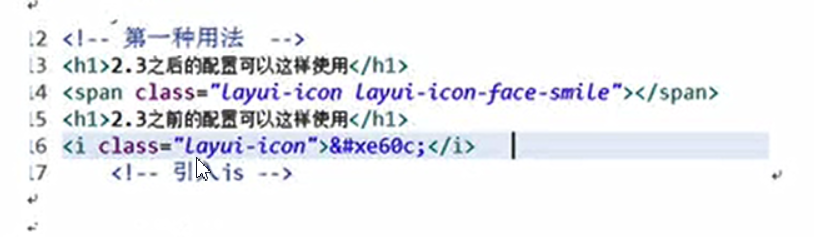
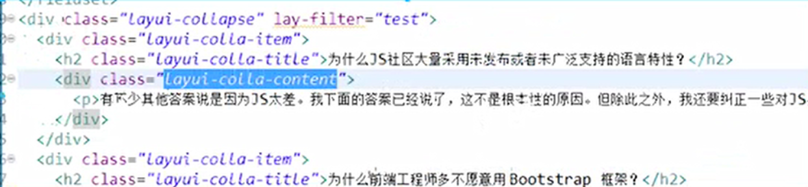
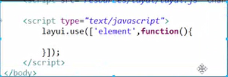
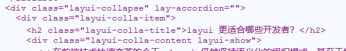
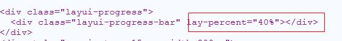

# 下载

## 下载文件说明

lay layui分模块管理js

layui.all.js默认引入所有模块的js

layui.js 默认不引入，如果要使用，必须手动引入

var layer=layui.layer;

​		var laydate=layui.laydate;

​		var table=layui.table;

​		var form=layui.form;

layui.use(["layer","laydate","table","form"].function[]){

​		var layer=layui.layer;

​		var laydate=layui.laydate;

​		var table=layui.table;

​		var form=layui.form;

}

# 按钮

创建一个maven项目

引入layui

apache-tomcat-8.5.37-windows-x64

### 相关样式：

layui -btn  把当前标签渲染成layui的按钮

layui-btn-primary 原始按钮样式

layui-btn-normal：百搭按钮

layui-btn-warm 暖色按钮

layui-btn-danger:警告按钮

layui-btn-disable禁用按钮

### 尺寸：

layui-btn-lg 最大的按钮

layui-btn-sm 小型按钮

layui-btn-xs 迷你按钮

### 形状：

layui-ui-radius：圆角按钮

# 图标

https://www.layui.com/doc/element/icon.html

layui 的所有图标全部采用字体形式，取材于阿里巴巴矢量图标库（iconfont）。因此你可以把一个 icon 看作是一个普通的文字，这意味着你直接用 css 控制文字属性，如 color、font-size，就可以改变图标的颜色和大小。你可以通过 *font-class* 或 *unicode* 来定义不同的图标。

相关样式：

layui-icon

两种方式使用样式如 layui-icon-fact-smile

使用矢量图：#xe6c9；

# 面板

## 卡片面板

相关样式：

layui -row 代表一行

layui-col-space15 设置卡片之间的间距

layui-col-md6 设置所占的宽度的比例md1-md12

layui-card 代表一张卡片

layui-card-header 设置卡片里面内容的标题

layui-card-body 设置 卡片里的内容

## 常规折叠面板

相关样式：

layui-collapse  代表是一个折叠面板

layui-colla-item 代表折叠面板里面的一个折叠项目

layui-colla-title代表一个折叠项目的标题

layui-colla-content 代表一个折叠项目的内容

一定要引用元素

## 手风琴面板

lay-accordion=“”标记当前折叠面板是手风琴面板

# 布局【熟系】

相关样式：

layui-layout-body 标记当前body里面的内容都使用loyui的布局

layout-layout代表是一个布局

layui-layout-admin：后台管理系统的布局

头：

layui-header 后台布局的头部样式

layui-logo  设置头部里面的系统标题

layui-nav 代表一个水平的菜单

layui-layout-left代表这个水平菜单在当前这个头里面左边的位置 

layui-nav-item水平菜单的选项

layui-nav-child水平菜单的子菜单

layui-layout-right 代表水平菜单在右边

左边：

layui-side 代表左边的导航菜单是一个滑块类型的样式

layui-side-scroll 可以有滚动条的菜单

中

layui-body代表左边的主题内容

脚

layui-footer底部固定区域

# 选项卡

相关属性

layui-tab：标记当前是一个选项卡

layui-tab-title 设置选项卡的标题

layui-this 当前被选中的选项卡

layui-tab-content 选项卡的具体内容

layui-tab-item 代表选项卡的内容

layui-show 代表默认显示的内容

layui-tab-brief 标记当前选项卡是简洁风格

layui-tab-card  标记当前选项卡是卡片风格

lay-allowclose="true" 代表选项卡可以删除

# 进度条

进度卡的原理就是不同颜色的两个div相互成比例的覆盖

相关样式：

layui-progress  标记为进度条

layui-progress-bar 标记进度条上的值

layui-progress-big

相关属性

lay-percent  所占的百分比

颜色样式 ：

layui -bg-red 红色

layui-bg-orange 橙色

layui-bg-green 绿色

layui-bg-blue 蓝色

layui-bg-cyan 

layui-showpercent="true" 显示进度具体的值

# 徽章

相关样式

layui-badge-dot  小圆点

layui-badge 弧形徽章

layui-badge-rim 边框徽章

# 动画 

# 时间和日期选择器

# 表单

# 副文本编辑器

# 弹出层

# 数据表格

# 文件上传

