## mybatis与hibernate的区别

### mybatis的技术特点

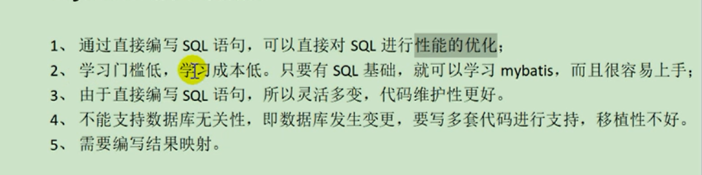

分页函数：

1. Mysql：limit
2. Oracle：rownum

## Hibernate技术特点

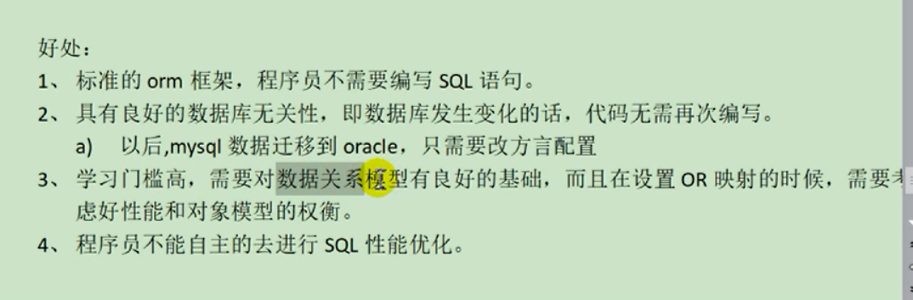

## 一对一resultType实现

扩展类：order类是order表的模型，要进行和user表多表查询时创建一个orderExe继承order在增加user的属性

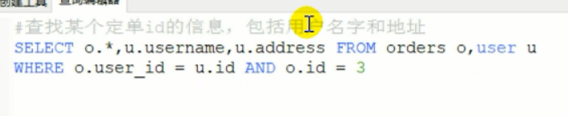

模型有模型：

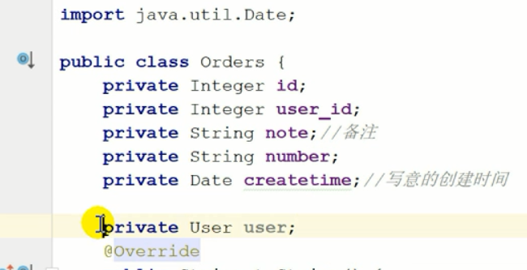

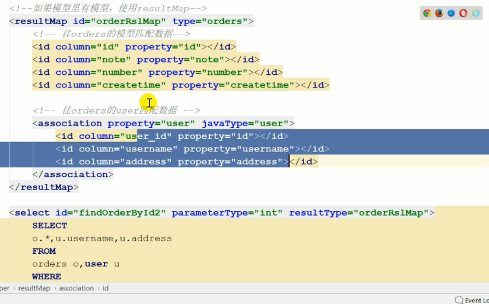

## 一对多

## 多对多

## 延时加载

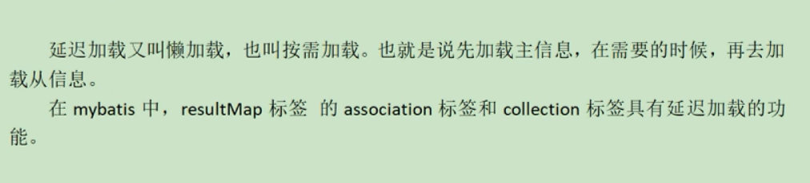

## 查询缓存

### ｍｙｂａｔｉｓ的缓存的理解

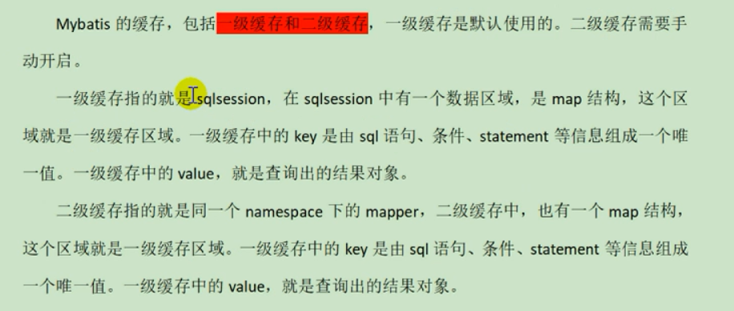

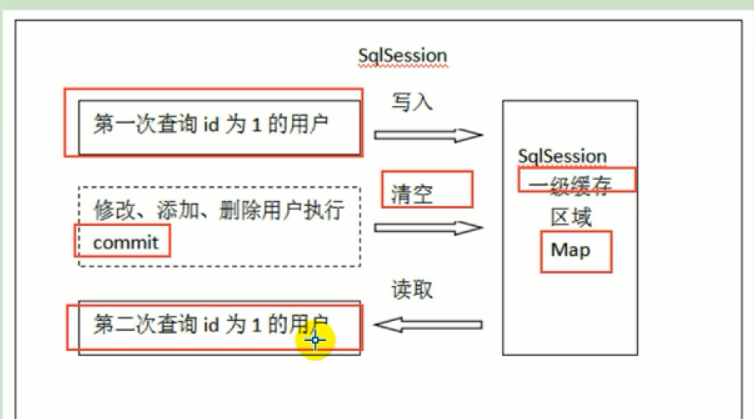

默认一级缓存是开启的是session的

## 二级缓存

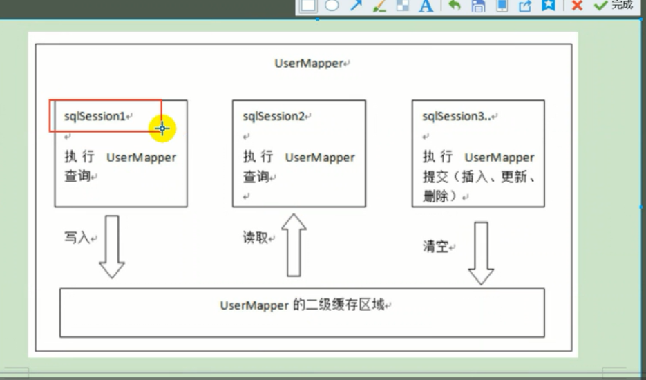

开启二级缓存

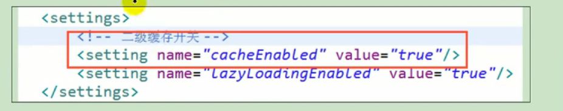

在UserMapper下开启缓存

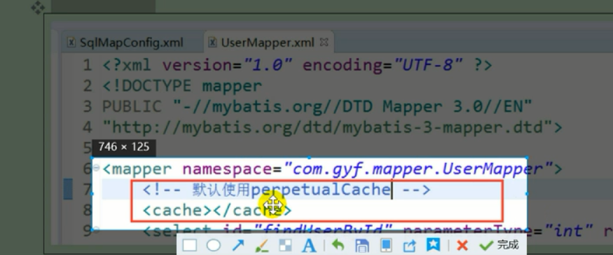