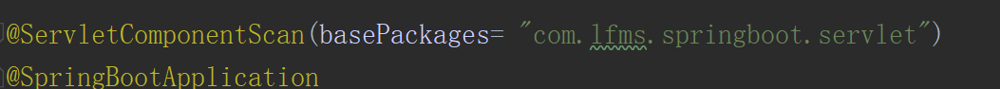
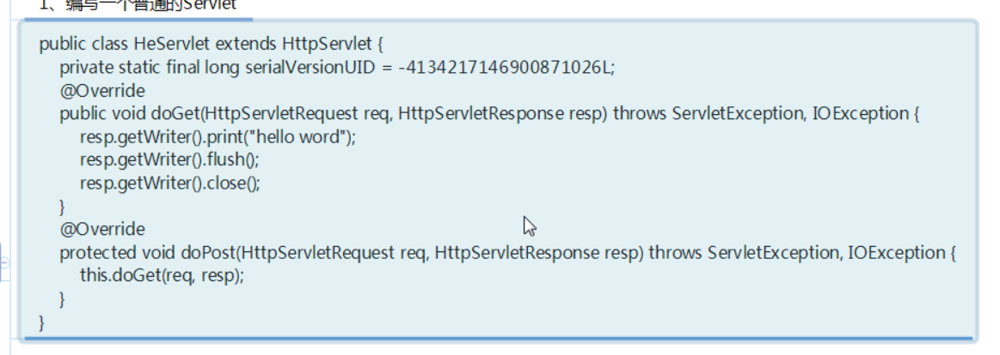
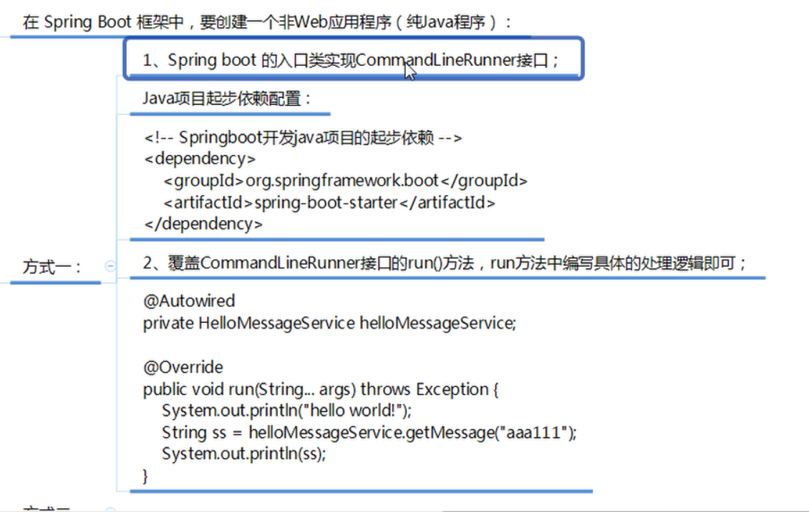

## 文件结构


---

## 主方法


```java
@SpringBootApplication
public class Application {

    public static void main(String[] args) {

        SpringApplication.run(Application.class, args);
    }

}
```

## control


```java
@Controller
public class HelloController {
    @RequestMapping("/boot/hello")
    public @ResponseBody String  hello(){
        return "hello Spring Boot";
    }
}
```

在浏览器打开


实际上自动帮你导包了


---

## 开发流程解析


---


## spring boot的核心配置文件


---

## 配置另一种方法yml


### 多环境配置文件


当多环境，可以激活单一配置文件


---

## 自定义配置文件 

在配置文件赋值


另外写个control


```java
@Controller
public class ConfigInfoController {
    @Value("${boot.name}")
    private  String name;
    @Value("${boot.location}")
    private  String location;
    @RequestMapping("/boot/config")
    public  @ResponseBody String configInfo(){
        return  name+"...."+location;
    }
}
```


处理乱码


```
spring.http.encoding.charset=UTF-8
spring.http.encoding.enabled=true
spring.http.encoding.force=true
```


---

### @ConfigurationProperties自定义配置


```java
@Component
@ConfigurationProperties(prefix = "boot")
public class configInfo {
    private  String name;
    private String location;

    public String getName() {
        return name;
    }

    public String getLocation() {
        return location;
    }

    public void setName(String name) {
        this.name = name;
    }

    public void setLocation(String location) {
        this.location = location;
    }
}
```


```java
@Controller
public class ConfigInfoController {
    @Value("${boot.name}")
    private  String name;
    @Value("${boot.location}")
    private  String location;
    @Autowired
    private  configInfo configInfoa;

    @RequestMapping("/boot/config")
    public  @ResponseBody String configInfo(){
        return  name+"...."+location+"=="+configInfoa.getName()+"...."+configInfoa.getLocation();
    }
}
```


---


## spring boot下的spring mvc

### @RestController

```java
@RestController  //@RestController=@Controller+@ResponBady
public class MvcController {
    @RequestMapping("/boot/getuser")
    public  Object getuser(){
        User user =new User();
        user.setId(100);
        user.setName("张无忌");
        return user;
    }
}
```

model


```java
public class User {
    private  int id;
    private String name;

    public int getId() {
        return id;
    }

    public String getName() {
        return name;
    }

    public void setId(int id) {
        this.id = id;
    }

    public void setName(String name) {
        this.name = name;
    }
}
```


###  @GetMapping

```java
    @GetMapping("/boot/getuser1")//@GetMapping=@RequestMapping+RequestMethod.GET

    public  Object getuser1(){
        User user =new User();
        user.setId(100);
        user.setName("张无忌");
        return user;
    }
```


### @PostMapping

```java
@PostMapping ("/boot/getuser2")//@GetMapping=@RequestMapping+RequestMethod.Post

public  Object getuser2(){
    User user =new User();
    user.setId(100);
    user.setName("张无忌");
    return user;
}
```

由于post请求要经过表单提交


### @PutMapping相当于@PostMapping

### @deleteMapping相当于@GetMapping

---


## Spring boot下使用jsp 

在porm下配置

```
<dependency>
    <groupId>org.springframework.book</groupId>
    <artifactId>spring-boot-starter-test</artifactId>
</dependency>
```

```
<dependency>
    <!--servlet依賴的jar-->
    <groupId>javax.servlet</groupId>
    <artifactId>javax.servlet-api</artifactId>
</dependency>
<dependency>
    <!--jsp所依賴的jar-->
    <groupId>javax.servlet.jsp</groupId>
    <artifactId>javax.servlet.jsp-api</artifactId>
    <version>2.3.1</version>
</dependency>
<dependency>
    <!--jslt依賴的jar包-->
    <groupId>javax.servlet</groupId>
    <artifactId>jslt</artifactId>
</dependency>
```

## 在application.properties文件配置spring mvc的视图展示为jsp


```
spring.mvc.view.prefix=/
spring.mvc.view.suffix=.jsp
```

## Spring boot使用jsp

创建webapp文件夹


创建访问控制

```java
@Controller
public class JSPController {
    @GetMapping("/boot/index")
    public String index(Model model){
        model.addAttribute("msg","springboot 集成jsp");
        return "index";
    }
}
```

在pom.xml配置

```
<build>
    <plugins>
        <plugin>
            <groupId>org.springframework.boot</groupId>
            <artifactId>spring-boot-maven-plugin</artifactId>
        </plugin>
    </plugins>
    <resources>
        <resource>
            <directory>src/main/java</directory>
            <includes>
                <include>**/*.xml</include>
            </includes>
            <!--例如mybatis的dao层有xml文件也编译到classes文件夹中-->
        </resource>

        <resource>
            <directory>src/main/resources</directory>
            <includes>
                <include>**/*.*</include>
            </includes>
        </resource>
        <resource>
            <directory>src/main/webapp</directory>
            <targetPath>META-INF/resources</targetPath>
            <includes>
                <include>**/*.*</include>
            </includes>
        </resource>
    </resources>
</build>
```

```
<dependency>
    <!--引入Spring boot 内嵌的Tomcat对jsp的解析包-->
    <groupId>org.apache.tomcat.embed</groupId>
    <artifactId>tomcat-embed-jasper</artifactId>
</dependency>
```


## spring boot集成mybatis


创建一个Model


在pom.xml文件配置、

```
<dependency>
    <!--加载mybatis整合springboot-->
    <groupId>org.mybatis.spring.boot</groupId>
    <artifactId>mybatis-spring-boot-starter</artifactId>
</dependency>
```

```
<dependency>
    <!--mysql的jdbc驱动包-->
    <groupId>mysql</groupId>
    <artifactId>mysql-connector-java</artifactId>
</dependency>
```

```
<dependency>
    <!--springboot开发web的起步依赖-->
    <groupId>org.springframework.boot</groupId>
    <artifactId>spring-boot-starter-web</artifactId>
</dependency>
```

```
<parent>
    <groupId>org.springframework.boot</groupId>
    <artifactId>spring-boot-starter-parent</artifactId>
    <version>2.1.5.RELEASE</version>
    <relativePath/> <!-- lookup parent from repository -->
</parent>
```


在java目录下创建一个包放映射文件


在application.properties下配置

```
mybatis.mapper-locations=classpath:com/lfm/springboot/mapper/*.xml
spring.datasource.username=root
spring.datasource.password=123456
spring.datasource.driver-class-name=com.mysql.jdbc.Driver
spring.datasource.url=jdbc://mysql://localhost:3306/p2p?useUnicode=true&characterEncoding=utf8&useSSL=false
```

在model创建一个文件


相关配置省略

创建main函数


创建一个controller


创建一个service


创建service实现类


创建Mapper类


注意@Mapper


也可以不加@Mapper但要开启扫描

编写.xml


原因xml没有编译出来

添加配置


也可以安装插件自动格式化json

## spring boot事务支持


在main方法加入@EnableTransactionManagement注解

2.在访问数据库的service方法上添加注解@Transactional


## 认识RESTFull


### spring boot 开发RESTFull

```java
@RestController
public class RESTFullController {
    //http://lacalhost:8080
    @RequestMapping("/boot/user/{id}")
    public Object user(@PathVariable("id") Integer id){
        User user=new User();
        user.setId(id);
        user.setName("张三丰");
        return  user;
    }
}
```


@RestController注解其实是@Controller和@ResponseBody的组合RESTFull风格


## spring boot热部署插件


在pom配置即可

```
<dependency>
    <groupId>org.springframework.boot</groupId>
    <artifactId>spring-boot-devtools</artifactId>
    <optional>true</optional>
</dependency>
```

## spring boot集成redit


在application.properties配置


在service的实现类中实现


## springboot 哨兵集群配置


## springboot集成dubbo

### 集成前的准备


新建一个Model实现Dubbo服务接口


分别建立com.lfm.springboot.Model和com.lfm.springboot.service包


```java
public class User {
    private int id;
    private  String name;
    private String phone;

    public int getId() {
        return id;
    }

    public void setId(int id) {
        this.id = id;
    }

    public String getName() {
        return name;
    }

    public void setName(String name) {
        this.name = name;
    }

    public String getPhone() {
        return phone;
    }

    public void setPhone(String phone) {
        this.phone = phone;
    }
}
```

```java
public interface UserService {
    public  String sayHi(String name);
    public User getUser(int id);
}
```

### 开发Dubbo服务提供者


在pom配置起步依赖

```
<dependency>
            <!--springboot继承dubbo的起步依赖（阿里巴巴提供）-->
            <groupId>com.alibaba.spring.boot</groupId>
            <artifactId>dubbo-spring-boot-starter</artifactId>
            <version>1.0.0</version>
   </dependency>
```

在springboot的核心配置文件application.properties中配置dubbo的信息

```
#内嵌的Tomcat服务端口
#dubbo的配置
sever.port=8080
spring.dubbo.appname=springboot-dubbo-provider
spring.dubbo.registry=zookeeper://192.168.230.128:2181
```

## Tip由于视频基础视频不完整，自己的另外学习


 

## spring boot 使用拦截器

1. 按照springMvC的模式写拦截器

   ```java
   public class LoginInterceptor implements  HandlerInterceptor{
       public boolean preHandle(HttpServletRequest request, HttpServletResponse response, Object handler) throws Exception {
           System.out.println("已近进入了登录拦截器");
           //逻辑代码按照之前的方式写即可
   
           return true;
       }
   
       public void postHandle(HttpServletRequest request, HttpServletResponse response, Object handler,  ModelAndView modelAndView) throws Exception {
       
       }
   
       public void afterCompletion(HttpServletRequest request, HttpServletResponse response, Object handler, Exception ex) throws Exception {
       }
   }
   ```

2. 编写配置类继承WebMvcConfigurerAdapterlei

   ```java
   @Configuration
   public class WebConfig extends WebMvcConfigurerAdapter {
       @Override
       public void addInterceptors(InterceptorRegistry registry) {
           //需要拦截的路径
           String[] addPathPatterns={
                   "/boot/**"
           };
           //不需要拦截的路径
           String[] excludePathPatters={
                   "/boot/hello",
                   "/boot/index"
           };
           //注册登录拦截器
        registry.addInterceptor(new LoginInterceptor())
                 .addPathPatterns(addPathPatterns)
                 .excludePathPatterns(excludePathPatters);
           //注册权限拦截器
          /* registry.addInterceptor(new UserRoleAuthorizationInterceptor())
                   .addPathPatterns()
                   .excludePathPatterns();*/
       }
   }
   ```

   

## sprringboot 使用servlet

1.  使用servlet的注解方式编写 一个 servlet

   ```java
   @WebServlet(urlPatterns = "/myServlet")
   public class MyServlet extends HttpServlet {
       @Override
       public void doGet(HttpServletRequest request,HttpServletResponse response) throws ServletException, IOException {
           response.getWriter().print("my servlet hello world");
           response.getWriter().flush();
           response.getWriter().close();
       }
       protected void doPost(HttpServletRequest req, HttpServletResponse resp) throws ServletException, IOException {
           this.doGet(req, resp);
       }
   }
   ```

2. 在main方法的 主类上添加注解@ServletComponentScan（basePackages="包名"）

   

   ### 方式二

   1. 编写普通的Servlet

      

      ```java
      public class HeServlet extends HttpServlet {
          @Override
          public void doGet(HttpServletRequest request,HttpServletResponse response) throws ServletException, IOException {
              response.getWriter().print("he servlet hello world");
              response.getWriter().flush();
              response.getWriter().close();
          }
          protected void doPost(HttpServletRequest req, HttpServletResponse resp) throws ServletException, IOException {
              this.doPost(req, resp);
          }
      }
      ```

2. 编写一个Springboot 的配置类

   

   ```java
   Configuration //springboot没有xml，@Configuration可以表示一个Spring的xml配置文件
   //比如application.xml
   
   public class ServletConfig {
       /**
        * @Bean相当于<bean  id="heServletRegistrationBean" class="org.springframework.boot.web.servlet.ServletRegistrationBean">
        *     </bean>
        */
       @Bean
       public ServletRegistrationBean heServletRegistrationBean(){
           ServletRegistrationBean servletRegistrationBean=new ServletRegistrationBean(new HeServlet(),"/servlet/heservlet");
           return  servletRegistrationBean;
       }
   }
   
   ```

   ## springboot 使用Filter

   方式一：

   1. 编写一个Servlet3注解过滤器：

   

   ```java
   @WebFilter(urlPatterns = "/*")
   public class MyFilter implements Filter {
       @Override
       public void init(FilterConfig filterConfig) throws ServletException {
       }
   
       @Override
       public void doFilter(ServletRequest servletRequest, ServletResponse servletResponse, FilterChain filterChain) throws IOException, ServletException {
           System.out.println("您已进入filter过滤器 您的请求正常 请继续遵循规则...");
           filterChain.doFilter(servletRequest,servletResponse);
       }
   
       @Override
       public void destroy() {
       }
   }
   
   ```

   2.  在main方法的主类上添加注解：@ServletComponentScan(basePackages={"com.lfm.springboot.servlet","com.lfm.springboot.filter"})

      ```
      @ServletComponentScan(basePackages= {"com.lfms.springboot.servlet","com.lfms.springboot.control.Filter"})
      ```

方式二：

1.  编写一个普通的Filter

   

   ```java
   public class HeFilter implements Filter {
           @Override
           public void init(FilterConfig filterConfig) throws ServletException {
           }
   
           @Override
           public void doFilter(ServletRequest servletRequest, ServletResponse servletResponse, FilterChain filterChain) throws IOException, ServletException {
               System.out.println(" He Filter 您已进入filter过滤器 您的请求正常 请继续遵循规则...");
               filterChain.doFilter(servletRequest, servletResponse);
           }
   
           @Override
           public void destroy() {
           }
       }
   ```

2. 编写一个springboot的配置类

   

```
 @Bean
    protected FilterRegistrationBean hefilterRegistrationBean(){
        FilterRegistrationBean registration=new FilterRegistrationBean(new HeFilter());
        registration.addUrlPatterns("/*");
        return registration;
    }
```

## Spring boot配置字符编码

1.  第一种方式是使用传统的Spring提供的字符编码过滤器

   

   ```
   @Bean
       public FilterRegistrationBean  filterRegistrationBean(){
           FilterRegistrationBean registrationBean=new FilterRegistrationBean();
           CharacterEncodingFilter characterEncodingFilter=new CharacterEncodingFilter();
           characterEncodingFilter.setForceEncoding(true);
           characterEncodingFilter.setEncoding("UTF-8");
           registrationBean.setFilter(characterEncodingFilter);
           registrationBean.addUrlPatterns("/*");
           return registrationBean;
       }
   ```

   在主类上需要扫描包或者class：basePackageClass=“org.springframework.web.filter.CharacterEncodingFilter.class”

   

   注意：只有spring.http.encoding.enable=false配置成false后，过滤器才会起作用

   方式二：

   

   

## springboot开发非web项目应用程序

方式一：



如方法二一样先写好service和serviceimpl

```java
@SpringBootApplication
public class Application implements CommandLineRunner {
   @Autowired
    private Userservice userservice;
    //返回了spring的容器对象
    public static void main(String[] args) {
            //启动Spring boot，启动spring容器
        SpringApplication.run(Application.class, args);
    }
    @Override
    /**
     * 相当于是我们纯java程序的main方法
     */
    public void run(String... args) throws Exception {
       String hi= userservice.sayHi("spring boot java");
        System.out.println(hi);
    }
}
```


方式二：


编写一个USerService

```java
public interface Userservice {
    public String sayHi(String name);
}
```

实现类

```java
@Service
public class UserServiceimpl implements Userservice {
    @Override
    public String sayHi(String name) {
        return "Hi"+name;
    }
}
```

在application实现如下代码

```java
public static void main(String[] args) {

       ConfigurableApplicationContext context =SpringApplication.run(Application.class, args);
       Userservice userservice=(Userservice) context.getBean("userServiceimpl");
       String hi= userservice.sayHi("springboot java");
        System.out.println(hi);
    }
```

在控制台输出如下：


## 关闭springboot图标日志输出


## springboot程序 war包部署


在pom里添加相应的包

1.  程序入口类扩展继承SpringBootServeletInitalizer类

   

2. 程序入口类覆盖如下方法：

   

3. 更新报为war，在pom.xml中修改 <package>war</package>

4. 配置springboot打包插件

   

5. 在项目中通过Maven install在本地 Maven仓库安装一个war包，然后将war包都部署到tomcat下运行

## spring boot程序打jar包与运行 


jsp解析包一定别忘记了，不然访问变下载

jar包 在cmd 下运行 java -jar 然后再浏览器打开，jar包是用的是内嵌的tomcat ，war包使用的是外置的tomcat

## spring boot部署与运行方式总结


## spring boot集成Thymeleaf


1.  认识Thymeleaf


2. springboot集成Thymeleaf在核心配置文件application.properties中对Thymeleaf进行配置

   如果使用Thymeleaf是，要求HTML格式必须为严谨的HTML5格式，必须有结束标签，否则会报错。如果不想对标签有严格的验证，使用spring.thymeleaf.mode=LEGACYHTML5

   ```
   #开发阶段建议关闭thymeleaf
   spring.thymeleaf.cache=false
   #使用遗留的html5以去掉html标签的校验
   spring.thymeleaf.mode=LEGACYHTML5
   ```

   

3. 写一个Controller去映射到模板页面（和springmvc基本一致）比如

   ```java
   @Controller
   public class ThymeleafController {
       @RequestMapping("/boot/index3")
       public  String index(Model model){
           model.addAttribute("msg","spring boot 集成Thymeleaf");
           return "index1";
       }
   }
   ```

   

4. 在src/main/resources的templates下建一个indexe1.html页面用于显示数据，html页面中加入以下属性：<html xmlns:th="http://www.thymeleaf.org">

   

   

   ```html
   <!DOCTYPE html>
   <html lang="en"xmlns:th="http://www.thymeleaf.org">
   <head>
       <meta charset="UTF-8">
       <title>Title</title>
   </head>
   <body>
   <p th:text="${msg}">
       dddd
   </p>
   </body>
   </html>
   ```

5. spring boot使用Thymeleaf，约定模板文件放置在src/main/resource/tempates目录下，静态资源放置在src/main/resource/static

