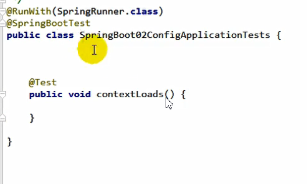
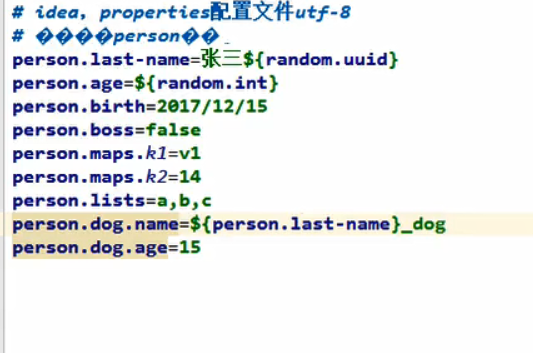
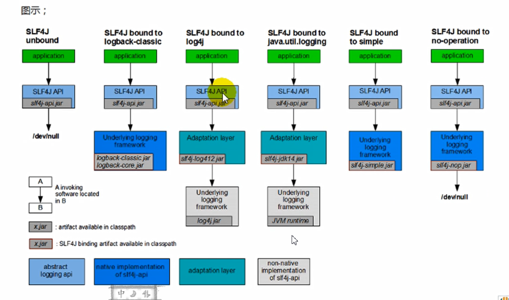
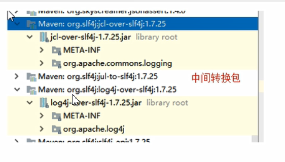
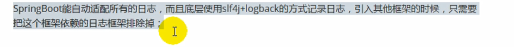

# Springboot入门


> 简化Spring应用开发的一个档案
>
> 整个Spring技术栈的一个大整合
>
> j2ee开发的一站式解决方案

## 微服务

+ 2014 martin fowler
+ 微服务：架构风格
+ 一个应用是一组小型服务，可以通过HTTP的方式进行互通
+ 每一个功能单元最终都是一个可独立替换和独立升级的软件单元
+ 详细参照微服务文档

### maven设置

### idea设置

# springboot hello world

+ 一个功能
+ 流量器发送hello请求，服务器接受请求并处理 ，响应hello world字符串

### 1.创建一个maven工程（jar）

```xml
<?xml version="1.0" encoding="UTF-8"?>
<project xmlns="http://maven.apache.org/POM/4.0.0"
         xmlns:xsi="http://www.w3.org/2001/XMLSchema-instance"
         xsi:schemaLocation="http://maven.apache.org/POM/4.0.0 http://maven.apache.org/xsd/maven-4.0.0.xsd">
    <modelVersion>4.0.0</modelVersion>

    <groupId>com.lfm</groupId>
    <artifactId>spring-boot-01-helloworld</artifactId>
    <version>1.0-SNAPSHOT</version>
    <parent>
        <groupId>org.springframework.boot</groupId>
        <artifactId>spring-boot-starter-parent</artifactId>
        <version>2.1.1.RELEASE</version>
    </parent>
    </project>
```


### 2.导入Springboot的相关的依赖

```xml
<?xml version="1.0" encoding="UTF-8"?>
<project xmlns="http://maven.apache.org/POM/4.0.0"
         xmlns:xsi="http://www.w3.org/2001/XMLSchema-instance"
         xsi:schemaLocation="http://maven.apache.org/POM/4.0.0 http://maven.apache.org/xsd/maven-4.0.0.xsd">
    <modelVersion>4.0.0</modelVersion>

    <groupId>com.lfm</groupId>
    <artifactId>spring-boot-01-helloworld</artifactId>
    <version>1.0-SNAPSHOT</version>
    <parent>
        <groupId>org.springframework.boot</groupId>
        <artifactId>spring-boot-starter-parent</artifactId>
        <version>2.1.1.RELEASE</version>
    </parent>
    <dependencies>
        <dependency>
            <groupId>org.springframework.boot</groupId>
            <artifactId>spring-boot-starter-web</artifactId>
        </dependency>
    </dependencies>

</project>
```


### 3.编写一个主程序；启动Springboot应用

```java
@SpringBootApplication
public class HelloWorldMainApplication {
    public static void main(String[] args) {
//        /*spring 应用启动起来*/
        SpringApplication.run(HelloWorldMainApplication.class,args);

    }
```

### 4.编写相关的controller、service

```java
@Controller
public class HelloController {
    @ResponseBody
    @RequestMapping("/hello")
    public  String hello(){
        return "hello world";
    }
}
```

### 5.运行主程序测试

### 6.简化部署

```xml
<build>
	<plugins>
		<plugin>
			<groupId>org.springframework.boot</groupId>
			<artifactId>spring-boot-maven-plugin</artifactId>
		</plugin>
	</plugins>
</build>
```

将应用打包成jar包，使用java -jar命令运行

### 5.hello world探究

####  pom文件

 ##### 1.父项目

```xml
<parent>
        <groupId>org.springframework.boot</groupId>
        <artifactId>spring-boot-starter-parent</artifactId>
        <version>2.1.1.RELEASE</version>
  </parent>
他的父项目是
 <parent>
        <groupId>org.springframework.boot</groupId>
        <artifactId>spring-boot-dependencies</artifactId>
        <version>2.1.1.RELEASE</version>
        <relativePath>../../spring-boot-dependencies</relativePath>
    </parent>
他来真正管理Spring boot应用程序的所有依赖版本
```

Spring boot的版本仲裁中心

以后我们导入依赖默认是不需要些版本，（没有在depenencies里面管理的依赖自然需要写版本号）

#### 2.导入的依赖

```xml
   <dependencies>
        <dependency>
            <groupId>org.springframework.boot</groupId>
            <artifactId>spring-boot-starter-web</artifactId>
        </dependency>
    </dependencies>
```


spring-boot-starter-web:

+ spring-boot-starter:springboot场景启动器：帮我们导入web模块运行所依赖的组件
+ Springboot将所有功能的场景都抽取出来，做成一个个starts（启动器）只需要在项目里面引入这些starts相关场景的所有的依赖搜会 导入进来

### 2.主程序、主入口类

```
@SpringBootApplication
public class HelloWorldMainApplication {
    public static void main(String[] args) {
//        /*spring 应用启动起来*/
        SpringApplication.run(HelloWorldMainApplication.class,args);

    }

}

```

@SpringBootApplication ：Springboot应用标注在类，这个类就成了启动类

```java
@Target({ElementType.TYPE})
@Retention(RetentionPolicy.RUNTIME)
@Documented
@Inherited
@SpringBootConfiguration
@EnableAutoConfiguration
@ComponentScan(
    excludeFilters = {@Filter(
    type = FilterType.CUSTOM,
    classes = {TypeExcludeFilter.class}
), @Filter(
    type = FilterType.CUSTOM,
    classes = {AutoConfigurationExcludeFilter.class}
)}
)
public @interface SpringBootApplication {
    @AliasFor(
        annotation = EnableAutoConfiguration.class
    )
    Class<?>[] exclude() default {};

    @AliasFor(
        annotation = EnableAutoConfiguration.class
    )
    String[] excludeName() default {};

    @AliasFor(
        annotation = ComponentScan.class,
        attribute = "basePackages"
    )
    String[] scanBasePackages() default {};

    @AliasFor(
        annotation = ComponentScan.class,
        attribute = "basePackageClasses"
    )
    Class<?>[] scanBasePackageClasses() default {};
}
```

@SpringBootConfiguration:spring boot的配置类

+ 标注在类上，表示这是一个Springboot配置类
  + @Configuration配置类上标助这个注解
    + 配置类---配置文件：配置类也是容器中的一个组件
+ @EnableAutoConfiguration


 

以前我们需要自己配置的东西 ，自动配置类帮我们配置了

# 使用Spring initializer快速创建Springboot项目


# Springboot的配置文件

+ Springboot使用一个全局的配置文件，配置文件名是固定的
  + application.properties
  + application .yml

yaml

+ 是一个标记语言

+ yaml以数据为中心，比json，xml更适合做标记语言

  ```yaml
  server:
  	port:8081
  ```

  ```xml
  <server>
      <port>8081</port>
  </server>
  ```

  

# yaml语法

+ k(空格):v表示一对键值对（必须要有空格）

+ 以空格的缩进来控制层级关系，只要左对齐的都是同一个层级的
+ 属性的写法

值的写法

+ 字面量：普通的值（数字，字符串，布尔）

  + k:v字面直接来写
  + “”双引号不会转义特殊字符
    + name：“zhangsan\nlist” ;输出 zhangsan换行list
  + ‘’单引号：会转义特殊字符

+ 对象

  + 对象还是 k:v，注意缩进
  + friends:
    + lastname：zhangsan
    + age：20
  + 行内写法
    + friends:{lastname:zhangsan,age:18}

+ 数组

  + ```yaml
    pets:
    	-cat
    	-dog
    ```

  + pets:[cat,dog,dog]

@ConfigurationProperties:告诉Springboot将本类 中的所有属性和配置文件中相关的配置进行绑定


prefix=“person”配置文件中哪个下面的所有属性进行一一映射

+ 只有这个组件是容器的组件，才能容器提供@ConfigurationProperties功能
  + 

# Springboot单元测试

+ 可以在测试期间很方便的类似编码一样进行自动注入等容器功能
  + 

# 在properties中配置对象的值


跟上面使用同样的注解

# @Value获取值和@ConfigurationProperties获值 的比较

|                      | @ConfigurationProperties | @Value     |
| -------------------- | ------------------------ | ---------- |
| 功能                 | 批量注入配置文件中的属性 | 一个个指定 |
| 松散绑定（松散语法） | 支持                     | 不支持     |
| SpEL                 | 不支持                   | 支持       |
| jsr303数据校验       | 支持                     | 不支持     |
| 复杂类型封装         | 支持                     | 不支持     |


# 配置文件注入值数据校验

@Validated


如果说 ，我们只是在摸个业务逻辑中需要获取一下配置文件的摸个值，使用@Value；

# @PropertySource和@ImportResource

@PropertySource

+ 加载指定的配置文件
+ 

@ ImportResource

+ 导入Spring的配置文件，让配置文件里面的内容生效


Springboot不推荐使用spring配置文件，推荐使用全注解方式

# @Configuration

+ 指明当前是一个配置类，就是来替代之前的spring配置文件

@Bean加在方法中

+ 将方法返回值添加到容器中，容器中这个组件默认的id就是方法名 
+ 

# 配置文件占位符




随机数


占位符获取之前配置的值，如果没有可以用：指定默认值


# profile多环境支持


## 多profile文件

+ 我们在主配置文件编写的时候，文件名可以使application-｛profile｝。properties/yml
+ 默认使用application.properties的配置环境

## 激活指定profile

+ 在application.properties配置文件中指定spring.profiles.active=dev

## yaml多文档模式


+ 在application.yml中编写


+ 命令行
  + 
  + 

+ 虚拟机参数

  + 

  

# 配置文件加载位置


+ 优先级有高到低，高优先级的会覆盖低优先级的配置

+ springboot有互补配置


+ 我们还可以通过spring.config.location来改变默认的配置文件位置
+ 项目打包好以后，我们可以使用命令行参数的形式，启动项目的时候指定配置文件的位置，指定配置文件和默认加载的这些配置文件形成互补配置

# 外部配置加载顺序

spring boot支持多种外部配置方式，优先级从高到低：高优先级的配置覆盖低优先级的配置


# 自动装配原理

+ 配置文件能配置的属性参照官网

## 原理

+ springboot启动的时候加载主配置类，开启自动配置功能@EnableAutoConfiguration
+ 


我们可以通过debug=true属性来打印自动配置报告


# springboot 与日志


# slf4j的使用




如何让系统中的所有日志都统一到slf4j

+ 将系统中的其他日志框架先排除出去
+ 用中间包 来替换原有的日志框架
+ 我们导入slf4j其他的实现

# springboot的日志关系







# springboot日志默认配置


## 指定配置

给类路径下放上每个日志框架的配置文件即可，springboot就不使用默认配置了


logback.xml:直接被日志框架识别了 

logback-spring.xml：日志框架就不直接加载日志配置项，由springBoot加载

```
<springProfile name="staging">
	<!-- configuration to be enabled when the "staging" profile is active -->
</springProfile>
```

## 切换日志框架 

# springboot与web开发

+ 创建springboot应用，选中我们需要的模块
+ 只需要少量配置就可以运行起来
+ 自己编写业务代码

##  springboot对静态资源的映射规则

+ 所有/webjars/**，都去classpath:/META-inf/resources/webjars找资源
+ 


# 引入thymeleaf

## 模板引擎


+ 引入thymeleaf
+ 

# thymeleaf使用语法

+ 导入thymeleaf的名称空间
+ 使用thymeleaf的语法


## 语法规则

+ th：text改变当前元素里面的文本内容
+ th：任意html属性：来 替换原生属性的值
+ 

# springmvc自动配置

https://www.springcloud.cc/spring-boot.html#boot-features-spring-mvc


# 扩展和全面接管


编写一个配置类（@Configuration)是webMvcconfigureAdapter


原理：

+ webMvcautoConfiguration是springMvc的自动配置类 
+ 在做其他自动配置时会导入；@import（“EnableWebMvcConfiguration.class”）


# 全面接管springmvc

springboot对springmvc的自动配置不需要了 ，所有都是我们自己配；

我们需要在配置类中添加@EnableWebMvc


原理：


# 如何修改springboot默认配置


# 国际化

+ 编写国际化配置文件
+ 使用ResourceBundleMessageSource管理国际化资源文件
+ 在页面使用fmt:message取出国际化内容

步骤：

+ 编写国际化配置文件，抽取页面需要显示的国际化消息


# forword与redirect

+ redirect：表示重定向到一个地址
+ forward：表示转发到一个地址

# springboot与数据访问


jdbc


效果：

+ 默认使用org.apache.tomcat.jdbc.pool.DateSource作为数据源
+ 数据源的相关配置都在DataSourceProperties里面

自动配置原理

+ D:\Maven-Repository\org\springframework\boot\spring-boot-autoconfigure\2.1.6.RELEASE\spring-boot-autoconfigure-2.1.6.RELEASE.jar!\org\springframework\boot\autoconfigure\jdbc

+ 参考DataSourceConfiguration，根据配置创建数据源，默认使用tomcat连接池，可以使用spring.datasource.type指定自定义的数据类型
+ springboot默认可以支持
  + 
+ 自定义数据类型
  + 


# 整合基本druid与数据源

 


# 整合Mybatis


