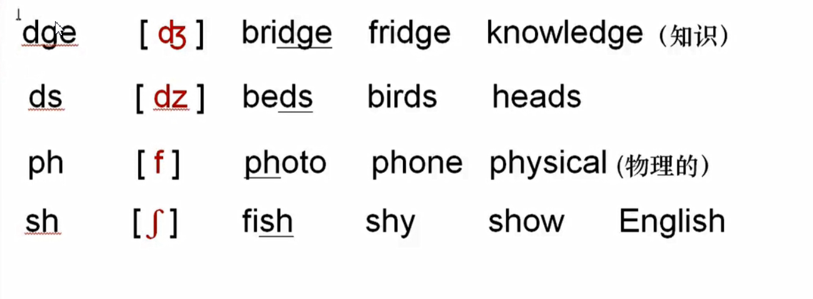

# 自然拼读法

+ 辅音字母念法
  + 

+ 元音字母的念法
  + 

+ 组合字母的念法（抓特点）

  

ee（e） oo（乌）ie（ai）（li）

# 辅音字母的念法（21个）

m(en) f(si) n(en)l(e)j(ji)

都是没有e的音

j读鸡

r(瑞) v(fu)w(wu)      y开头(ye)，第二个开始读e

# 元音字母的发音（6个）

闭音节辅音结尾

【ae】读apple的a  [e]读apple的a  【i】读e 【o】英音哦 美音读啊【u】啊 后面有元音读q

 ll（哦）th（r拼）

# 弱音节（有多个元音时）

【e】读鹅

# 组合辅音字母的念法

【tf】吃 【n】嗯 【n：】嗯的长音

【dg】吉 【dz】子【f】浮【f：】西

【th】死【  ai读ei拼【dr】古【ts】次

# 元音字母的组合念法

【u：】乌长音【o】英音乌美音，我【au】澳【eu】欧

【ei】a【oi】爱客家话【a：】啊  ther读的

【ai】唉 ce读s【ju：】优【3：】饿

【ee】a饿【ie】e饿【aie】唉饿【ie】e饿v

【o：】哦

# 少数特殊的念法

ture读车 【fen】屎【3en】融【3e】傻【bl】波【pl】婆

# 重音朗读规律

