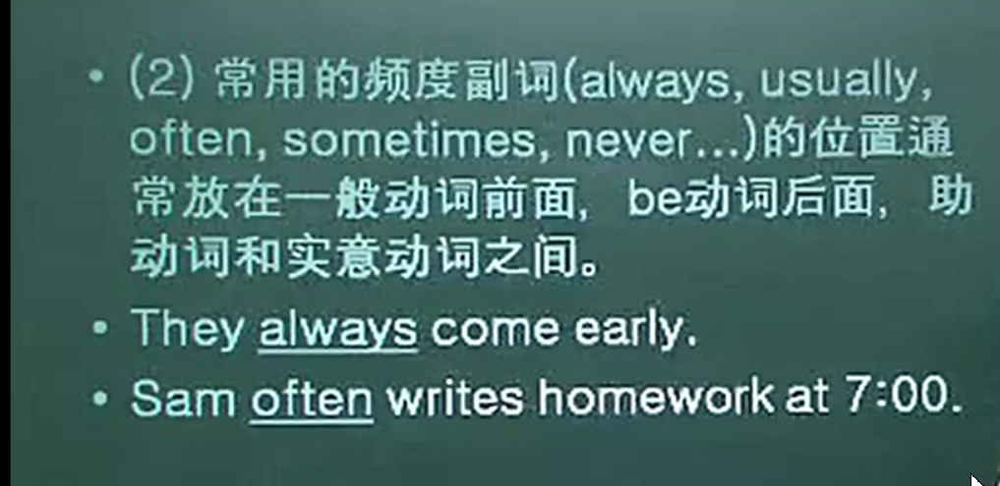
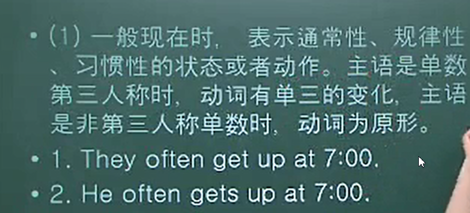
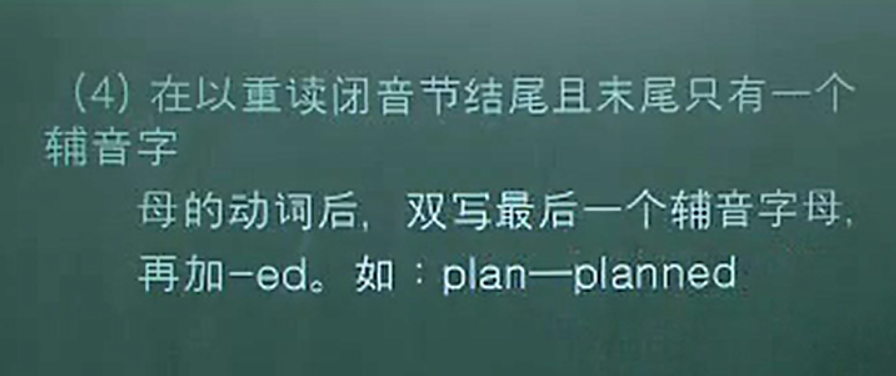
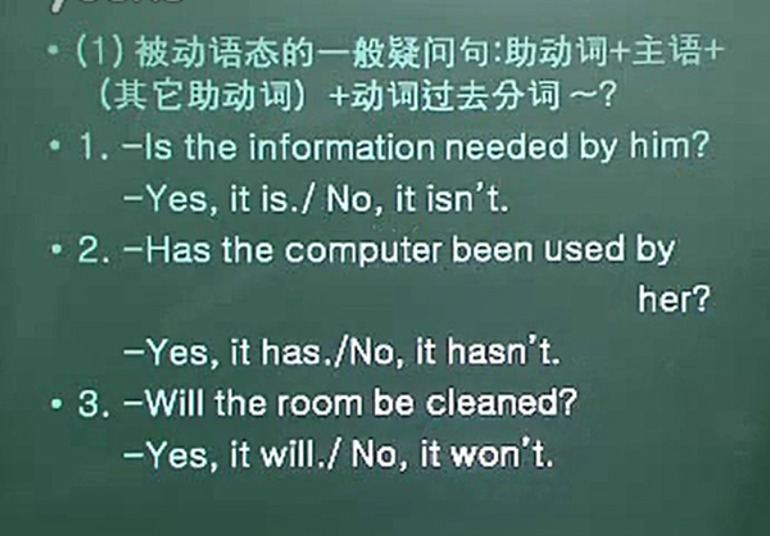
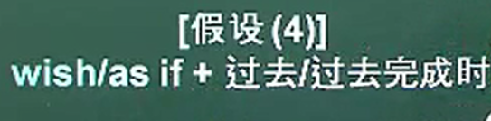

#  语序和五种基本句式

## 英语五种基本句式

+ 基本句式一：sv（主+谓）the universe remains(宇宙长存)
+ svp（主系表）the food is delicious
+ svo（主谓宾）he took his bag and left
+ SVoO（主谓间宾直宾）her father bought her a dictionary
+ SVOC（主谓宾宾补）we made him our monitor(我们选他当班长)

# be动词的形式和用法

be  is  am was were being been

 

## be 动词的用法

后面接名词，形容词，地点副词或短语作补足语

+ the man is a teacher(补足语)
+ Mary is new dresses are colorful
+ my mother was in the kitchen

# be动词的否定

在 am is are was were 后面加not

am not ，isn't，

## 使用be动词提问和回答

# 代词的主格和宾格

主格代词： I  he  she  it you we  they

宾格代词：me him her it you us them

+ 宾语（动词执行的对象）
+ 

# 名词性/形容性物主代词

形容性物主代词

+ 单数形式：my  your  his/her/its, oneis
+ 复数形式：our,your,their  

名词性物主代 词:

+ 单数形式:mine,yours,his,hers,its,oneis
+ 复数形式:ours yours theirs 

# 反身代词

myself ，yourself，hereself，himself，itself，yourselves，ourselves，themselves

列子

+ please help yourself to some fish

+ the thing itself is not important(同位语)

# 实意动词的特征

实意动词

come read go watch play fly

+ he come from shenzhou 
+ she is reading story books
+ they went to america yesterday
+ we have watch the game for three times
+ my mother will fly back to china next month
+ 有数量的变化，和时态

# 实意动词的否定

+ 使用助动词进行否定，在助动词do does did后面加not

例子

+ I dont go to school by bus
+ she doesnt watch tv everyday
+ they didnot swim last night

使用助动词进行提问

+ he often plays golf
+ does he often play golf

# 使用疑问句进行提问和回答

+ when where who what how

how long ,how far,how often ,why 

 

# 名词

+ 可数名词 Apple pencil student
+ 不可数名词 salt coffee water history love

可数名词有单数和复数之分

不可名词无复数，只用单数表征

名词变复数规则 

+ 一般末尾加上后缀-s friend-》friends
+ 以s，z，x，ch，sh结尾的词，在该词末尾加上后缀-es  bus  buses
+ 辅音字母+y结尾的名词，将y改为i再加-es candy—》candies
+ 以o结尾的名词，如果不是外来词或缩写，就加-es  tomato  tomatoes

可数名词前可加a（an）或量词

# 指示代词和不定代词

+ 指示代词：标识人或事物的代词用来代替前面已经提到过的名词、
+ this（these）that（those） 

+ 不定代词：指代不确定的人或事物
+ 常用的指示代词：one，the other，some,any,something,nothing

# 形容词

形容词通常形容人或事物的状态，性质，大小等，通常在名词前，be动词后

the+形容词=复数名词，表示一类后面的动词使用复数

# 副词

+ 副词可以修饰动词，形容词，其他副词以及其他结构

 # 不定量表达

不定量表达法：

some，any，most, every,all

# 不定量的表达法

# there/here be句型

# 一般现在时和现在进行时

# 一般过去时和过去进行时

重读闭音节是辅音结尾的重读

# 将来时

# 完成时

# 动词的用法

# 情态动词

# 情态动词的否定和疑问

# 被动语态

# 被动时态和情态动词的结合

# 被动语态by+行为者可省略

 

# 被动语态的疑问

# 非谓语动词

 

  

# 原型不定式使役动词

# 假设从句为现在时

# 假设与现在事实相反的虚拟语气

  

# 与过去事实相反的虚拟语气

# 假设4 wish asif

 

# 定语从句

 # 定语从句的关系副词

# 宾语从句连词

# 比较级和最高级

