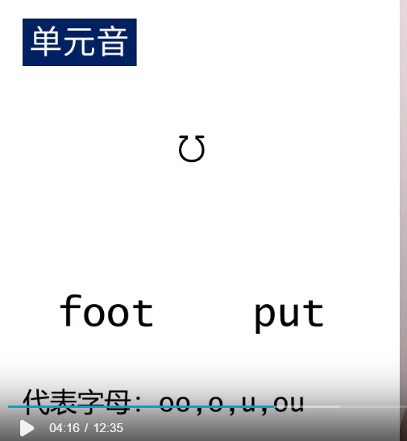
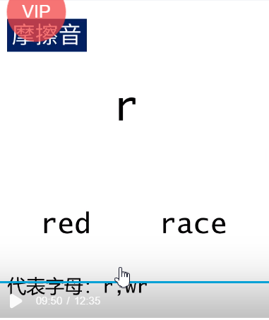
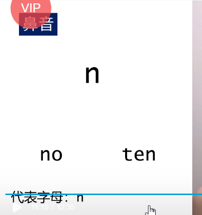

# 英语音标 

单元音分单元音，中元音，后元音

d

读e（长音）

读e（短音）

读apple的a

读apple的a（口张大）

# 中元音犹豫不决音

读鹅（长音）

读鹅（短音）

# 长元音

读哦（长音）

读哦（短音）

读乌（长音）

读鹅（短音 ）

读啊（长音）

读鹅（短音）

# 双元音

读爱

读爱（客家话）

读澳

读oh（英语的oh my god）

读e（短音）儿

读Apple的a+儿

读乌儿

# 辅音

k读可

 

g读哥

f读腐

读污

读屎

读屎（震动）

v

读滋

读屎

读医（客家话）

读热（第一声）re

读滋

读吃

读吱

 

读车（短音）

读者

读牟

读嗯

读嗯（长音）

读yes的y

读我

再元音之前读l（拼音）在元音之后读鹅